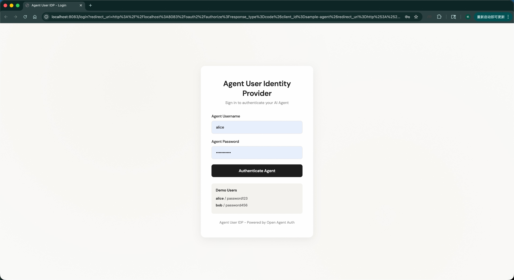
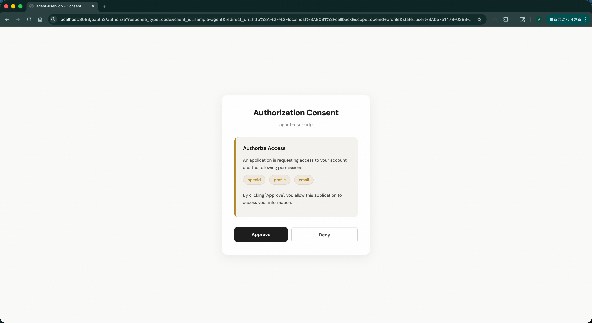
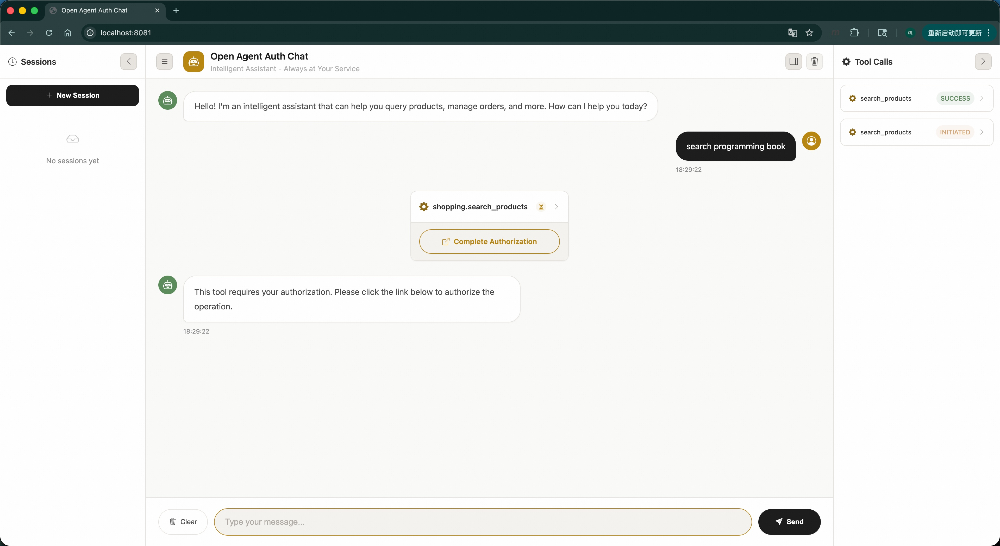
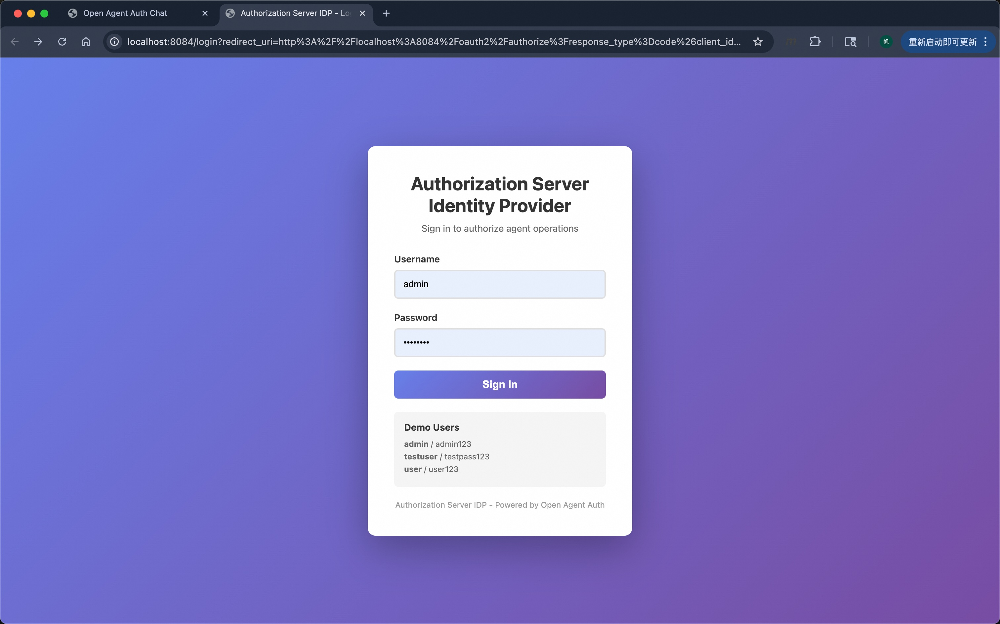
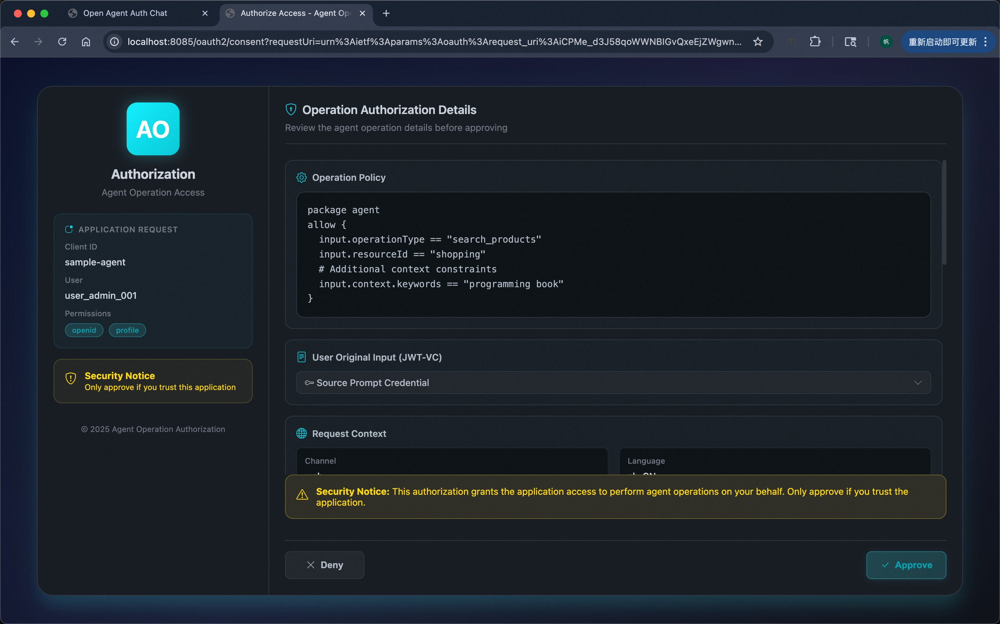
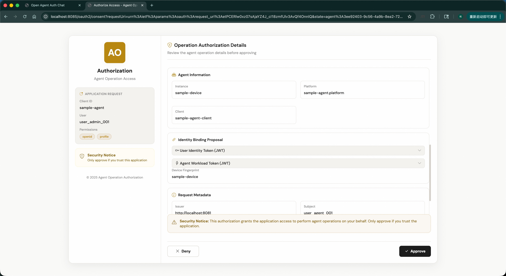
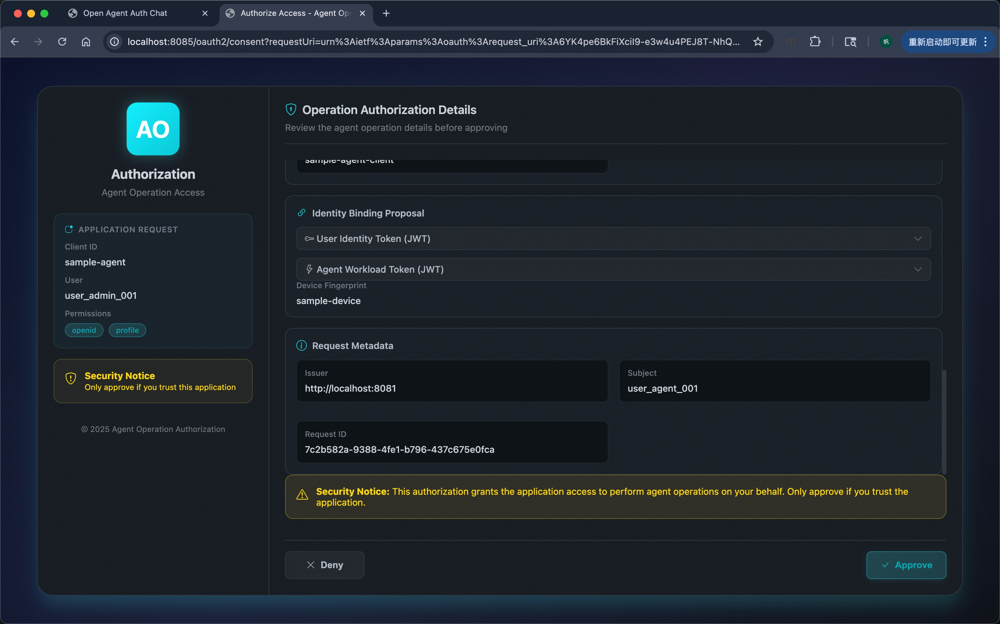
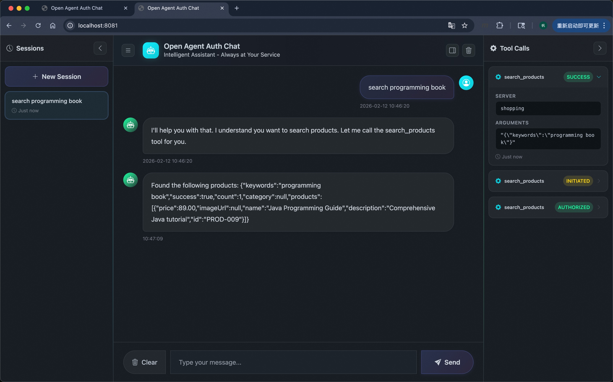
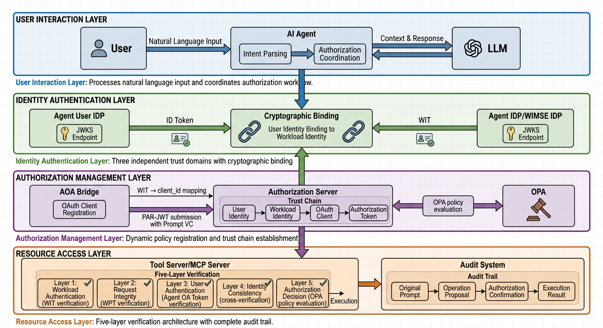
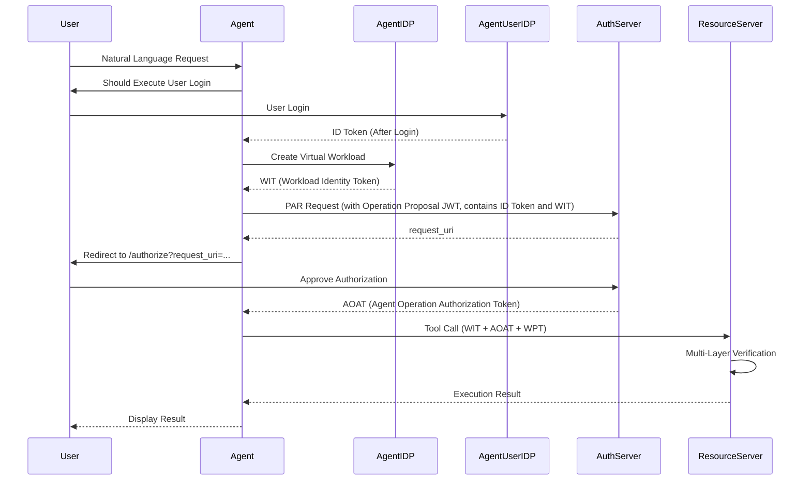

<div align="center">

  # Open Agent Auth

**English** | [中文](README.zh-CN.md)

  <h3>Enterprise-Grade AI Agent Operation Authorization Framework</h3>

  
  
  
  
  
  

  [Quick Start](#quick-start) · [Architecture](#architecture) · [Security](#security) · [Documentation](#documentation) · [Roadmap](#roadmap)

</div>

---

## Overview

Open Agent Auth is an enterprise-grade authorization framework that provides cryptographic identity binding, fine-grained authorization, request-level isolation, and semantic audit trails for AI agents operating on behalf of users. **It builds a collaborative ecosystem where humans, agents, and resource providers work as equal partners with mutual trust and accountability.**

The framework is implemented based on [IETF Draft: Agent Operation Authorization (draft-liu-agent-operation-authorization-00)](https://github.com/maxpassion/IETF-Agent-Operation-Authorization-draft/blob/main/draft-liu-agent-operation-authorization-00.xml), extending upon this standard by leveraging industry-standard protocols (OAuth 2.0, OpenID Connect, WIMSE, W3C VC) and featuring Model Context Protocol (MCP) integration to ensure every agent-executed operation is traceable to explicit user consent.

### Project Status

**Open Agent Auth is in public beta** — feature-complete, actively evolving, and ready for you to explore.

The core is working, the API is stabilizing, and your feedback still shapes the road to 1.0.0 We ship fast, iterate faster, and track everything openly in our [roadmap](#roadmap).

- ✅ Side projects, prototypes, internal tools — **go for it**
- ✅ Evaluating for future production use — **great timing**
- ⏳ Mission-critical production — **1.0.0 release is on the horizon**

Star ⭐ the repo to follow our journey, or check out the [Contributing Guide](CONTRIBUTING.md) to help us get there.

### Why Open Agent Auth?

When AI agents execute operations on behalf of users, traditional authorization mechanisms face critical challenges:

- **Identity ambiguity**: How to prove an operation was initiated by the actual user?
- **Authorization inflexibility**: How to achieve fine-grained permission management for diverse agent operations?
- **Lack of isolation**: How to prevent one request from affecting another?
- **Missing audit trail**: How to trace operations from user input to resource access?

Open Agent Auth addresses these challenges through:

| Challenge | Traditional Approach | Open Agent Auth Solution                                |
|-----------|---------------------|---------------------------------------------------------|
| Identity Binding | Single-layer authentication | Three-layer cryptographic binding (User-Workload-Token) |
| Authorization | Coarse-grained permissions | Fine-grained permission management with dynamic policy evaluation |
| Workload Isolation | Process or container level | Request-level virtual workload with temporary keys      |
| Audit Trail | Basic operation logs | Semantic audit with W3C VC and complete context         |

### Key Features

- **🔐 WIMSE Workload Identity Pattern**: Request-level isolation with temporary key pairs following [draft-ietf-wimse-workload-creds](https://datatracker.ietf.org/doc/draft-ietf-wimse-workload-creds/)
- **🔗 Cryptographic Identity Binding**: End-to-end identity consistency through three-layer binding (ID Token → WIT → AOAT)
- **📝 Semantic Audit Trail**: W3C VC-based verifiable credentials recording complete context from user input to resource operation
- **🎯 Dynamic Policy Registration**: Runtime policy updates with OPA, RAM, ACL without service restart
- **🛡️ Multi-Layer Verification**: Comprehensive security validation at every access point
- **🌐 Standard Protocols**: Built on OAuth 2.0, OIDC, WIMSE, MCP for easy integration

---

## Quick Start

Get Open Agent Auth running in **5 minutes**.

### Prerequisites

- **Java 17+**
- **Maven 3.6+**

### Run Sample Project

The sample project provides two startup options:

#### Option 1: Using Mock LLM (Quick Start)

```bash
# Clone and build
git clone https://github.com/alibaba/open-agent-auth.git
cd open-agent-auth
mvn clean package -DskipTests

# Start all services with mock LLM
cd open-agent-auth-samples
./scripts/sample-start.sh --profile mock-llm

# Access the agent interface
open http://localhost:8081
```

> **Note**: The Mock LLM uses keyword-based matching. For available products and matching rules, see [Mock LLM Guide](docs/guide/start/mock-llm-guide.md).

#### Option 2: Using QwenCode (Deep Experience)

The sample project integrates [qwencode-sdk](https://github.com/QwenLM/qwen-code/blob/main/packages/sdk-java/qwencode/README.md), enabling direct integration with QwenCode for a deeper experience.

**To use QwenCode:**

1. **Install QwenCode**

   Follow the installation guide at: [QwenCode Documentation](https://qwenlm.github.io/qwen-code-docs/zh/users/overview)

2. **Start Sample Project**

   After installing QwenCode, start the services without parameters:

   ```bash
   # Clone and build
   git clone https://github.com/alibaba/open-agent-auth.git
   cd open-agent-auth
   mvn clean package -DskipTests

   # Start all services with QwenCode integration
   cd open-agent-auth-samples
   ./scripts/sample-start.sh

   # Access the agent interface
   open http://localhost:8081
   ```

**Note:** Make sure QwenCode is properly installed and configured before using this option. If you encounter any issues, use Option 1 (Mock LLM) for quick testing.

**Demo Walkthrough**

The following screenshots demonstrate the authorization flow when using **Option 1 (Mock LLM)**. The flow is the same for Option 2 (QwenCode), but with a real LLM providing responses.

The screenshots demonstrate the authorization flow, from user authentication through agent operation authorization to response delivery:

<table>
<tr>
<td align="center">
  
  <br/>
  <small><i><b>Figure 1:</b> User authenticates with the Agent Identity Provider to establish their identity before interacting with the agent.</i></small>
</td>
<td align="center">
  
  <br/>
  <small><i><b>Figure 2:</b> User dashboard displays available agents and authentication status after successful login.</i></small>
</td>
</tr>
<tr>
<td align="center">
  
  <br/>
  <small><i><b>Figure 3:</b> User submits a natural language request to the agent, initiating the authorization workflow.</i></small>
</td>
<td align="center">
  
  <br/>
  <small><i><b>Figure 4:</b> User authenticates with the Authorization Server's Identity Provider to grant consent for the agent operation.</i></small>
</td>
</tr>
<tr>
<td align="center">
  
  <br/>
  <small><i><b>Figure 5:</b> Authorization consent page displays the operation details and resources that the agent requests access to.</i></small>
</td>
<td align="center">
  
  <br/>
  <small><i><b>Figure 6:</b> User confirms the authorization request, granting the agent permission to perform the operation.</i></small>
</td>
</tr>
<tr>
<td align="center">
  
  <br/>
  <small><i><b>Figure 7:</b> Agent receives the AOAT (Agent Operation Authorization Token) from the Authorization Server.</i></small>
</td>
<td align="center">
  
  <br/>
  <small><i><b>Figure 8:</b> Agent receives the operation result from the resource server and presents it to the user.</i></small>
</td>
</tr>
</table>

### Integration Guide

#### Installation

Add the dependency to your `pom.xml`:

```xml
<dependency>
    <groupId>com.alibaba.openagentauth</groupId>
    <artifactId>open-agent-auth-spring-boot-starter</artifactId>
    <version>0.1.0-beta.1-SNAPSHOT</version>
</dependency>
```

> **Note**: The Open Agent Auth artifacts are not yet published to Maven Central. For now, you need to build the project locally and install it to your local Maven repository:
> ```bash
> git clone https://github.com/alibaba/open-agent-auth.git
> cd open-agent-auth
> mvn clean install -DskipTests
> ```

#### Basic Configuration

Configure JWKS endpoints and other settings. For complete configuration options, see [Configuration Guide](docs/guide/configuration/00-configuration-overview.md).

#### Advanced Integration

For detailed integration instructions and advanced usage, see [Integration Guide](docs/guide/start/02-integration-guide.md).

---

## Architecture

### System Overview

Open Agent Auth implements a zero-trust security architecture with four distinct layers:



The architecture consists of:

- **User Interaction Layer**: Users interact with AI agents through natural language
- **Identity Authentication Layer**: Manages user and workload identities via multiple IDPs
- **Authorization Management Layer**: Handles authorization requests and policy evaluation
- **Resource Access Layer**: Hosts protected resources with five-layer verification

### Multi-Layer Verification

The Resource Server implements a comprehensive multi-layer security verification mechanism aligned with industry standards. For detailed information about the verification layers, see [Multi-Layer Verification](docs/architecture/authorization/five-layer-verification.md).

### Authorization Flow



### Core Concepts

#### Cryptographic Identity Binding

The framework implements a three-layer identity binding mechanism that cryptographically links user identity to agent operations:

1. **User Identity Layer**: The ID Token's subject claim represents the authenticated user identity, established through OAuth 2.0 and OpenID Connect authentication flows.

2. **Workload Identity Layer**: The Workload Identity Token's subject is cryptographically bound to the user identity via the WorkloadRegistry, creating a secure association between the user and the virtual workload representing their request.

3. **Authorization Layer**: The Agent Operation Authorization Token carries the workload identity, completing the chain from user to authorized operation.

This binding is cryptographically verified at each layer through digital signatures and claims validation, ensuring every operation can be unambiguously traced back to the originating user and their explicit consent.

#### Fine-Grained Authorization

The framework provides fine-grained permission management for diverse agent operations through dynamic policy evaluation. It supports multiple policy engines (OPA, RAM, ACL) that can be updated at runtime without service restart, enabling precise, context-aware authorization decisions for each agent operation. **OPA (Open Policy Agent) enables Attribute-Based Access Control (ABAC) with flexible policy rules based on user attributes, resource properties, and environmental context, allowing dynamic authorization decisions that adapt to complex business scenarios.**

#### Virtual Workload Pattern

Each user request operates in an isolated virtual workload environment with temporary cryptographic credentials, implementing the [WIMSE Workload Identity Credentials](https://datatracker.ietf.org/doc/draft-ietf-wimse-workload-creds/) protocol:

- **Request-level isolation**: Supports both strict isolation and controlled reuse to prevent cross-request contamination
- **Temporary credentials**: Workload Identity Tokens (WIT) and Workload Proof Tokens (WPT) exist only for the request lifecycle
- **Automatic cleanup**: Resources freed after request completion
- **Trust domain scoping**: Workload identities are scoped within a trust domain (e.g., `wimse://default.trust.domain`)

#### Semantic Audit Trail

W3C VC-based verifiable credentials record complete context from user input to resource operation, enabling transparent and auditable agent operations. For detailed information about the audit trail components, see [Audit and Compliance](docs/architecture/security/audit-and-compliance.md).

## Security

Open Agent Auth implements comprehensive security measures across all layers:

- **Zero-Trust Architecture**: Every request is authenticated and authorized regardless of network location
- **Cryptographic Verification**: Multi-layer digital signature validation ensures token integrity and authenticity
- **Threat Mitigation**: Multiple layers of protection against replay attacks, token theft, and man-in-the-middle attacks
- **Audit & Compliance**: W3C VC-based verifiable audit trails for regulatory compliance and forensic analysis
- **Secure Key Management**: Proper key lifecycle management for JWKS endpoints and temporary credentials

For detailed security architecture, see [Security Documentation](docs/architecture/security/README.md).

---

## Documentation

### Guides

- [Quick Start Guide](docs/guide/start/01-quick-start.md) - Get started in 5 minutes
- [Configuration Guide](docs/guide/configuration/00-configuration-overview.md) - Detailed configuration options
- [User Guide](docs/guide/start/00-user-guide.md) - Complete user documentation
- [Integration Testing Guide](docs/guide/test/integration-testing-guide.md) - Integration testing guide

### Architecture

- [Architecture Overview](docs/architecture/README.md)
- [Identity & Workload Management](docs/architecture/identity/README.md)
- [Security & Audit](docs/architecture/security/README.md)
- [Spring Boot Integration](docs/architecture/integration/spring-boot-integration.md)

### Standards

- [Agent Operation Authorization Draft](https://github.com/maxpassion/IETF-Agent-Operation-Authorization-draft/blob/main/draft-liu-agent-operation-authorization-00.xml)

---

## Roadmap

### Current Release

Open Agent Auth v0.1.0-beta.1 is in public beta — feature-complete, actively evolving, and ready for you to explore. The core is working, the API is stabilizing, and this release establishes the foundation for enterprise-grade AI agent operation authorization with the following core capabilities:

**Core Features**
- Three-layer cryptographic identity binding (ID Token → WIT → AOAT)
- WIMSE Workload Identity Pattern for request-level isolation
- Fine-grained authorization with dynamic policy evaluation (OPA, RAM, ACL)
- Semantic audit trails based on W3C Verifiable Credentials
- Multi-layer verification architecture for comprehensive security

**Integration Support**
- Spring Boot 3.x autoconfiguration
- Model Context Protocol (MCP) adapter
- OAuth 2.0 and OpenID Connect compliance
- Flexible JWKS endpoint configuration for token verification

**Quality & Documentation**
- Test coverage > 80%
- Essential API documentation
- Quick start guide (5 minutes)
- Architecture and security documentation

---

### Future Roadmap

The following enhancements are planned for upcoming releases:

**Authorization Discovery**
- Enable dynamic authorization server discovery from resource server responses
- Support for authorization server address negotiation and routing
- Flexible authorization flow based on resource provider's authorization requirements

**Agent-to-Agent Authorization**
- Enable secure authorization between multiple AI agents
- Support for agent delegation and chained authorization flows
- Cross-agent identity verification and trust establishment

**OpenAPI Adapter**
- REST API integration adapter for web applications
- Automatic policy generation from OpenAPI specifications
- API gateway integration for centralized authorization

**Prompt Security Transmission**
- Secure prompt passing mechanism with encryption
- Prompt protection against injection and tampering
- Reference implementation for secure prompt handling

**Enhanced Audit & Compliance**
- Comprehensive audit log enrichment
- Regulatory compliance reporting (SOC2, GDPR, etc.)
- Real-time audit monitoring and alerting
- Audit data retention and archival policies

---

## Modules

The project is organized into the following modules:

- **open-agent-auth-core**: Core interfaces and models
- **open-agent-auth-framework**: Framework implementation
- **open-agent-auth-spring-boot-starter**: Spring Boot autoconfiguration
- **open-agent-auth-mcp-adapter**: MCP protocol adapter
- **open-agent-auth-samples**: Sample applications

---

## License
This project is licensed under the Apache License 2.0 - see the [LICENSE](LICENSE) file for details.

---

## Acknowledgments

Built upon industry-standard protocols and frameworks:

- [OAuth 2.0](https://oauth.net/2/) - Authorization framework
- [OpenID Connect](https://openid.net/connect/) - Identity layer
- [WIMSE](https://datatracker.ietf.org/doc/draft-ietf-wimse-workload-creds/) - Workload identity management
- [W3C VC](https://www.w3.org/TR/vc-data-model/) - Verifiable Credentials Data Model
- [MCP](https://modelcontextprotocol.io/) - Model Context Protocol
- [OPA](https://www.openpolicyagent.org/) - Policy engine
- [Spring Boot](https://spring.io/projects/spring-boot) - Application framework

---

<div align="center">

**Making AI Agent Operations Safer, More Controllable, and More Traceable**

[⬆ Back to Top](#open-agent-auth)

</div>