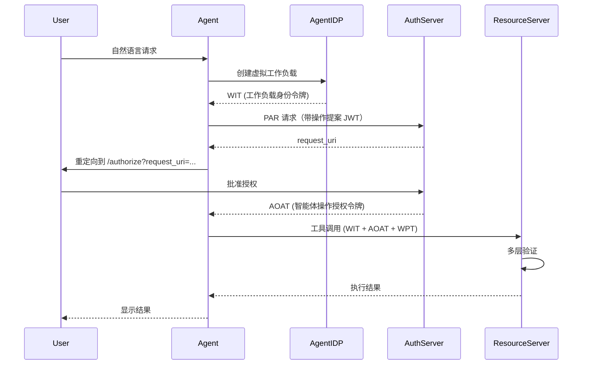

<div align="center">

  # Open Agent Auth

  **English** | [中文](README.zh-CN.md)

  <h3>企业级 AI 智能体操作授权框架</h3>

  
  
  
  
  
  

  [快速开始](#快速开始) · [架构](#架构) · [安全机制](#安全机制) · [文档资源](#文档资源) · [路线图](#路线图)

</div>

---

## 概述

Open Agent Auth 是一款企业级授权框架，为代表用户执行操作的 AI 智能体提供密码学身份绑定、细粒度授权、请求级隔离与语义审计追踪能力。**该框架构建了一个协作生态系统，人类、智能体与资源提供方以平等伙伴的身份，在相互信任与问责机制下共同协作**。

本框架基于 [IETF 草案：智能体操作授权（draft-liu-agent-operation-authorization-00）](https://github.com/maxpassion/IETF-Agent-Operation-Authorization-draft/blob/main/draft-liu-agent-operation-authorization-00.xml) 标准实现并对其进行扩展，融合 OAuth 2.0、OpenID Connect、WIMSE、W3C VC 等行业标准协议，并集成模型上下文协议（MCP），确保智能体执行的每一项操作均可追溯至明确的用户授权。

### 项目状态

**Open Agent Auth 处于公开 Beta 测试阶段** — 功能完整、持续演进，现已开放探索。

核心功能已就绪，API 逐步稳定，您的反馈将持续推动我们迈向 1.0.0 版本。我们快速发布、快速迭代，并在 [路线图](#路线图) 中公开追踪所有进展。

- ✅ 个人项目、原型开发、内部工具 — **可直接采用**
- ✅ 评估未来生产环境部署 — **最佳时机**
- ⏳ 关键业务生产环境 — **1.0.0 正式版本即将发布**

为关注我们的进展，请为仓库点 ⭐，或查阅 [贡献指南](CONTRIBUTING.md) 助力我们达成目标。

### 为什么选择 Open Agent Auth？

当 AI 智能体代表用户执行操作时，传统授权机制面临以下关键挑战：

- **身份模糊性**：如何证明操作确由真实用户发起？
- **授权灵活性不足**：如何为多样化的智能体操作实现细粒度权限管控？
- **隔离机制缺失**：如何避免单个请求对其他请求产生影响？
- **审计追踪缺失**：如何实现从用户输入到资源访问的全链路追踪？

Open Agent Auth 通过以下方案应对上述挑战：

| 挑战 | 传统方案 | Open Agent Auth 解决方案 |
|------|----------|--------------------------|
| 身份绑定 | 单层认证 | 三层密码学绑定（用户-工作负载-令牌） |
| 授权管控 | 粗粒度权限 | 支持动态策略评估的细粒度权限管理 |
| 工作负载隔离 | 进程或容器级别 | 基于临时密钥的请求级虚拟工作负载 |
| 审计追踪 | 基础操作日志 | 基于 W3C VC 的语义审计与完整上下文 |

### 核心特性

- **🔐 WIMSE 工作负载身份模式**：遵循 [draft-ietf-wimse-workload-creds](https://datatracker.ietf.org/doc/draft-ietf-wimse-workload-creds/) 标准，基于临时密钥对实现请求级隔离
- **🔗 密码学身份绑定**：通过三层绑定机制（ID Token → WIT → AOAT）实现端到端身份一致性
- **📝 语义审计追踪**：基于 W3C VC 可验证凭证，记录从用户输入到资源操作的完整上下文
- **🎯 动态策略注册**：支持运行时更新 OPA、RAM、ACL 策略，无需服务重启
- **🛡️ 多层验证机制**：在每个访问点实施全面的安全验证
- **🌐 标准协议集成**：基于 OAuth 2.0、OIDC、WIMSE、MCP 等标准协议构建，易于集成

---

## 快速开始

在 **5 分钟内**快速启动 Open Agent Auth。

### 前置条件

- **Java 17+**
- **Maven 3.6+**

### 运行示例程序

示例程序提供两种启动方式：

#### 方式一：使用模拟 LLM（快速开始）

```bash
# 克隆并构建
git clone https://github.com/alibaba/open-agent-auth.git
cd open-agent-auth
mvn clean package -DskipTests

# 使用模拟 LLM 启动所有服务
cd open-agent-auth-samples
./scripts/sample-start.sh --profile mock-llm

# 访问智能体界面
open http://localhost:8081
```

> **注意**：模拟 LLM 使用关键词匹配。关于可用产品和匹配规则，请参阅 [模拟 LLM 使用指南](docs/guide/start/mock-llm-guide.md)。

#### 方式二：使用 QwenCode（深度体验）

示例程序集成了 [qwencode-sdk](https://github.com/QwenLM/qwen-code/blob/main/packages/sdk-java/qwencode/README.md)，可直接集成 QwenCode 提供深度体验。

**使用 QwenCode：**

1. **安装 QwenCode**

   请参考安装指南：[QwenCode 文档](https://qwenlm.github.io/qwen-code-docs/zh/users/overview)

2. **启动示例程序**

   安装 QwenCode 后，直接启动服务（无需参数）：

   ```bash
   # 克隆并构建
   git clone https://github.com/alibaba/open-agent-auth.git
   cd open-agent-auth
   mvn clean package -DskipTests

   # 启动所有服务（集成 QwenCode）
   cd open-agent-auth-samples
   ./scripts/sample-start.sh

   # 访问智能体界面
   open http://localhost:8081
   ```

**注意：** 使用此方式前请确保 QwenCode 已正确安装并配置。如遇到问题，可使用方式一（模拟 LLM）进行快速测试。
```

### 集成指南

#### 安装依赖

将以下依赖添加至项目的 `pom.xml` 文件：

```xml
<dependency>
    <groupId>com.alibaba.openagentauth</groupId>
    <artifactId>open-agent-auth-spring-boot-starter</artifactId>
    <version>0.1.0-beta.1-SNAPSHOT</version>
</dependency>
```

> **注意**：Open Agent Auth 的二方库尚未发布到 Maven Central。目前，您需要在本地构建项目并将其安装到本地 Maven 仓库：
> ```bash
> git clone https://github.com/alibaba/open-agent-auth.git
> cd open-agent-auth
> mvn clean install -DskipTests
> ```

#### 基础配置

配置 JWKS 端点及其他相关参数。完整的配置选项请参阅 [配置指南](docs/guide/configuration/00-configuration-overview.md)。

#### 高级集成

详细的集成说明与高级用法，请参阅 [集成指南](docs/guide/start/02-integration-guide.md)。

---

## 架构

### 系统架构概览

Open Agent Auth 实现了零信任安全架构，包含四个核心层级：


架构组成：

- **用户交互层**：用户通过自然语言与 AI 智能体进行交互
- **身份认证层**：通过多个 IDP（身份提供商）管理用户身份与工作负载身份
- **授权管理层**：处理授权请求并执行策略评估
- **资源访问层**：托管受保护的资源，实施五层验证机制

### 多层验证机制

资源服务器实现了符合行业标准的多层安全验证机制。验证层的详细信息请参阅 [多层验证](docs/architecture/authorization/five-layer-verification.md)。

### 授权流程



### 核心概念

#### 密码学身份绑定

该框架实现了三层身份绑定机制，通过密码学方式将用户身份与智能体操作建立关联：

1. **用户身份层**：ID Token 的 subject claim 代表已认证的用户身份，通过 OAuth 2.0 与 OpenID Connect 认证流程建立。

2. **工作负载身份层**：工作负载身份令牌的 subject 通过 WorkloadRegistry 与用户身份进行密码学绑定，在用户与其请求所代表的虚拟工作负载之间建立安全关联。

3. **授权层**：智能体操作授权令牌承载工作负载身份，完成从用户到授权操作的完整链条。

该绑定机制在每一层均通过数字签名与声明验证进行密码学验证，确保每一项操作均可明确追溯至发起用户及其明确授权。

#### 细粒度授权

该框架通过动态策略评估为多样化的智能体操作提供细粒度权限管理。支持多个策略引擎（OPA、RAM、ACL），可在运行时更新而无需服务重启，为每个智能体操作实现精确的上下文感知授权决策。**OPA（Open Policy Agent）支持基于属性的访问控制（ABAC），通过基于用户属性、资源属性和环境上下文的灵活策略规则，实现能够适应复杂业务场景的动态授权决策。**

#### 虚拟工作负载模式

每个用户请求均在隔离的虚拟工作负载环境中运行，具备临时加密凭证，实现了 [WIMSE 工作负载身份凭证](https://datatracker.ietf.org/doc/draft-ietf-wimse-workload-creds/) 协议：

- **请求级隔离**：支持严格隔离与受控重用，防止跨请求污染
- **临时凭证**：工作负载身份令牌（WIT）与工作负载证明令牌（WPT）仅在请求生命周期内存在
- **自动清理**：请求完成后自动释放资源
- **信任域范围**：工作负载身份限定在信任域范围内（例如 `wimse://default.trust.domain`）

#### 语义审计追踪

基于 W3C VC 可验证凭证，记录从用户输入到资源操作的完整上下文，实现透明且可审计的智能体操作。审计追踪组件的详细信息请参阅 [审计与合规](docs/architecture/security/audit-and-compliance.md)。

## 安全机制

Open Agent Auth 在所有层级实施全面的安全措施：

- **零信任架构**：无论网络位置如何，每个请求均需经过身份认证与授权
- **密码学验证**：多层数字签名验证确保令牌的完整性与真实性
- **威胁缓解**：多层防护机制，防止重放攻击、令牌盗用与中间人攻击
- **审计与合规**：基于 W3C VC 的可验证审计追踪，用于监管合规与取证分析
- **安全密钥管理**：JWKS 端点与临时凭证的密钥生命周期管理

详细的安全架构请参阅 [安全文档](docs/architecture/security/README.md)。

---

## 文档资源

### 使用指南

- [快速开始指南](docs/guide/start/01-quick-start.md) - 5 分钟快速上手
- [配置指南](docs/guide/configuration/00-configuration-overview.md) - 详细配置选项
- [用户指南](docs/guide/start/00-user-guide.md) - 完整用户文档
- [集成测试指南](docs/guide/test/integration-testing-guide.md) - 集成测试指南

### 架构文档

- [架构概览](docs/architecture/README.md)
- [身份与工作负载管理](docs/architecture/identity/README.md)
- [安全与审计](docs/architecture/security/README.md)
- [Spring Boot 集成](docs/architecture/integration/spring-boot-integration.md)

### 标准规范

- [智能体操作授权草案](https://github.com/maxpassion/IETF-Agent-Operation-Authorization-draft/blob/main/draft-liu-agent-operation-authorization-00.xml)

---

## 路线图

### 当前版本

Open Agent Auth v0.1.0-beta.1 处于公开 Beta 测试阶段 — 功能完整、持续演进，现已开放探索。核心功能已就绪，API 逐步稳定，该版本为企业级 AI 智能体操作授权奠定了坚实基础，具备以下核心能力：

**核心功能**
- 三层密码学身份绑定（ID Token → WIT → AOAT）
- 用于请求级隔离的 WIMSE 工作负载身份模式
- 支持动态策略评估的细粒度授权（OPA、RAM、ACL）
- 基于 W3C 可验证凭证的语义审计追踪
- 用于全面安全的多层验证架构

**集成支持**
- Spring Boot 3.x 自动配置
- 模型上下文协议（MCP）适配器
- OAuth 2.0 与 OpenID Connect 合规
- 灵活的 JWKS 端点配置，用于令牌验证

**质量与文档**
- 测试覆盖率 > 80%
- 基础 API 文档
- 快速开始指南（5 分钟）
- 架构与安全文档

---

### 未来路线图

计划在后续版本中提供以下增强功能：

**授权发现**
- 支持从资源服务器响应中动态发现授权服务器
- 支持授权服务器地址协商与路由
- 基于资源提供方授权要求的灵活授权流程

**智能体到智能体授权**
- 在多个 AI 智能体之间实现安全授权
- 支持智能体委托与链式授权流程
- 跨智能体身份验证与信任建立

**OpenAPI 适配器**
- 用于 Web 应用程序的 REST API 集成适配器
- 基于 OpenAPI 规范自动生成策略
- 用于集中授权的 API 网关集成

**提示安全传输**
- 带加密的安全提示传递机制
- 防止注入与篡改的提示保护
- 安全提示处理的参考实现

**增强审计与合规**
- 全面的审计日志增强
- 监管合规报告（SOC2、GDPR 等）
- 实时审计监控与告警
- 审计数据保留与归档策略

---

## 项目模块

项目包含以下模块：

- **open-agent-auth-core**：核心接口与模型
- **open-agent-auth-framework**：框架实现
- **open-agent-auth-spring-boot-starter**：Spring Boot 自动配置
- **open-agent-auth-mcp-adapter**：MCP 协议适配器
- **open-agent-auth-samples**：示例应用程序

## 许可证

本项目采用 Apache License 2.0 许可 - 详见 [LICENSE](LICENSE) 文件。

---

## 致谢

基于行业标准协议与框架构建：

- [OAuth 2.0](https://oauth.net/2/) - 授权框架
- [OpenID Connect](https://openid.net/connect/) - 身份层
- [WIMSE](https://datatracker.ietf.org/doc/draft-ietf-wimse-workload-creds/) - 工作负载身份管理
- [W3C VC](https://www.w3.org/TR/vc-data-model/) - 可验证凭证数据模型
- [MCP](https://modelcontextprotocol.io/) - 模型上下文协议
- [OPA](https://www.openpolicyagent.org/) - 策略引擎
- [Spring Boot](https://spring.io/projects/spring-boot) - 应用程序框架

---

<div align="center">

**让 AI 智能体操作更安全、更可控、更可追溯**

[⬆ 返回顶部](#open-agent-auth)

</div>

## here are the updates to merge: 

```markdown:README.zh-CN.md
**演示流程**

以下截图展示了使用 **方式一（模拟 LLM）** 时的授权流程。方式二（QwenCode）的流程相同，只是由真实的 LLM 提供响应。

以下截图展示了完整的授权流程，包括用户认证、智能体操作授权及响应交付：
```

## here are the updates to merge: 

```markdown:README.zh-CN.md
### 运行示例程序

示例程序提供两种启动方式：

#### 方式一：使用模拟 LLM（快速开始）

```bash
# 克隆并构建
git clone https://github.com/alibaba/open-agent-auth.git
cd open-agent-auth
mvn clean package -DskipTests

# 使用模拟 LLM 启动所有服务
cd open-agent-auth-samples
./scripts/sample-start.sh --profile mock-llm

# 访问智能体界面
open http://localhost:8081
```

> **注意**：模拟 LLM 使用关键词匹配。关于可用产品和匹配规则，请参阅 [模拟 LLM 使用指南](docs/guide/start/mock-llm-guide.md)。

#### 方式二：使用 QwenCode（深度体验）
```