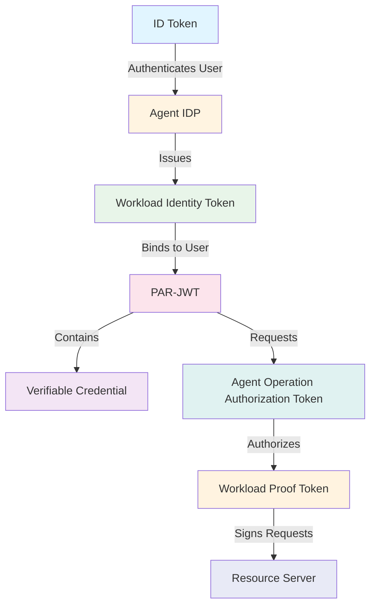
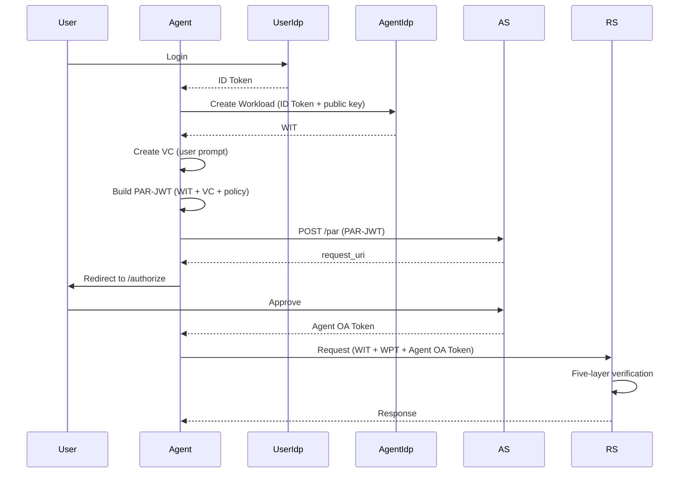

# Token Reference

The Open Agent Auth framework orchestrates multiple token types to establish secure, verifiable delegation chains from human principals to autonomous AI agents. Each token plays a distinct role in this cryptographic choreography, ensuring that AI agents operate within user-approved boundaries while maintaining complete auditability.



## ID Token

### Purpose and Role

The ID Token serves as the foundation of the entire authorization chain, representing the user's authenticated identity. It follows the OpenID Connect standard and is issued by a trusted Identity Provider after successful user authentication. This token is critical because all subsequent tokens in the flow ultimately derive their authority from the user's proven identity established by this token.

When a user logs into the system through the Agent User IDP, the Identity Provider validates the user's credentials and issues an ID Token containing the user's subject identifier, email address, and other profile information. The Agent Client then uses this ID Token as proof of user identity when requesting workload creation from the Agent IDP and when submitting authorization proposals to the Authorization Server.

### Token Structure

The ID Token is a standard JWT (JSON Web Token) signed by the Identity Provider using asymmetric cryptography. It contains standard OpenID Connect claims that identify the user and establish the token's validity.

```json
{
  "iss": "https://agent-user-idp.example.com",
  "sub": "user_12345",
  "aud": "https://agent.example.com",
  "exp": 1731668100,
  "iat": 1731664500,
  "nonce": "abc123",
  "email": "user@example.com",
  "email_verified": true,
  "name": "John Doe"
}
```

The `iss` claim identifies the Identity Provider that issued the token, enabling verification through the provider's public keys published at their JWKS endpoint. The `sub` claim contains the user's canonical subject identifier, which becomes the foundation for all identity binding throughout the framework. The `aud` claim specifies the intended audience—in this case, the Agent Client—ensuring the token cannot be used by unauthorized parties. The `exp` and `iat` claims establish the token's validity period, typically one hour from issuance.

### Security Characteristics

The ID Token's security derives from its cryptographic signature, which can be verified by any component with access to the Identity Provider's public keys. This enables distributed verification without requiring shared secrets. The token's short lifetime limits the window of opportunity for credential misuse, while the `nonce` claim provides protection against replay attacks by binding the token to a specific authentication session.

The framework treats the ID Token's subject identifier as immutable and authoritative. All identity binding operations reference this identifier, ensuring that workload creation, authorization grants, and resource access remain consistently bound to the authenticated user throughout the authorization flow.

## Workload Identity Token (WIT)

### Purpose and Architecture

The Workload Identity Token represents a fundamental innovation in the framework's security architecture: request-level isolation through virtual workloads. Unlike traditional identity providers that authenticate long-lived service accounts or processes, the Agent IDP creates temporary, isolated workloads for each user request. This approach enables fine-grained security boundaries with minimal overhead, which is particularly valuable in AI agent scenarios where each interaction may involve different operations, permissions, and security requirements.

When an agent needs to perform an operation on behalf of a user, it doesn't simply use a long-lived service account. Instead, it creates a dedicated virtual workload for that specific request. This workload has its own cryptographic identity, represented by the WIT, and its own key pair for signing subsequent requests. All operations the agent performs for that user are authenticated using this workload's credentials, ensuring that operations from different users cannot interfere with each other and that every action can be traced back to its originating user.

The WIT implements the WIMSE (Workload Identity and Management) protocol specification, providing a standardized approach to workload authentication that aligns with modern cloud-native security practices. It enables the framework to support multi-tenant environments where multiple users and agents operate concurrently without compromising isolation or auditability.

### Token Structure

The WIT is a JWT that follows the WIMSE protocol specification (draft-ietf-wimse-workload-creds). It contains standard claims that identify the workload and provide the public key for verifying Workload Proof Tokens (WPT).

```json
{
  "iss": "wimse://example-trust-domain",
  "sub": "agent-001",
  "aud": ["https://as.example.com", "https://api.example.com"],
  "exp": 1731668100,
  "iat": 1731664500,
  "jti": "wit-789xyz",
  
  "cnf": {
    "jwk": {
      "kty": "EC",
      "crv": "P-256",
      "alg": "ES256",
      "x": "base64url-encoded-x-coordinate",
      "y": "base64url-encoded-y-coordinate"
    }
  }
}
```

The `sub` claim is the core of the WIT's identity model and represents the Workload Identifier. This identifier is scoped within a trust domain and should be unique within that domain. The identifier format is implementation-specific and may follow standards such as SPIFFE (`spiffe://<trust-domain>/<workload-identifier>`) or other formats.

The `aud` claim specifies the intended audiences for this token, typically including the Authorization Server and Resource Servers that will accept this WIT for authentication. This ensures that the token cannot be used by unauthorized parties.

The `cnf` (confirmation) claim contains the workload's public key, which Resource Servers use to verify Workload Proof Tokens (WPT) signed by the workload's private key. This design ensures that the private key never leaves the workload's memory, minimizing the attack surface. The key pair is generated using strong cryptographic algorithms (ECDSA with P-256 curve by default) and exists only for the duration of the workload's lifetime, typically one hour.

### Workload Lifecycle and Management

The Agent IDP manages the complete lifecycle of workloads, from creation through expiration. When an agent requests a workload creation, it submits the user's ID Token and a newly generated public key to the Agent IDP. The Agent IDP validates the ID Token to ensure the user is authenticated, extracts the user's subject identifier, and creates a WIT that cryptographically binds the workload to that user.

The Agent IDP maintains a WorkloadRegistry that stores workload information including the workload ID, user ID, public key, creation timestamp, and expiration time. This registry enables the Agent IDP to validate WITs presented by agents and to perform cleanup operations when workloads expire. The registry implementation uses thread-safe data structures to support concurrent workload creation and validation, which is essential for high-throughput agent scenarios.

Workloads have a configurable expiration time (default 3600 seconds) and are automatically cleaned up when they expire. This time-bounded approach follows the principle of least privilege, granting credentials only for the duration needed to complete the operation. In the event of a security breach where credentials are compromised, the impact is limited to the remaining lifetime of the workload, reducing potential damage.

### Security Benefits

The virtual workload pattern provides several security advantages beyond traditional isolation mechanisms. First, it prevents cross-request contamination where operations from one user could inadvertently access data or perform actions intended for another user. Second, it enables fine-grained auditing where each operation can be traced to a specific workload and user, providing complete audit trails for compliance and security monitoring. Third, it supports dynamic resource allocation where workloads can be assigned different resource limits, priorities, or quality of service levels based on the operation context.

The temporary nature of workload credentials enhances security by limiting the window of opportunity for credential misuse. Unlike long-lived service accounts that provide persistent access, workload credentials exist only for the minimum necessary time and are automatically destroyed when the workload expires. This ephemeral approach significantly reduces the risk of credential theft and misuse.

## Workload Proof Token (WPT)

### Purpose and Mechanism

The Workload Proof Token provides cryptographic proof that a request originated from an authenticated workload and possesses the required authorization tokens. It is implemented as a JWT following the WIMSE Workload Proof Token specification (draft-ietf-wimse-wpt), supporting DPoP (Demonstrating Proof-of-Possession) patterns for token binding.

The WPT addresses a critical security challenge in distributed systems: ensuring that requests cannot be forged or tampered with during transmission. Even if an attacker intercepts a valid WIT, they cannot use it to forge valid requests without possessing the workload's private key, which never leaves the workload's memory. This binding between the WIT and the WPT creates a two-factor authentication system where the attacker would need both the WIT (verifying the workload's identity) and the private key (proving possession of the workload's credentials).

The WPT supports flexible token binding through the `oth` (other tokens hashes) claim, enabling it to be cryptographically bound to additional tokens such as the Agent Operation Authorization Token (AOAT). This binding ensures that the workload presenting the WPT also possesses the corresponding authorization token, preventing token replay attacks and enabling fine-grained access control. The `oth` claim follows a flexible design pattern where any token implementing the `OthBindableToken` interface can be bound to the WPT without requiring modifications to the core WPT generation logic.

### Token Structure

The WPT is a JWT that contains claims proving possession of the workload's private key and optionally binding it to other tokens such as the Agent Operation Authorization Token (AOAT).

```json
{
  "header": {
    "typ": "wpt+jwt",
    "alg": "ES256"
  },
  "payload": {
    "aud": "https://api.example.com",
    "exp": 1731668100,
    "iat": 1731664500,
    "jti": "wpt-123xyz",
    
    "wth": "base64url-encoded-wit-hash",
    
    "oth": {
      "aoat": "base64url-encoded-aoat-hash"
    }
  }
}
```

The `wth` (Workload Token Hash) claim is the core of the WPT's security model. It contains the base64url-encoded SHA-256 hash of the WIT, cryptographically binding the WPT to a specific WIT. This ensures that the WPT was created by the workload identified by that WIT. When validating the WPT, the `wth` claim MUST match the hash of the WIT presented in the request.

The `oth` (Other Tokens Hashes) claim is a JSON object containing hashes of other tokens that this WPT is bound to. Each entry consists of a token type identifier (the key) and a base64url-encoded SHA-256 hash of that token (the value). For example, when binding to an Agent Operation Authorization Token, the `oth` claim would contain `"aoat": "base64url-encoded-aoat-hash"`. This creates a cryptographic binding between the WPT and the AOAT, ensuring that the workload presenting the WPT also possesses the corresponding authorization token.

The `aud`, `exp`, `iat`, and `jti` claims provide standard JWT functionality: audience specification, expiration time, issuance time, and unique identifier for replay protection. The `exp` claim provides protection against replay attacks by limiting the validity window for the WPT.

### WPT Generation Process

When an agent needs to make a request to a protected resource, it generates a WPT following a structured process. First, it retrieves the WIT and extracts the workload's private key. Second, it computes the SHA-256 hash of the WIT's JWT string and includes it in the `wth` claim. Third, if the request requires binding to an authorization token (e.g., AOAT), it computes the SHA-256 hash of that token's JWT string and includes it in the `oth` claim with the appropriate token type identifier. Fourth, it constructs the WPT claims including the `aud`, `exp`, `iat`, `jti`, `wth`, and optionally `oth` claims. Fifth, it signs the WPT using the workload's private key with the algorithm matching the WIT's `cnf.jwk.alg` field. Finally, it includes the resulting WPT in the request headers.

The Resource Server validates the WPT by extracting the WIT from the request headers and verifying its signature and expiration. It then extracts the workload's public key from the WIT's `cnf` claim and uses it to verify the WPT's signature. It verifies that the `wth` claim matches the hash of the presented WIT. If the `oth` claim is present, it verifies that the hashes match the corresponding tokens presented in the request. Only if all validations pass does the Resource Server process the request.

### Security Considerations

The WPT mechanism provides several important security benefits. The `wth` claim creates a cryptographic binding between the WPT and the WIT, ensuring that the WPT was created by the workload identified by that WIT. The `oth` claim enables flexible token binding, allowing the WPT to be bound to authorization tokens such as AOAT, preventing token replay attacks and enabling fine-grained access control.

The use of asymmetric cryptography enables distributed verification—any component with the public key from the WIT can verify the WPT signature without requiring shared secrets or coordination with the Agent IDP. This design supports horizontal scaling and high availability, as multiple Resource Server instances can validate WPTs independently.

The `oth` claim follows a flexible design pattern where any token implementing the `OthBindableToken` interface can be bound to the WPT. This provides extensibility, allowing new token types to be added without requiring modifications to the core WPT generation and validation logic.

## PAR-JWT (Pushed Authorization Request JWT)

### Purpose and Design Philosophy

The PAR-JWT serves as the vehicle for the agent's authorization proposal, carrying the operation request, user intent evidence, and identity binding information to the Authorization Server in a secure, structured format. It follows OAuth 2.0 Pushed Authorization Requests (RFC 9126), which addresses a critical security vulnerability in traditional OAuth flows: the exposure of sensitive authorization parameters in URLs.

In traditional OAuth 2.0 authorization code flows, authorization parameters are transmitted as query parameters in the redirect URL. This exposes sensitive information—including scopes, requested permissions, and potentially user data—to browser history, server logs, and network intermediaries. The PAR protocol addresses this by having the client submit authorization parameters directly to the Authorization Server via a POST request, receiving a single-use `request_uri` that is then used in the redirect. This design ensures that sensitive information never appears in URLs.

The PAR-JWT extends this pattern by encoding the authorization request as a JWT, which provides additional security benefits. The JWT can be signed by the client, providing cryptographic proof of the request's origin. It can include custom claims that carry agent-specific information such as operation proposals, evidence credentials, and identity binding proposals. This enables a rich authorization request that captures the complete context of the agent's request.

### Token Structure

The PAR-JWT contains both standard OAuth 2.0 claims and custom claims specific to the Agent Operation Authorization framework.

```json
{
  "iss": "https://agent.example.com",
  "sub": "user_12345",
  "aud": "https://as.example.com",
  "exp": 1731668100,
  "iat": 1731664500,
  "jti": "par-req-456",
  
  "response_type": "code",
  "client_id": "agent_client_id",
  "redirect_uri": "https://agent.example.com/callback",
  "scope": "openid agent:operation",
  
  "evidence": {
    "source_prompt_credential": "eyJhbGciOiJSUzI1NiIsInR5cCI6IkpXVCJ9..."
  },
  
  "agent_user_binding_proposal": {
    "user_identity_token": "eyJhbGciOiJSUzI1NiIsInR5cCI6IkpXVCJ9...",
    "agent_workload_token": "eyJhbGciOiJFUzI1NiIsInR5cCI6IkpXVCJ9...",
    "device_fingerprint": "dfp_abc123"
  },
  
  "agent_operation_proposal": "package agent\nallow { input.transaction.amount <= 50.0 }",
  
  "context": {
    "channel": "mobile-app",
    "deviceFingerprint": "dfp_abc123",
    "language": "zh-CN",
    "user": {
      "id": "user_12345"
    },
    "agent": {
      "instance": "dfp_abc123",
      "platform": "personal-agent.example.com",
      "client": "mobile-app-v1"
    }
  }
}
```

The `evidence` claim contains a Verifiable Credential (JWT-VC) that cryptographically captures the user's original natural language input. The `source_prompt_credential` field within the evidence is a JWT string containing the full Verifiable Credential structure. This credential serves as tamper-evident evidence of the user's intent, enabling the Authorization Server to present the original prompt to the user during the consent flow and enabling audit trails for compliance and dispute resolution.

The `agent_user_binding_proposal` claim proposes the binding between the user and the workload. It contains the user's ID Token and the workload's WIT, enabling the Authorization Server to verify that the workload requesting authorization is indeed bound to the authenticated user. The `device_fingerprint` field provides additional context about the client device, which can be used for fraud detection and security analytics.

The `agent_operation_proposal` claim contains a Rego policy string that defines the operation the agent wants to perform. This policy will be evaluated by the Open Policy Agent (OPA) at runtime to make fine-grained authorization decisions. The policy can express complex conditions and business logic, enabling the framework to support sophisticated authorization scenarios beyond simple scope-based permissions.

The `context` claim provides additional information for policy evaluation, including the interaction channel, device fingerprint, user language preference, and agent context. This information enables context-aware authorization decisions that consider factors such as the user's location, the device's security posture, and the agent's deployment characteristics.

### Authorization Flow

The PAR-JWT participates in a multi-step authorization flow that ensures user consent and cryptographic verification of all components. When the agent receives a user's natural language request, it parses the intent and constructs an operation proposal in the form of a Rego policy. It then creates a Verifiable Credential capturing the user's original prompt, including the timestamp, channel information, and device fingerprint. The agent builds the PAR-JWT with all required claims and signs it with its private key.

The agent submits the PAR-JWT to the Authorization Server via a POST request to the `/par` endpoint. The Authorization Server validates the PAR-JWT's signature, extracts and validates the embedded evidence and identity binding information, and generates a single-use `request_uri`. The Authorization Server stores the PAR-JWT temporarily, associating it with the `request_uri`, and returns the `request_uri` to the agent.

The agent then redirects the user's browser to the Authorization Server's authorization endpoint with the `request_uri` as a parameter. The Authorization Server retrieves the stored PAR-JWT, presents the user with a consent interface that shows the original prompt (from the evidence credential) and the interpreted operation (from the operation proposal), and waits for the user's approval.

### Security Advantages

The PAR-JWT design provides several important security advantages. By using the PAR protocol, it prevents sensitive authorization data from appearing in URLs, protecting against leakage through browser history, server logs, and network intermediaries. By encoding the request as a JWT, it enables cryptographic verification of the request's origin and integrity. By including custom claims for evidence and identity binding, it enables a rich authorization request that captures the complete context of the agent's request.

The single-use `request_uri` prevents replay attacks, ensuring that each authorization request can only be used once. The temporary storage of the PAR-JWT ensures that sensitive data is not persisted indefinitely, reducing the attack surface. The cryptographic signature on the PAR-JWT ensures that the request cannot be modified without detection.

## Verifiable Credential (VC)

### Purpose and Significance

The Verifiable Credential serves as the cryptographic foundation of the framework's auditability and dispute resolution capabilities. It captures the user's original natural language input in a tamper-evident format that can be verified independently by any component with access to the issuer's public keys. This is particularly important in AI agent scenarios where the system interprets and potentially expands the user's intent, creating a gap between what the user said and what the system does.

The VC addresses this gap by providing an immutable record of the user's original prompt. When disputes arise—for example, when a user claims "I didn't authorize that transaction" or "I didn't say to spend that much"—the VC provides cryptographic evidence of what the user actually authorized. This enables post-hoc analysis, compliance audits, and dispute resolution with a high degree of confidence.

The VC follows the W3C Verifiable Credentials Data Model, a standardized format for expressing tamper-evident claims that can be cryptographically verified. This standardization ensures interoperability with other systems and tools that support W3C VCs, enabling integration with broader identity and credential ecosystems.

### Credential Structure

The VC is embedded as a JWT within the PAR-JWT's `evidence` claim, following the W3C JWT VC format.

```json
{
  "header": {
    "alg": "RS256",
    "typ": "JWT",
    "kid": "https://agent.example.com/.well-known/jwks.json#key-01"
  },
  
  "payload": {
    "jti": "pt-001",
    "iss": "https://agent.example.com",
    "sub": "user_12345",
    "iat": 1731664500,
    "exp": 1731668100,
    
    "type": "VerifiableCredential",
    "credentialSubject": {
      "type": "UserInputEvidence",
      "prompt": "Buy something cheap on Nov 11 night",
      "timestamp": "2025-11-11T10:30:00Z",
      "channel": "voice",
      "deviceFingerprint": "dfp_abc123"
    },
    "issuer": "https://agent.example.com",
    "issuanceDate": "2025-11-11T10:30:30Z",
    "expirationDate": "2025-11-11T23:59:00Z",
    
    "proof": {
      "type": "JwtProof2020",
      "created": "2025-11-11T10:30:30Z",
      "verificationMethod": "https://agent.example.com/#key-01"
    }
  }
}
```

The `credentialSubject` contains the core evidence: the user's original prompt text, the timestamp when the prompt was captured, the channel through which the input was received (e.g., voice, text), and a device fingerprint for additional context. The `type` field identifies this as "UserInputEvidence," a custom credential type defined by the framework for capturing user intent.

The `proof` object contains cryptographic proof of the credential's authenticity. It includes the proof type ("JwtProof2020"), the creation timestamp, and a reference to the verification method (the public key used to verify the signature). This proof enables any component with access to the issuer's public keys to verify that the credential has not been modified since issuance.

### Semantic Audit Trail

The VC is a key component of the framework's semantic audit trail, which provides a complete, traceable chain from the user's original intent to the system's final executed action. This audit trail captures not just what happened, but why it happened, enabling sophisticated analysis and compliance reporting.

The semantic audit trail serves several important purposes. First, it provides intent provenance by recording what the user originally said, preventing disputes about authorization. Second, it documents action interpretation by showing how the system interpreted and rendered the input into a concrete operation, reflecting the AI's reasoning process. Third, it provides semantic transparency by showing whether semantic expansions or default values were applied—for example, mapping "cheap" to a specific dollar amount or defining "night" as a specific time range. Fourth, it provides user confirmation evidence by including timestamps indicating when the user reviewed and confirmed the interpreted action. Fifth, it enables accountability support by facilitating post-hoc analysis in case of erroneous transactions, helping determine whether issues stemmed from ambiguous user input, system misinterpretation, or misleading UI guidance.

The Authorization Server incorporates the VC into the Agent Operation Authorization Token, ensuring that the evidence travels with the authorization through the entire system. This enables Resource Servers and audit systems to verify the provenance of each authorized operation, even if the original PAR-JWT has been deleted.

### Security Properties

The VC's security derives from its cryptographic signature, which can be verified independently by any component with access to the issuer's public keys. This enables distributed verification without requiring coordination with the issuing agent. The signature covers all claims in the credential, ensuring that any modification is detected.

The VC's short lifetime (typically matching the PAR-JWT's expiration) limits the window of opportunity for misuse. The credential's unique identifier (`jti`) enables tracking and potential revocation if needed. The inclusion of the device fingerprint provides additional context for fraud detection and security analytics.

The VC follows the W3C Verifiable Credentials Data Model, ensuring interoperability with standard VC tooling and enabling integration with broader identity ecosystems. This standardization also provides a clear specification for implementing VC validation and verification logic.

### JWE Encryption Support

The framework provides optional JWE (JSON Web Encryption) support for enhanced privacy protection of user prompts. When enabled, the VC's `source_prompt_credential` can be encrypted using JWE before being embedded in the PAR-JWT, ensuring that the user's original input remains confidential even in transit and at rest.

JWE encryption follows RFC 7516 and supports multiple encryption algorithms:

- **Key Encryption Algorithms**: RSA-OAEP, RSA-OAEP-256, ECDH-ES
- **Content Encryption Algorithms**: A128GCM, A192GCM, A256GCM, A128CBC-HS256, A256CBC-HS512

The encryption process uses the recipient's public key (obtained from their JWKS endpoint) to encrypt the VC, ensuring that only the intended recipient (typically the Authorization Server) can decrypt it using their private key. This end-to-end encryption provides an additional layer of security beyond the cryptographic signature, protecting sensitive user information from unauthorized access even if the token is intercepted.

JWE encryption is configurable and can be enabled or disabled based on security requirements. When disabled, the VC is transmitted as a standard JWS (JSON Web Signature) token, maintaining cryptographic integrity without confidentiality. This flexibility allows deployments to choose the appropriate security level based on their threat model and compliance requirements.

## Agent Operation Authorization Token

### Purpose and Authority

The Agent Operation Authorization Token (also called Agent OA Token) represents the culmination of the authorization flow: the user's explicit consent to the agent's proposed operation. It serves as a cryptographically signed "authorization letter" that grants the agent permission to perform the requested operation, with all necessary claims for enforcement and auditability.

Unlike traditional OAuth access tokens, which typically contain only scopes and basic claims, the Agent OA Token contains a rich set of claims that enable fine-grained authorization and complete auditability. It includes the user's identity, the verified agent identity, a reference to the policy that governs the operation, the evidence credential capturing the user's original intent, and a semantic audit trail documenting the authorization decision.

The token is issued by the Authorization Server after successful validation of the PAR-JWT, identity binding verification, and user consent. The Authorization Server acts as the witness of the user's consent, presenting the rendered operation to the user on an AS-controlled interface and, upon explicit approval, issuing the token with embedded audit information. This audit information is covered by the AS's signature on the token, making it verifiable evidence of the consent event.

### Token Structure

The Agent OA Token contains both standard JWT claims and custom claims specific to the Agent Operation Authorization framework.

```json
{
  "iss": "https://as.example.com",
  "sub": "user_12345",
  "aud": ["https://api.example.com"],
  "exp": 1731668100,
  "iat": 1731664500,
  "jti": "aoat-789xyz",
  
  "scope": "agent:operation",
  
  "evidence": {
    "source_prompt_credential": "eyJhbGciOiJSUzI1NiIsInR5cCI6IkpXVCJ9..."
  },
  
  "agent_identity": {
    "version": "1.0",
    "id": "urn:uuid:agent-identity-789",
    "issuer": "https://as.example.com",
    "issuedTo": "user_12345",
    "issuedFor": {
      "platform": "personal-agent.example.com",
      "client": "mobile-app-v1",
      "clientInstance": "dfp_abc123"
    },
    "issuanceDate": "2025-11-11T10:35:30Z",
    "validFrom": "2025-11-11T10:35:30Z",
    "expires": "2025-11-11T23:59:00Z"
  },
  
  "agent_operation_authorization": {
    "policy_id": "opa-policy-789"
  },
  
  "context": {
    "renderedText": "Purchase items under $50 during the Nov 11 promotion (valid until 23:59)"
  },
  
  "audit_trail": {
    "originalPromptText": "Buy something cheap on Nov 11 night",
    "renderedOperationText": "Purchase items under $50 during the Nov 11 promotion (valid until 23:59)",
    "semanticExpansionLevel": "medium",
    "userAcknowledgeTimestamp": "2025-11-11T10:33:00Z",
    "consentInterfaceVersion": "consent-ui-v2.1"
  },
  
  "references": {
    "relatedProposalId": "urn:uuid:op-proposal-456"
  },
  
  "delegation_chain": [
    {
      "delegator_jti": "urn:uuid:token-abc-123",
      "delegator_agent_identity": { "version": "1.0", "id": "urn:uuid:agent-identity-456", "issuer": "https://as.example.com", "issuedTo": "user_12345", "issuedFor": { "platform": "personal-agent.example.com", "client": "mobile-app-v1", "clientInstance": "dfp_abc123" }, "issuanceDate": "2025-11-11T10:35:30Z", "validFrom": "2025-11-11T10:35:30Z", "expires": "2025-11-11T23:59:00Z" },
      "delegation_timestamp": "2025-12-18T10:15:00Z",
      "operation_summary": "Delegate inventory check for item X",
      "as_signature": "eyJhbGciOiJSUzI1NiIs..."
    }
  ]
}
```

The `agent_identity` claim is issued by the Authorization Server after validating the user-workload binding through the WorkloadRegistry. It provides authoritative confirmation that the binding has been verified and is cryptographically endorsed by the AS. This enables Resource Servers to trust the identity binding without needing to re-validate the original ID Token and WIT.

The `agent_operation_authorization` claim contains a `policy_id` that references a registered OPA policy. The Resource Server retrieves this policy and evaluates it against the request context to make fine-grained authorization decisions. This policy-based approach enables complex, context-aware authorization that can consider factors such as the user's role, the resource's sensitivity, the time of day, and the data being accessed.

The `audit_trail` claim provides a complete semantic audit trail from the user's original intent to the system's final executed action. It includes the original prompt text, the rendered operation text, the semantic expansion level, the user acknowledgment timestamp, and the consent interface version. This information enables post-hoc analysis and compliance reporting.

The `delegation_chain` claim, when present, provides a complete history of agent-to-agent delegations, enabling Resource Servers to validate that the current agent's authority is derived without escalation from an original human-confirmed authorization. Each entry in the chain is signed by the Authorization Server, ensuring its integrity and non-repudiation.

### Token Issuance Process

The issuance of the Agent OA Token is a multi-step process that ensures cryptographic verification of all components and explicit user consent. When the user approves the authorization request, the Authorization Server retrieves the stored PAR-JWT and validates its signature and expiration. It extracts and validates the evidence credential, verifying its signature and ensuring it has not expired.

The Authorization Server validates the identity binding by verifying that the workload ID (WIT.sub) is registered in the WorkloadRegistry with the user's subject identifier from the ID Token. This cross-validation ensures that the workload requesting authorization is indeed bound to the authenticated user. The Authorization Server then registers the OPA policy referenced in the `agent_operation_proposal` claim, ensuring that the policy is available to all Resource Servers that will validate the token.

The Authorization Server constructs the Agent OA Token with all required claims, including the user identity, verified agent identity, policy reference, audit trail, and evidence credential. It signs the token with its private key and returns it to the agent as the access token for the authorized operation.

### Delegation Support

The framework supports agent-to-agent delegation, enabling primary agents to delegate subsets of their authorized operations to secondary agents while preserving end-to-end auditability and preventing privilege escalation. The delegation is managed by the Authorization Server, which acts as the central policy enforcer and trust anchor.

When an agent wants to delegate an operation, it submits a PAR request to the Authorization Server containing its current Agent OA Token, a new `agent_user_binding_proposal` for the secondary agent, and a descriptor of the requested sub-operation. The Authorization Server validates that the original token is valid and permits delegation, verifies that the requested sub-operation is strictly narrower than the original authorization, and authenticates the secondary agent's identity.

If all checks pass, the Authorization Server issues a new Agent OA Token for the secondary agent. The new token references the same original human intent, includes a new `agent_identity` for the secondary agent, and extends the `delegation_chain` with a new, AS-signed record referencing the delegating agent's token. Resource Servers can validate the entire delegation chain by verifying the AS signature on each entry and ensuring that no operation exceeds the cumulative scope of the chain.

## Token Flow and Relationships

### Complete Authorization Sequence

The tokens flow through the system in a carefully orchestrated sequence that ensures security, auditability, and proper authorization at each step.



The flow begins with user authentication through the User IDP, which issues an ID Token proving the user's identity. The Agent Client uses this ID Token to request workload creation from the Agent IDP, which issues a WIT that cryptographically binds a virtual workload to the user. The Agent Client then creates a Verifiable Credential capturing the user's original prompt and builds a PAR-JWT containing the operation proposal, evidence, and identity binding information.

The Agent Client submits the PAR-JWT to the Authorization Server via the PAR endpoint, receiving a single-use `request_uri`. The Agent Client redirects the user to the Authorization Server's authorization endpoint with this `request_uri`. The Authorization Server retrieves the stored PAR-JWT, presents the user with a consent interface showing the original prompt and interpreted operation, and waits for user approval.

Upon user approval, the Authorization Server validates all components, registers the OPA policy, and issues an Agent OA Token containing the user identity, verified agent identity, policy reference, audit trail, and evidence credential. The Agent Client uses this token to access protected resources, presenting it along with the WIT and WPT to the Resource Server.

The Resource Server performs five-layer verification: validating the WIT signature, validating the WPT signature, validating the Agent OA Token, verifying identity consistency across all tokens, and evaluating the OPA policy. If all verifications pass, the Resource Server executes the requested operation and returns the result to the Agent Client.

### Identity Binding Chain

The framework maintains a cryptographic identity binding chain throughout the authorization flow, ensuring that all tokens remain consistently bound to the authenticated user and authorized workload.

```
ID Token.sub 
  ↓ (binds to)
WIT.sub (via Workload Registry)
  ↓ (binds to)
Agent OA Token.sub
```

This binding chain ensures that the workload is bound to the authenticated user, the authorization is granted to the specific workload, and the authorization token can only be used by the bound workload. Any mismatch in this chain indicates a potential security breach and causes immediate rejection of the request.

The binding chain is established when the Agent IDP creates the WIT and registers the workload in the WorkloadRegistry with the user's subject identifier from the ID Token. This binding is verified by the Authorization Server when processing the PAR-JWT, ensuring that the workload requesting authorization is bound to the authenticated user. The binding is then perpetuated in the Agent OA Token, which includes the user's subject identifier as the subject claim.

The Resource Server validates this binding during request processing through a two-layer verification mechanism implemented by the IdentityConsistencyValidator:

1. **User Identity Verification**: The validator extracts the user ID from the AOAT's `agent_identity.issuedTo` field (format: "issuer|userId") and retrieves the corresponding BindingInstance from the Authorization Server using the `agent_identity.id` as the key. It then verifies that the extracted user ID matches the BindingInstance's `userIdentity`.

2. **Workload Identity Verification**: The validator extracts the workload identity from the WIT's `sub` claim and verifies that it matches the BindingInstance's `workloadIdentity`.

This two-layer verification prevents scenarios where a malicious agent might attempt to use a workload created for one user to access authorization tokens granted to another user, or where a workload might try to use an authorization token issued to a different workload.

### Lifecycle Phases

The authorization flow can be understood as progressing through distinct phases, each involving specific tokens and serving specific security purposes.

During the **Authentication Phase**, the ID Token proves user identity, establishing the foundation for all subsequent operations. This token is issued by the User IDP after successful authentication and contains the user's subject identifier, which becomes the anchor for identity binding throughout the flow.

In the **Workload Creation Phase**, the Agent IDP issues a WIT that binds a virtual workload to the authenticated user. This token contains the workload's public key for signing subsequent requests and includes an `agent_identity` claim that cryptographically binds the workload to the user.

During the **Authorization Request Phase**, the Agent Client creates a PAR-JWT containing the operation proposal, evidence credential, and identity binding information. This token is submitted to the Authorization Server via the PAR protocol, which prevents sensitive data from appearing in URLs.

In the **Authorization Grant Phase**, the Authorization Server issues an Agent OA Token after user consent. This token grants operational permission and includes all necessary claims for enforcement and auditability, including the policy reference, audit trail, and evidence credential.

Finally, during the **Resource Access Phase**, the Agent Client presents the WIT, WPT, and Agent OA Token to the Resource Server. The Resource Server performs five-layer verification and enforces the OPA policy, executing or denying the requested operation based on the policy evaluation result.

## Security Best Practices

### Token Validation Requirements

All tokens must undergo comprehensive validation before being accepted. Signature verification ensures the token's authenticity and integrity by validating the cryptographic signature using the issuer's public key obtained from a trusted JWKS endpoint. Expiration checks ensure the token has not expired, with configurable clock skew tolerance to handle minor time synchronization issues. Issuer verification confirms the token is from a trusted issuer by checking the `iss` claim against a whitelist of authorized issuers. Audience verification ensures the token is intended for the current recipient by checking the `aud` claim. Nonce and replay prevention checks detect replay attacks by validating nonce values and checking token identifiers against recent usage.

### Token Storage Guidelines

Proper token storage is critical for maintaining security. ID Tokens should be stored securely in memory and cleared immediately after use, minimizing the window of opportunity for credential theft. WITs should be stored in memory for the workload's lifetime and never persisted to disk, as they contain sensitive cryptographic material. Agent OA Tokens can be cached for the token's remaining lifetime but must be validated on each use to ensure they have not been revoked or expired. Private keys must be stored only in memory and destroyed when the workload expires or is revoked, ensuring they cannot be recovered after their useful lifetime.

### Token Revocation Strategies

The framework supports multiple token revocation strategies. The `jti` claim provides a unique identifier for each token, enabling token identification for revocation tracking. Token blacklists provide immediate revocation capability in security incident scenarios, allowing compromised tokens to be invalidated before their natural expiration. The framework primarily relies on expiration for invalidation, as this provides a simple, stateless approach that doesn't require distributed coordination. OAuth 2.0 Token Introspection (RFC 7662) enables Resource Servers to query the Authorization Server for token status and metadata, which is particularly useful for scenarios where tokens may be revoked before expiration.

### Key Management Practices

Robust key management is essential for maintaining the security of the token system. The framework uses asymmetric cryptography (RS256 or ES256) for signing tokens, enabling distributed verification without requiring shared secrets. Public keys are published via JWKS endpoints, enabling automatic key discovery and rotation. Key rotation is implemented without service interruption by publishing new keys alongside existing keys, allowing a gradual transition period. The framework uses in-memory key storage, with keys generated on-demand using strong cryptographic random number generators, ensuring unpredictability and resistance to brute-force attacks. Private keys are stored only in memory and are automatically destroyed when the application shuts down or when the workload expires.

## References

This framework builds upon several established standards and protocols:

- **OAuth 2.0**: [RFC 6749](https://datatracker.ietf.org/doc/html/rfc6749) - The foundation for authorization flows
- **OpenID Connect**: [OpenID Connect Core 1.0](https://openid.net/specs/openid-connect-core-1_0.html) - Provides identity layer on top of OAuth 2.0
- **PAR**: [RFC 9126](https://datatracker.ietf.org/doc/html/rfc9126) - Pushed Authorization Requests for secure parameter transmission
- **JWT**: [RFC 7519](https://datatracker.ietf.org/doc/html/rfc7519) - JSON Web Token format for signed tokens
- **WIMSE**: [I-D.ietf-wimse-workload-creds](https://datatracker.ietf.org/doc/html/draft-ietf-wimse-workload-creds) - Workload Identity Credentials protocol
- **HTTP Message Signatures**: [RFC 9421](https://datatracker.ietf.org/doc/html/rfc9421) - HTTP-layer request authentication
- **W3C VC**: [Verifiable Credentials Data Model](https://www.w3.org/TR/vc-data-model/) - Standard for tamper-evident credentials
- **OPA**: [Open Policy Agent](https://www.openpolicyagent.org/) - Policy evaluation engine for fine-grained authorization

## Glossary

- **ID Token**: OpenID Connect token representing user identity, issued by a trusted Identity Provider after authentication
- **WIT (Workload Identity Token)**: Token that authenticates virtual workloads, implementing the WIMSE protocol for request-level isolation
- **WPT (Workload Proof Token)**: Cryptographic signature over HTTP request components, proving request authenticity and integrity
- **PAR-JWT**: Pushed Authorization Request in JWT format, carrying operation proposals with embedded evidence
- **VC (Verifiable Credential)**: W3C-standard credential that cryptographically captures user intent, enabling semantic audit trails
- **Agent OA Token (Agent Operation Authorization Token)**: Final access token granting operational permission after user consent
- **WIMSE**: Workload Identity and Management protocol, standard for workload authentication
- **OPA**: Open Policy Agent, policy evaluation engine for fine-grained authorization decisions
- **JWKS**: JSON Web Key Set, standard mechanism for distributing public keys
- **JTI**: JWT ID, unique identifier for each token enabling revocation tracking
