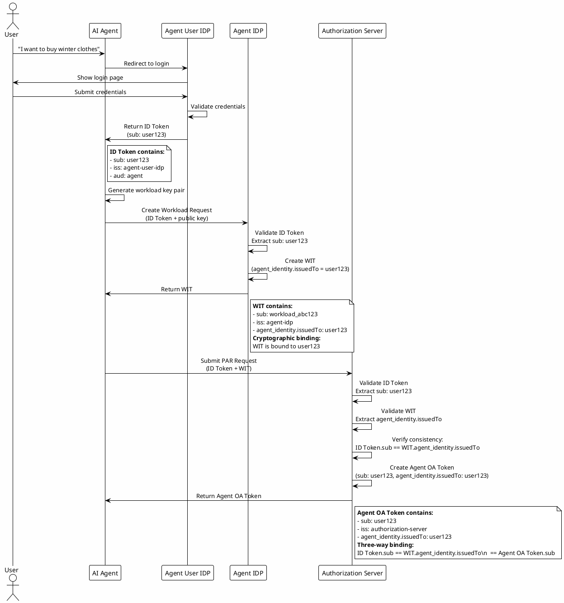

# Identity and Workload Management

The Identity and Workload Management layer provides the foundational identity infrastructure for the Open Agent Auth framework, implementing a dual-layer identity model that separates user identity from workload identity. This architecture enables fine-grained access control and accountability by establishing cryptographically verifiable bindings between human users and autonomous agents, following the Agent Operation Authorization specification's requirements for identity isolation and traceability.

The layer leverages the WIMSE (Workload Identity in Multi-Service Environments) protocol for workload identity management, providing a standardized approach to workload authentication and authorization. User identity is managed through OpenID Connect, ensuring interoperability with existing identity systems. The separation of concerns between user and workload identities enables the framework to support complex authorization scenarios while maintaining security and compliance.

## Identity Authentication Architecture

### Agent User IDP

The Agent User Identity Provider serves as the primary authentication endpoint for AI agent systems, responsible for verifying user credentials and issuing ID Tokens that establish the initial trust anchor for subsequent authorization flows. The implementation leverages OpenID Connect (OIDC) protocol to ensure interoperability with standard identity systems while supporting multiple authentication methods including username/password, SMS verification, OAuth 2.0, and multi-factor authentication (MFA).

The authentication process begins when a user interacts with the AI agent interface. The agent redirects unauthenticated users to the Agent User IDP login page, which presents a configurable login form with username and password fields. Upon receiving credentials, the IDP validates them against the configured user registry, which in the sample implementation uses an in-memory user store supporting predefined demo users for development and testing purposes. In production environments, this registry would be replaced with enterprise identity systems such as LDAP directories, database-backed user stores, or external identity providers.

Once credentials are validated, the Agent User IDP generates an ID Token containing essential user identity claims including the subject identifier (sub), issuer (iss), audience (aud), expiration time (exp), and optional profile attributes such as name and email. The token is cryptographically signed using the configured signing algorithm (ES256 by default) with the IDP's private key, ensuring authenticity and integrity. The signing key management follows best practices with key rotation support and JWKS (JSON Web Key Set) endpoints for public key distribution.

The ID Token serves multiple critical functions in the authorization framework. First, it provides proof of user authentication that can be verified by any component in the system without requiring additional authentication requests. Second, it establishes the user subject that will be bound to workloads and authorization tokens through cryptographic identity binding mechanisms. Third, it carries user attributes that may be used for policy evaluation and access control decisions throughout the authorization flow.

### AS User IDP

The Authorization Server User Identity Provider performs a similar authentication function but specifically serves the authorization server's authorization flow. When users are redirected to the authorization server to approve agent operations, the AS User IDP authenticates them to ensure that only legitimate users can grant authorization to agents. This separation of concerns allows different authentication policies and user registries for agent operations versus authorization decisions, supporting more flexible security architectures.

The AS User IDP implementation mirrors the Agent User IDP in many aspects, supporting OIDC protocol, multiple authentication methods, and configurable token lifetimes. However, its role in the authorization flow is distinct: it authenticates users specifically for the purpose of reviewing and approving authorization requests presented by the authorization server. This authentication happens after the agent has already initiated the authorization flow and submitted a PAR (Pushed Authorization Request) to the authorization server.

The authentication flow through AS User IDP follows the standard OAuth 2.0 authorization code flow pattern. Users are redirected to the authorization server's authorization endpoint with a request_uri parameter referencing a previously submitted PAR request. The authorization server retrieves the PAR request details, then redirects the user to the AS User IDP for authentication. After successful authentication, users are presented with a consent screen showing the specific operation the agent intends to perform, along with any policies or conditions attached to the authorization. User approval results in an authorization code that can be exchanged for an Agent OA Token.

### Agent IDP (WIMSE IDP)

The Agent Identity Provider implements the WIMSE protocol for workload identity management, representing a fundamental innovation in the framework's security architecture. Unlike traditional identity providers that authenticate human users, the Agent IDP authenticates and manages virtual workloads created for each user request. This workload-centric approach enables request-level isolation and cryptographic binding between user identity and workload identity.

When an agent needs to perform an operation on behalf of a user, it first creates a virtual workload by generating a temporary key pair (public/private key) specific to that request. The agent then submits a CreateWorkloadRequest to the Agent IDP, including the user's ID Token (proof of user authentication), the workload's public key, and metadata about the operation context. The Agent IDP validates the ID Token to ensure the user is authenticated, then creates a Workload Identity Token (WIT) that cryptographically binds the workload to the user.

The WIT construction process follows the WIMSE protocol specification and includes several critical claims. The subject claim (sub) contains a WIMSE workload identifier that uniquely identifies the workload within the trust domain. The issuer claim (iss) identifies the Agent IDP as the token issuer. The audience claim (aud) specifies the intended recipients of the token, typically the authorization server and resource servers. Most importantly, the agent_identity claim contains an issuedTo field that stores the user's subject identifier from the ID Token, establishing the cryptographic binding between user and workload.

The Agent IDP maintains a WorkloadRegistry that stores workload information including the workload ID, user ID, public key, creation timestamp, and expiration time. The registry implementation uses an in-memory concurrent hash map for thread-safe access, with automatic filtering of expired workloads during retrieval operations. For production deployments, this can be replaced with persistent storage solutions such as databases or distributed caches to support horizontal scaling and workload recovery after restarts.

Workload lifecycle management is a critical aspect of the Agent IDP's responsibilities. Workloads have a configurable expiration time (default 3600 seconds) and are automatically cleaned up when they expire. The registry provides methods for saving, finding, deleting, and checking existence of workloads, with all operations being thread-safe to support concurrent request processing. The temporary key pairs used for workload authentication are generated using strong cryptographic random number generators and are stored only in memory, ensuring they cannot be recovered after the workload expires or is revoked.

## Workload Isolation Model

### Virtual Workload Pattern

The virtual workload pattern represents a paradigm shift from traditional process or container-level isolation to request-level isolation. Instead of isolating entire applications or services, this pattern isolates individual user requests within the same agent instance, providing fine-grained security boundaries with minimal overhead. This approach is particularly well-suited for AI agent scenarios where each user interaction may involve different operations, permissions, and security requirements.

When a user submits a request to the AI agent, the agent creates a dedicated virtual workload for that specific request. This workload has its own identity, represented by the WIT, and its own cryptographic key pair for signing requests. All subsequent operations performed by the agent on behalf of that user are authenticated using the workload's credentials, ensuring that operations from different users cannot interfere with each other and that each operation can be traced back to its originating user.

The virtual workload creation process involves several steps. First, the agent generates a unique workload identifier, typically using a UUID or similar mechanism to ensure uniqueness across concurrent requests. Second, the agent generates a temporary key pair using a strong asymmetric cryptographic algorithm such as ECDSA with P-256 curve. The private key is stored securely in memory for the duration of the workload's lifetime, while the public key is included in the CreateWorkloadRequest sent to the Agent IDP. Third, the agent submits the workload creation request along with the user's ID Token as proof of authentication. Finally, the Agent IDP validates the request, creates the WIT, and returns it to the agent.

The workload context encapsulates all information needed to manage the workload throughout its lifecycle. This includes the workload ID, user ID, WIT string, public key, private key, creation timestamp, and expiration timestamp. The WorkloadContext class provides a clean abstraction for passing this information between components in the authorization flow, ensuring that all necessary credentials are available when needed without requiring repeated lookups.

### Request-Level Isolation

Request-level isolation provides several security benefits beyond traditional isolation mechanisms. First, it prevents cross-request contamination where operations from one user could inadvertently access data or perform actions intended for another user. Second, it enables fine-grained auditing where each operation can be traced to a specific workload and user, providing complete audit trails for compliance and security monitoring. Third, it supports dynamic resource allocation where workloads can be assigned different resource limits, priorities, or quality of service levels based on the operation context.

The isolation is enforced through cryptographic mechanisms rather than process boundaries. Each request to protected resources includes the WIT in the X-Workload-Identity header, and the resource server validates this token to ensure the request is from an authenticated workload. Additionally, the request is signed using the workload's private key to create a Workload Proof Token (WPT), which proves that the request originated from the workload that possesses the corresponding private key. This cryptographic binding prevents request forgery and ensures that even if an attacker obtains a valid WIT, they cannot forge valid requests without the private key.

The temporary nature of workload credentials enhances security by limiting the window of opportunity for credential misuse. Workloads expire after a configurable time period, and their credentials are automatically invalidated. This time-bounded approach follows the principle of least privilege, granting credentials only for the duration needed to complete the operation. In the event of a security breach where credentials are compromised, the impact is limited to the remaining lifetime of the workload, reducing the potential damage.

## Identity Binding Mechanism

### Cryptographic Identity Binding

Cryptographic identity binding is the cornerstone of the framework's security model, ensuring that user identity, workload identity, and authorization tokens remain consistently linked throughout the authorization flow. This binding is achieved through cryptographic signatures and claims that establish unforgeable relationships between different tokens and identities.

The binding process begins when the Agent IDP creates the WIT. The issuedTo field in the agent_identity claim is set to the user's subject identifier extracted from the ID Token. This cryptographic binding means that the WIT can only represent the specific user who authenticated to obtain the ID Token. Even if an attacker intercepts the WIT, they cannot use it to impersonate a different user because the issuedTo field is cryptographically signed by the Agent IDP and cannot be modified without invalidating the signature.

When the agent submits an authorization request to the authorization server, it includes both the WIT and the ID Token in the PAR request. The authorization server validates both tokens and verifies that the ID Token's subject matches the WIT's agent_identity.issuedTo field. This cross-validation ensures that the workload requesting authorization is indeed bound to the authenticated user, preventing scenarios where a malicious agent might attempt to use a workload created for one user to obtain authorization for another user.

The binding continues when the authorization server issues the Agent OA Token. The token's subject claim is set to the user's subject identifier, and the agent_identity claim contains the same issuedTo field from the WIT. This creates a three-way binding: ID Token.sub == WIT.agent_identity.issuedTo == Agent OA Token.sub. Any mismatch in this chain causes authorization to fail, ensuring that authorization tokens can only be used by the specific workload that was bound to the specific user who requested authorization.

### Identity Consistency Verification

Identity consistency verification occurs at multiple points in the authorization flow to ensure that the binding remains intact. The first verification happens at the Agent IDP when creating the WIT, where the ID Token's subject is extracted and bound to the workload. The second verification happens at the authorization server when processing the PAR request, where the consistency between ID Token and WIT is checked. The third verification happens at the resource server when validating access requests, where the consistency between WIT and Agent OA Token is verified.

These verification steps collectively prevent identity spoofing and authorization token misuse. Even if an attacker manages to obtain a valid Agent OA Token, they cannot use it without also possessing the corresponding WIT that is bound to the same user. Similarly, even if an attacker obtains a valid WIT, they cannot use it to obtain authorization for a different user because the WIT is cryptographically bound to a specific user identity.

The framework implements this verification through specialized validator components that parse and validate each token type. The WitValidator checks the WIT signature using the Agent IDP's public key obtained from the JWKS endpoint, verifies the token's expiration, and extracts the agent_identity claims. The AoatValidator performs similar validation for Agent OA Tokens using the authorization server's public key. These validators work together to ensure identity consistency across the entire authorization flow.

## Workload Identity Token (WIT) Structure

The WIT is a JWT that encapsulates the workload's identity and authorization metadata. The token includes the standard JWT claims such as issuer, subject, audience, and expiration time, along with custom claims specific to the Agent Operation Authorization specification.

The agent_identity claim is the core of the WIT, providing a structured representation of the agent's identity and its relationship to the user. This claim includes the agent's unique identifier, the issuer that created the identity, the user to whom the agent is bound (issuedTo), the workload context, and validity timestamps. The cryptographic signature on the WIT ensures that these claims cannot be modified without invalidating the token, providing strong protection against identity spoofing.

The WIT also includes the agent_operation_authorization claim, which references the policy that governs the agent's authorized operations. This claim contains a policy_id that identifies the registered policy in the Authorization Server, along with any additional authorization metadata required for policy evaluation. This design enables the Authorization Server to act as the central policy enforcer, ensuring that all agents operate within the boundaries defined by the user's explicit consent.

## Implementation Details

### Core Components

The identity and workload management functionality is implemented across several core modules in the framework. The `open-agent-auth-core` module contains the fundamental interfaces and models, including `UserIdentity` and `AgentIdentity` classes that represent user and agent identity information, `WorkloadIdentityToken` class that encapsulates WIT data, and `WorkloadRegistry` interface that defines the contract for workload storage and retrieval.

The `UserIdentity` class provides a comprehensive model for user identity, including the subject identifier, display name, email address, email verification status, and additional custom attributes stored in a map. This model follows the OpenID Connect standard claims while allowing extensibility for application-specific attributes. The class is designed to be immutable, with all fields declared final and provided through a constructor, ensuring thread-safety and preventing accidental modification.

The `AgentIdentity` class represents agent identity with similar structure but includes agent-specific attributes such as agent type, version, and capabilities. This distinction between user and agent identities allows the framework to apply different authentication and authorization policies based on the type of entity being authenticated.

The `WorkloadRegistry` interface defines the contract for workload storage operations including save, findById, delete, and exists methods. The default implementation, `InMemoryWorkloadRegistry`, uses a `ConcurrentHashMap` for thread-safe storage and automatically filters expired workloads during retrieval operations. This implementation is suitable for development and testing scenarios, while production deployments would typically use database-backed implementations for persistence and scalability.

### Spring Boot Integration

The framework provides Spring Boot autoconfiguration for all identity provider roles, enabling developers to enable specific roles through simple configuration properties. The `AgentUserIdpAutoConfiguration` class automatically configures the Agent User IDP when `open-agent-auth.role` is set to `agent-user-idp`, creating beans for ID Token validation and user authentication. Similarly, `AsUserIdpAutoConfiguration` configures the AS User IDP, and `AgentIdpAutoConfiguration` configures the Agent IDP.

The autoconfiguration classes use conditional annotations to ensure that beans are only created when appropriate conditions are met. The `@ConditionalOnProperty` annotation checks for the correct role configuration, while `@ConditionalOnMissingBean` allows developers to override default implementations with custom beans. This design provides sensible defaults while maintaining flexibility for customization.

Configuration properties for each role are defined in dedicated property classes such as `AgentUserIdpProperties`, `AsUserIdpProperties`, and `AgentIdpProperties`. These classes use Spring Boot's `@ConfigurationProperties` annotation to bind YAML or properties file configurations to strongly-typed Java objects, providing type-safe configuration access and IDE autocomplete support.

The autoconfiguration loading order is defined in the `META-INF/spring/org.springframework.boot.autoconfigure.AutoConfiguration.imports` file, which specifies that `CoreAutoConfiguration` loads first to provide shared beans such as `KeyManager`, followed by role-specific configurations. This ordering ensures that dependencies are available when needed and prevents circular dependency issues.

### Key Management

Cryptographic key management is a critical aspect of the identity and workload management layer. The framework uses asymmetric cryptography (ECDSA with P-256 curve by default) for signing tokens and creating workload key pairs. Each identity provider maintains its own key pair for signing tokens, with the public key published through a JWKS endpoint for verification by other components.

The `KeyManager` interface provides methods for retrieving signing and verification keys by key ID, supporting key rotation and multiple active keys. The default implementation stores keys in memory, with keys generated on-demand and destroyed when the application shuts down.

Key rotation is an important security practice that the framework supports. When a new key is generated, it can be added to the JWKS endpoint alongside existing keys, allowing a gradual transition period where tokens signed with either key are accepted. Old keys can be removed after all tokens signed with them have expired, ensuring continuous operation without service interruption.

Workload key pairs are generated on-demand for each workload using strong random number generators. The private keys are stored only in memory and are automatically destroyed when the workload expires or is revoked. This ephemeral key management approach minimizes the attack surface by ensuring that workload credentials exist only for the minimum necessary time.

## Security Considerations

### Token Security

Tokens issued by the identity providers implement several security measures to protect against common attacks. All tokens include expiration time claims to limit their validity period, preventing indefinite use of compromised tokens. The expiration times are configurable, with ID Tokens typically valid for one hour and WITs valid for one hour by default.

Tokens are signed using asymmetric cryptography, allowing any component with access to the issuer's public key to verify the token's authenticity without needing to share secrets. This approach supports distributed verification across multiple components and services without requiring centralized secret management.

The framework supports token revocation mechanisms, though this is primarily implemented through expiration rather than active revocation lists. In scenarios where immediate revocation is required (such as security incidents), the framework supports token blacklisting through the WorkloadRegistry, where revoked workloads are marked and their tokens rejected during validation.

### Authentication Strength

The framework supports multiple authentication methods with varying security strengths. Username/password authentication is the most basic method and should be used with additional security measures such as rate limiting, account lockout after failed attempts, and password complexity requirements. SMS-based two-factor authentication adds an additional layer of security by requiring possession of the user's mobile device.

OAuth 2.0 authentication allows integration with external identity providers, leveraging their security infrastructure and enabling single sign-on scenarios. Multi-factor authentication combines multiple authentication factors (something you know, something you have, something you are) to provide the highest level of security for sensitive operations.

The authentication strength can be configured per identity provider and per user, allowing organizations to apply different authentication policies based on risk assessment. For example, routine operations might require only password authentication, while high-risk operations such as large financial transactions might require multi-factor authentication.

### Protection Against Attacks

The framework implements several protections against common authentication and authorization attacks. Cross-site request forgery (CSRF) protection is achieved through the OAuth 2.0 state parameter, which binds the authorization request to the user's session and prevents attackers from injecting malicious authorization requests.

Man-in-the-middle attacks are prevented through the use of TLS for all communications and cryptographic signatures on all tokens. Even if an attacker can intercept and modify requests, they cannot forge valid signatures without access to the private keys.

Replay attacks are prevented through the use of nonces and single-use authorization codes. The PAR protocol ensures that each request_uri can only be used once, and authorization codes are immediately invalidated after being exchanged for tokens.

Credential stuffing attacks are mitigated through rate limiting and account lockout mechanisms after repeated failed authentication attempts. The framework supports configurable rate limits per IP address and per user, preventing brute force attacks while allowing legitimate users to recover from typos or forgotten passwords.

## Performance and Scalability

### Caching Strategies

The framework implements several caching strategies to improve performance without compromising security. JWKS responses are cached with a configurable TTL (default 300 seconds), reducing the frequency of HTTP requests to JWKS endpoints. This caching is implemented with automatic refresh before expiration to ensure that key rotation does not cause service interruption.

Token validation results can also be cached, particularly for tokens with short remaining lifetimes, to reduce the computational overhead of repeated signature verification. However, this caching must be carefully implemented to ensure that revoked or expired tokens are not accepted after they become invalid.

Workload registry lookups benefit from in-memory storage for frequently accessed workloads, reducing database queries and improving response times. The concurrent hash map implementation provides O(1) average lookup performance and scales well with concurrent access patterns.

### Scalability

The identity and workload management layer is designed for horizontal scalability. Stateless token validation allows multiple instances of each component to be deployed behind load balancers, with each instance able to validate tokens independently using only the public keys available through JWKS endpoints.

For components requiring state (such as the WorkloadRegistry), the interface abstraction allows replacing the in-memory implementation with distributed caching solutions like Redis or database-backed implementations that support horizontal scaling and high availability.

The framework supports sharding of workload storage by user ID or workload ID prefix, allowing the registry to scale to handle millions of concurrent workloads across multiple server instances without becoming a bottleneck.

### Monitoring and Observability

Comprehensive monitoring and observability are essential for operating the identity and workload management layer in production. The framework logs all authentication events, token issuances, workload creations, and validation failures with appropriate log levels and correlation IDs to enable troubleshooting and security monitoring.

Metrics are exposed for critical operations including authentication latency, token validation duration, workload creation rate, and cache hit rates. These metrics can be integrated with monitoring systems like Prometheus to provide real-time visibility into system performance and identify potential issues before they impact users.

Distributed tracing support allows requests to be traced across all components in the authorization flow, from user authentication through workload creation to resource access. This tracing capability is invaluable for diagnosing performance issues and understanding the end-to-end behavior of complex authorization scenarios.
