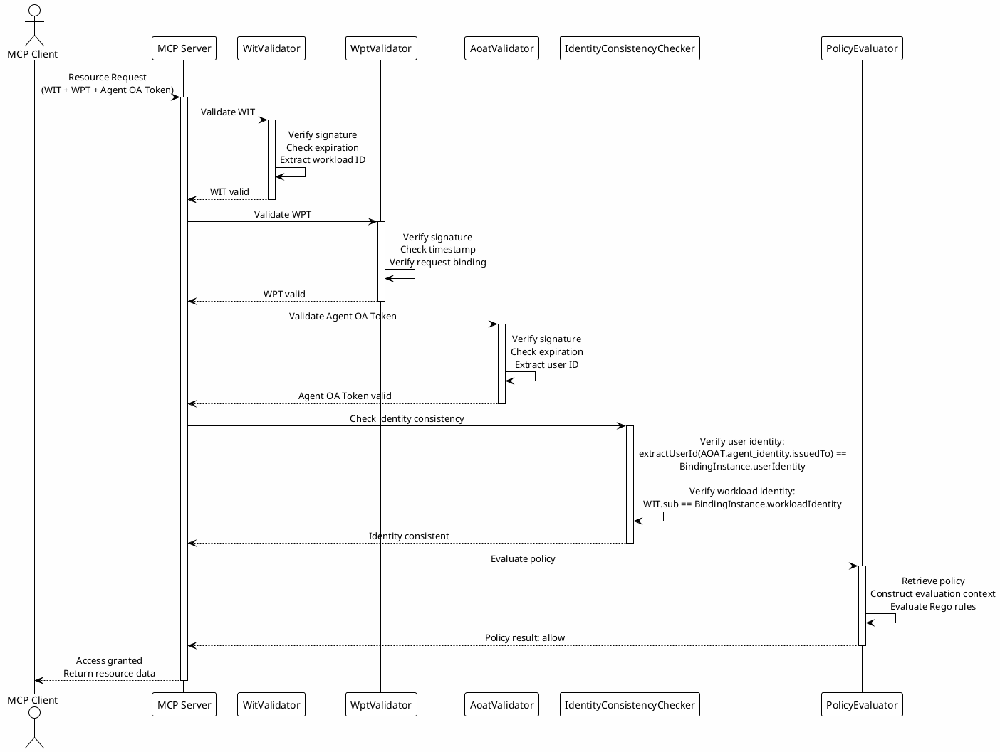

# Authorization Flow Architecture

This directory contains comprehensive documentation about the authorization flow implementation in the Open Agent Auth framework.

## Overview

The Authorization Flow architecture implements a comprehensive, standards-based authorization mechanism for AI agent operations, designed around the principle that every agent-executed operation must be traceable back to explicit user consent. This architecture follows the Agent Operation Authorization specification, where the Authorization Server acts as the witness of user consent, cryptographically binding the original user intent to the authorized operation through semantic audit trails.

The flow is orchestrated through the AOA (Agent Operation Authorization) Bridge pattern, which coordinates between multiple identity providers and authorization components. This pattern enables agents to obtain the necessary credentials and tokens while maintaining a clear separation of concerns: user authentication is handled by dedicated IDPs, workload identity is managed through WIMSE protocols, and authorization decisions are made by the Authorization Server with policy evaluation through OPA.

The Authorization Flow layer implements the core authorization logic of the Open Agent Auth framework, managing the complete lifecycle from agent operation proposals to access token issuance. This layer builds upon OAuth 2.0 and OpenID Connect standards while extending them with specialized features for AI agent scenarios, including Pushed Authorization Requests (PAR), fine-grained policy evaluation, and comprehensive audit tracking. The authorization flow ensures that agents can only perform operations explicitly authorized by users, with all decisions being cryptographically verifiable and fully auditable.

The authorization architecture follows a multi-stage approach that separates concerns between request preparation, authorization processing, and token issuance. This separation enables independent scaling of different components, clear security boundaries, and flexible integration with various identity providers and policy engines. The flow is designed to be both secure and user-friendly, balancing strong security guarantees with a smooth authorization experience that doesn't overwhelm users with technical details.

## OAuth 2.0 Authorization Code Flow

### Standard Authorization Flow

The authorization flow begins with the OAuth 2.0 authorization code grant, which provides a secure mechanism for obtaining user authorization without exposing user credentials to the agent. The agent initiates the flow by redirecting the user to the authorization server's authorization endpoint, providing parameters that describe the authorization request including the client identifier, requested scopes, redirect URI, and a state parameter for CSRF protection.

The authorization server receives the authorization request and must first authenticate the user before proceeding. This authentication is delegated to the AS User IDP, which verifies the user's identity through configured authentication methods such as username/password, SMS verification, or multi-factor authentication. The authentication result is returned as an ID Token that contains the user's subject identifier and other identity claims.

Once the user is authenticated, the authorization server presents a consent screen showing the specific operation the agent intends to perform. This consent screen is critical for transparency, ensuring users understand exactly what they are authorizing before granting permission. The screen displays the operation description, the resources that will be accessed, any conditions or limitations on the authorization, and the duration of the authorization. Users can either approve or deny the authorization request.

If the user approves the request, the authorization server generates an authorization code and redirects the user back to the agent's redirect URI with the code as a query parameter. The authorization code is a short-lived, single-use token that serves as proof of the user's authorization. The agent then exchanges this authorization code for an Agent OA Token by making a token request to the authorization server's token endpoint, providing the authorization code, client credentials, and the original redirect URI.

The authorization server validates the authorization code, ensuring it hasn't been used before and hasn't expired, then issues an Agent OA Token. This token contains the user's subject identifier, the agent's identity, the authorized scopes and permissions, policy information for access control decisions, and a complete audit trail of the authorization process. The token is cryptographically signed using the authorization server's private key, allowing resource servers to verify its authenticity without requiring additional calls to the authorization server.

### Pushed Authorization Request Extension

The framework extends the standard OAuth 2.0 flow with Pushed Authorization Request (PAR), as defined in RFC 9126, to enhance security for agent authorization scenarios. PAR addresses several security concerns in traditional OAuth flows where authorization parameters are transmitted through browser redirects, potentially exposing sensitive information to intermediaries or allowing parameter manipulation.

In the PAR flow, the agent first prepares a complete authorization request including all necessary parameters such as client ID, redirect URI, scopes, response type, state, and agent-specific extensions like evidence, operation proposals, and context information. This request is formatted as a JWT (PAR-JWT) and signed using the workload's private key, creating a cryptographically protected authorization request that cannot be forged or modified without detection.

The agent submits this PAR-JWT to the authorization server's PAR endpoint using an HTTP POST request with application/x-www-form-urlencoded content type. The request includes client authentication, typically using the private_key_jwt method where the client assertion is signed with the workload's private key, establishing a strong binding between the authorization request and the workload identity.

The authorization server validates the PAR-JWT by verifying its signature using the workload's public key extracted from the WIT, checking the token's expiration and issuance time, validating the issuer and audience claims, and ensuring all required claims are present. It also validates the embedded evidence including the user ID Token (verifying its signature and extracting the user subject) and the WIT (verifying its signature and extracting the agent_identity binding). The server performs identity consistency verification by checking that the user ID Token's subject matches the WIT's agent_identity.issuedTo field, ensuring the workload is bound to the authenticated user.

After successful validation, the authorization server generates a unique request URI and stores the authorization request parameters in a temporary store, typically with a short expiration time (default 90 seconds). The request URI is returned to the agent in a JSON response containing the request_uri and expires_in fields. The agent then redirects the user to the authorization server's authorization endpoint with the request_uri parameter instead of including all authorization parameters directly in the redirect URL.

The authorization server retrieves the stored authorization request using the request URI, ensuring that the request hasn't expired and hasn't been used before. The request_uri is single-use, preventing replay attacks where an attacker could reuse a valid authorization request. The server then proceeds with user authentication and consent presentation as in the standard flow.

The PAR extension provides several security benefits. Authorization parameters are transmitted directly to the authorization server over a secure TLS channel, avoiding exposure through browser redirects. The PAR-JWT signature ensures parameter integrity, preventing modification during transmission. The short expiration and single-use nature of request URIs limits the window for replay attacks. Client authentication using private_key_jwt provides strong client authentication that is cryptographically bound to the workload identity.

### PAR Request Processing

When the agent initiates an authorization request, it uses OAuth 2.0 Pushed Authorization Requests (PAR) to securely transmit operation proposals to the Authorization Server. The PAR mechanism prevents sensitive operation data from leaking through URLs and provides a secure, server-side storage mechanism for authorization parameters.

The PAR request includes several critical components that enable comprehensive authorization evaluation. The agent constructs a JWT containing the agent_operation_proposal claim, which defines the operation the agent intends to perform. This proposal is cryptographically signed to ensure integrity and authenticity. The request also includes the user's ID Token and the workload's WIT, establishing the identity context for the authorization.

The Authorization Server, acting as the witness of user consent, validates the semantic audit trail embedded in the request. This includes verifying the W3C Verifiable Credential that captures the user's original prompt and the agent's interpretation, ensuring that the transformation from user intent to operation proposal is transparent and auditable. The server extracts this evidence and stores it for later inclusion in the access token, creating a cryptographically verifiable link between the user's consent and the authorized operation.

## Agent OA Token Structure

### Token Claims

The Agent Operation Authorization Token (Agent OA Token) is a JWT that encapsulates all authorization information needed for resource access decisions. The token follows the standard JWT structure with a header, payload, and signature, using the ES256 signing algorithm by default for strong security with reasonable performance.

The token header contains the algorithm identifier (alg) and token type (typ), following JWT standards. The payload contains a rich set of claims that provide comprehensive authorization context. The standard JWT claims include the issuer (iss) identifying the authorization server, subject (sub) containing the user's subject identifier, audience (aud) specifying the intended recipients (typically resource servers), expiration time (exp), issued at time (iat), and JWT identifier (jti) for token tracking and potential revocation.

The agent_identity claim contains the binding information between the user and the workload, including the issuedTo field with the user's subject identifier and the workloadId field with the WIMSE workload identifier. This claim enforces the identity consistency requirement that the token can only be used by the specific workload that was bound to the specific user during authorization.

The agent_operation_authorization claim contains the authorization details including the operationType field describing the type of operation being authorized, the resourceId field identifying the target resource, the scopes field listing the granted permissions, and the conditions field specifying any limitations or conditions on the authorization such as time restrictions, rate limits, or data constraints.

The policy claim contains policy evaluation information including the policyId field referencing the registered OPA policy, the policyVersion field identifying the specific version of the policy, and the policyParameters field containing any parameters passed to the policy during evaluation. This information enables resource servers to perform consistent policy evaluation and supports policy versioning and rollback.

The evidence claim contains the cryptographic evidence supporting the authorization decision, including the userIdentityTokenHash field with a hash of the user ID Token, the workloadIdentityTokenHash field with a hash of the WIT, and the promptVc field containing the W3C Verifiable Credential representing the user's original input. This evidence provides a complete audit trail and enables verification that the authorization was based on valid user authentication and workload identity.

The audit_trail claim contains comprehensive audit information including the authorizationTimestamp field with the time when authorization was granted, the userConsent field indicating whether the user explicitly consented, the consentIpAddress field capturing the IP address from which consent was given, the consentUserAgent field recording the browser or client used for consent, and the semanticExtensionLevel field indicating the degree to which the agent extended the user's original intent.

### Token Security

The Agent OA Token implements several security measures to protect against common attacks while maintaining usability. Tokens are signed using asymmetric cryptography, allowing any component with access to the authorization server's public key to verify the token's authenticity. This signature verification is performed by resource servers without requiring additional calls to the authorization server, enabling distributed authorization decisions.

The token expiration time is set based on the sensitivity of the authorized operation and the expected duration of the operation. Short expiration times (5-15 minutes) are appropriate for sensitive operations like financial transactions, while longer expiration times (1-4 hours) may be acceptable for less sensitive operations like read-only queries. The expiration time should balance security (shorter is better) with usability (longer is better) and should be configurable per operation type.

The token includes a JWT identifier (jti) claim that uniquely identifies the token instance. This identifier can be used for token revocation tracking, allowing the authorization server to maintain a blacklist of revoked tokens. While the framework primarily relies on expiration for token invalidation, the jti claim provides a mechanism for immediate revocation in security incident scenarios.

The token signature covers all claims in the payload, ensuring that any modification to the token content invalidates the signature. This prevents token tampering where an attacker might attempt to modify the scopes, extend the expiration time, or change other claims to gain unauthorized access.

## Five-Layer Verification Architecture

### Layer 1: Workload Authentication

The first layer of verification validates the Workload Identity Token (WIT) to establish the workload's identity. This verification is performed by the WitValidator component, which checks the token's signature using the Agent IDP's public key obtained from the JWKS endpoint. The validator verifies that the signature was generated by the legitimate Agent IDP, preventing forgery of workload identities.

The validator checks several standard JWT claims including the expiration time (exp) to ensure the token hasn't expired, the issued at time (iat) to detect clock skew issues, the issuer (iss) claim to verify the token was issued by a trusted Agent IDP, and the audience (aud) claim to ensure the token is intended for the current resource server. These checks prevent expired tokens, tokens from untrusted issuers, and tokens intended for other services from being accepted.

The validator extracts the workload-specific claims including the subject (sub) containing the WIMSE workload identifier and the confirmation (cnf) claim containing the workload's public key. These claims are used in subsequent verification layers to establish identity consistency and perform authorization decisions.

The WIT validation is computationally intensive due to the cryptographic signature verification, but it provides strong security guarantees by ensuring that only authenticated workloads can access resources. The validation result is cached for the token's lifetime to avoid repeated verification for the same token in subsequent requests.

### Layer 2: Request Integrity

The second verification layer validates the Workload Proof Token (WPT) to ensure the integrity and authenticity of the HTTP request. The WPT is generated using HTTP Message Signatures (RFC 9421), where specific components of the HTTP request including the method, URI, headers, and body are signed using the workload's private key. This signature proves that the request originated from the workload that possesses the private key corresponding to the public key in the WIT.

The WptValidator component extracts the signature from the X-Workload-Proof header and verifies it using the public key extracted from the WIT. The validator reconstructs the signed message components from the HTTP request and verifies that the signature matches, ensuring that the request hasn't been modified in transit. The validator checks the signature timestamp to ensure the request is recent, preventing replay attacks where old valid requests are resent.

The validator verifies that the signature covers the required components including the HTTP method (htm), HTTP URI (htu), and WIT hash (wth) claims. The WIT hash ensures that the request is bound to a specific WIT instance, preventing an attacker from using a valid signature with a different WIT.

Request integrity verification is particularly important in distributed environments where requests may pass through multiple intermediaries such as proxies, load balancers, and API gateways. The WPT ensures that even if these intermediaries modify the request, the modification will be detected and the request will be rejected.

### Layer 3: User Authentication

The third verification layer validates the Agent OA Token to establish the user's authorization. This verification is performed by the AoatValidator component, which checks the token's signature using the authorization server's public key obtained from the JWKS endpoint. The validator verifies that the signature was generated by the legitimate authorization server, preventing forgery of authorization tokens.

The validator checks the standard JWT claims including expiration time, issued at time, issuer, and audience, similar to the WIT validation. Additionally, the validator checks the token's scope to ensure it includes the required permissions for the requested operation, and extracts the user subject identifier from the sub claim for use in identity consistency verification.

The AoatValidator also validates the agent_identity claim, extracting the issuedTo field and workloadId field for identity consistency verification. This ensures that the authorization token is bound to a specific workload and user, preventing token reuse across different workloads or users.

The Agent OA Token validation is the most critical layer in the verification architecture because it represents the user's explicit authorization for the operation. Any failure at this layer indicates that the agent is not authorized to perform the operation, and the request should be rejected immediately.

### Layer 4: Identity Consistency

The fourth verification layer ensures that the user identity, workload identity, and authorization identity are consistently bound together. This verification is performed by the IdentityConsistencyValidator component, which performs a two-layer verification using the BindingInstance.

The first layer verifies user identity consistency by extracting the user ID from the Agent OA Token's agent_identity.issuedTo field (format: "issuer|userId") and retrieving the corresponding BindingInstance from the Authorization Server using the agent_identity.id as the key. The validator then verifies that the extracted user ID matches the BindingInstance's userIdentity, ensuring that the authorization token is bound to the same user who granted authorization.

The second layer verifies workload identity consistency by extracting the workload identity from the WIT's sub claim and verifying that it matches the BindingInstance's workloadIdentity. This ensures that the authorization token is bound to the specific workload making the request, preventing token reuse across different workloads, even if they are bound to the same user.

Identity consistency verification is the cornerstone of the framework's security model, ensuring that the chain of trust from user authentication through workload creation to authorization issuance remains intact. Any inconsistency in this chain indicates a potential security breach and causes immediate rejection of the request.

### Layer 5: Policy Evaluation

The fifth and final verification layer performs fine-grained access control using OPA (Open Policy Agent) policy evaluation. This layer is implemented by the PolicyEvaluator component, which retrieves the policy referenced in the Agent OA Token and evaluates it against the request context.

The policy evaluator extracts the policyId from the Agent OA Token's policy claim and retrieves the policy from the PolicyRegistry. The registry may be implemented as an in-memory store for simple deployments or as a distributed cache or database for production deployments requiring policy persistence and sharing across multiple instances.

The evaluator constructs a policy evaluation input containing the request context including the user identity, workload identity, operation type, resource identifier, HTTP method, URI, headers, and body. This context provides the policy with all relevant information needed to make an access control decision.

The policy itself is written in Rego, a declarative policy language designed specifically for access control. Rego policies define rules that evaluate to allow or deny based on the input context. The framework supports complex policy logic including conditional permissions, time-based restrictions, rate limiting, data masking, and custom business rules.

The policy evaluation result is a boolean decision (allow or deny) along with any additional metadata such as the reason for denial or data filtering instructions. If the policy evaluation result is allow, the request proceeds to the resource access handler. If the result is deny, the request is rejected and an error response is returned to the agent.

The policy evaluation layer provides the flexibility to implement fine-grained, context-aware access control that goes beyond simple scope-based authorization. Policies can consider factors such as the user's role, the resource's sensitivity, the time of day, the user's location, and the data being accessed to make nuanced authorization decisions.

## Implementation Details

### Core Components

The authorization flow functionality is implemented across several core modules in the framework. The `open-agent-auth-core` module contains the fundamental interfaces and models for OAuth 2.0 and PAR, including `OAuth2ParClient` and `OAuth2ParServer` interfaces that define the contract for pushed authorization requests. These interfaces support both standard OAuth 2.0 PAR flows and the extended Agent Operation Authorization flows with additional claims and validation requirements.

The `DefaultOAuth2ParClient` implementation provides client-side PAR functionality, constructing PAR-JWT requests, submitting them to the authorization server, and handling request_uri responses. The client supports the `private_key_jwt` client authentication method, where the client assertion is signed with the workload's private key, establishing a strong cryptographic binding between the PAR request and the workload identity.

The `AapOAuth2ParServer` interface extends the standard PAR server with agent-specific validation requirements. The `DefaultOAuth2ParServer` implementation validates PAR-JWT requests, extracts and validates embedded evidence (ID Token and WIT), performs identity consistency verification, and generates request URIs. The server maintains a temporary store of authorization requests with configurable expiration time, ensuring that request URIs remain secure and single-use.

The `OAuth2AuthorizationServer` interface defines the contract for processing authorization requests and issuing authorization codes, following RFC 6749 specifications. The `DefaultOAuth2AuthorizationServer` implementation handles user authentication, consent presentation, authorization code generation, and code storage. The implementation supports both traditional OAuth 2.0 authorization code flows and PAR-enhanced flows.

The five-layer verification is implemented by the `FiveLayerVerifier` interface, which orchestrates the sequential execution of all verification layers. The `DefaultFiveLayerVerifier` implementation delegates to specialized validator components including `WitValidator`, `WptValidator`, and `AoatValidator`, and integrates with the `PolicyEvaluator` for policy-based access control. The verifier returns a comprehensive `VerificationResult` containing the validation outcome, any errors encountered, and the extracted identity and policy information.

### Policy Evaluation

The OPA policy evaluation mechanism provides flexible, fine-grained access control that can be customized without code changes. Policies are written in Rego language and registered with the `PolicyRegistry` interface, which manages policy lifecycle operations including registration, retrieval, deletion, and listing. The `InMemoryPolicyRegistry` implementation stores policies in memory for simple deployments, while production deployments may use database-backed or distributed registry implementations.

The `PolicyEvaluator` interface defines the contract for evaluating policies against request contexts. The `LightweightPolicyEvaluator` implementation provides a streamlined evaluation engine that is optimized for the specific requirements of the Agent Operation Authorization framework. The evaluator constructs evaluation inputs from the request context, executes the Rego policy, and returns the evaluation result with any additional metadata.

Policy definitions can reference complex conditions and business logic. For example, a policy might restrict access to sensitive resources to users with specific roles, limit access to business hours, enforce rate limits per user, or apply data masking rules based on user permissions. The Rego language supports these capabilities through its rich set of built-in functions and composable rule structures.

The framework supports policy versioning, allowing multiple versions of a policy to coexist. The Agent OA Token includes a policyVersion claim that specifies which version should be used for evaluation, enabling controlled policy rollouts and rollbacks. Versioning is particularly important in production environments where policies need to be updated without disrupting ongoing operations.

### Spring Boot Integration

The authorization server functionality is automatically configured through Spring Boot autoconfiguration when `open-agent-auth.role` is set to `authorization-server`. The `AuthorizationServerAutoConfiguration` class creates beans for all required components including PAR server, authorization server, token server, policy registry, and policy evaluator.

Configuration properties for the authorization server are defined in `AuthorizationServerProperties` class, which supports configuration of PAR endpoint settings, token issuance parameters, client registration settings, and policy evaluation options. These properties can be configured through YAML or properties files, providing a flexible configuration mechanism that doesn't require code changes.

The autoconfiguration uses conditional annotations to ensure that beans are only created when appropriate conditions are met. The `@ConditionalOnProperty` annotation checks for the correct role configuration, while `@ConditionalOnMissingBean` allows developers to override default implementations with custom beans. This design provides sensible defaults while maintaining flexibility for customization scenarios.

The framework also supports dynamic client registration (DCR) through the `OAuth2DcrClient` interface, which allows agents to register themselves as OAuth clients with the authorization server dynamically. The `AgentDcrAutoRegistrationConfiguration` handles automatic DCR registration for agents, simplifying the integration process. According to the architecture design, DCR registration should be performed dynamically during the authorization flow using WIT as authentication proof, with WIT.sub as the client_id and private_key_jwt as the authentication method.

## Security Considerations

### Authorization Code Security

Authorization codes are critical security tokens that represent user authorization and must be strongly protected. The framework implements several security measures for authorization codes including cryptographic randomness (minimum 128 bits of entropy), short expiration time (default 10 minutes), single-use enforcement (codes are immediately invalidated after being exchanged), and binding to client_id and redirect_uri (prevents code interception attacks).

The authorization code storage uses secure random generation algorithms to ensure unpredictability. Codes are stored in a secure registry that prevents unauthorized access and supports concurrent operations. The registry implementation should use encryption-at-rest for production deployments to protect codes even if the storage system is compromised.

The framework validates the redirect_uri parameter against the registered redirect URI for the client, preventing open redirect attacks where an attacker might redirect the authorization code to a malicious endpoint. The validation ensures that the redirect URI exactly matches (or is a subpath of) the registered URI, depending on the client's registration configuration.

### Token Security

The framework implements comprehensive token security measures to protect against token theft, replay, and tampering. All tokens are signed using asymmetric cryptography, allowing verification without sharing secrets. Token signatures are verified on every use, ensuring that modified tokens are rejected immediately.

Token expiration is enforced strictly, with no grace period for expired tokens. The framework supports clock skew tolerance (configurable, default 60 seconds) to handle minor time synchronization issues between servers, but tokens that are significantly past their expiration time are always rejected.

Token revocation is supported through a blacklist mechanism that tracks revoked token identifiers. While the framework primarily relies on expiration for token invalidation, the blacklist provides a mechanism for immediate revocation in security incident scenarios. The blacklist can be implemented as an in-memory cache for simple deployments or as a distributed cache for production deployments requiring high availability.

The framework supports token introspection through the OAuth 2.0 Token Introspection endpoint (RFC 7662), allowing resource servers to query the authorization server for token status and metadata. This is particularly useful for scenarios where tokens may be revoked before their expiration time.

### Replay Attack Prevention

The framework implements multiple layers of replay attack prevention. The PAR protocol's single-use request_uri prevents replay of authorization requests. Authorization codes are single-use and immediately invalidated after being exchanged. The WPT signature includes a timestamp that limits the validity window for signed requests.

The framework maintains state for all authorization codes and request URIs, tracking whether they have been used. This state is stored with expiration times, ensuring that old state is automatically cleaned up. The state storage should be designed for high concurrency and low latency to avoid becoming a performance bottleneck.

For additional protection, the framework supports nonce parameters in authorization requests, which provide additional randomness that must be included in the authorization code. The nonce is returned in the token and verified by the client, preventing replay attacks where an attacker might reuse an authorization code.

### Token Issuance

After the user approves the authorization request, the Authorization Server issues an Agent Operation Authorization Token (AOAT) that grants the agent permission to perform the requested operation. This token is a JWT that includes all necessary claims for authorization enforcement, including the user identity, workload identity, operation scope, and policy reference.

The token issuance process incorporates the semantic audit trail as a core component. The audit_trail claim within the token captures the complete context of the authorization decision, including the original user prompt (via a W3C VC), the rendered operation description, the semantic expansion details, and the user confirmation timestamp. This audit information is cryptographically signed by the Authorization Server, serving as verifiable evidence of the user's consent and enabling post-hoc analysis in case of disputes or compliance audits.

The Authorization Server also registers the policy referenced in the token, ensuring that the same policy is available to all resource servers that will validate the token. This registration process creates a shared understanding of the authorization rules across the distributed system, enabling consistent enforcement and reducing the risk of policy drift.

## Performance and Scalability

### Caching Strategies

The authorization flow implements several caching strategies to improve performance while maintaining security. JWKS responses are cached with a configurable TTL (default 300 seconds) to reduce HTTP requests to JWKS endpoints. The cache is refreshed before expiration to ensure that key rotation doesn't cause service interruption.

Token validation results are cached for the token's remaining lifetime, avoiding repeated signature verification for the same token. The cache key includes the token's JWT identifier (jti) and a hash of the token content, ensuring that modified tokens are not cached incorrectly. The cache is invalidated when tokens expire or are revoked.

Policy evaluation results can be cached for identical request contexts, particularly for policies that produce deterministic results. The cache key includes the policy ID, version, and a hash of the evaluation input. This caching is most effective for frequently accessed resources with simple policies.

Authorization code and request_uri state is stored in an in-memory cache with automatic expiration, providing fast access without database queries. For deployments requiring persistence or horizontal scaling, this can be replaced with distributed caching solutions like Redis.

### Scalability

The authorization flow architecture is designed for horizontal scalability. Stateless token validation allows multiple authorization server instances to be deployed behind load balancers, with each instance able to validate tokens independently using only public keys from JWKS endpoints.

Stateful components such as the authorization code store and PAR request store can be scaled using distributed caching solutions. The interface abstraction allows replacing in-memory implementations with Redis, Memcached, or database-backed implementations that support horizontal scaling and high availability.

Policy evaluation can be scaled by deploying multiple policy evaluator instances with a shared policy registry. The registry interface supports distributed implementations that maintain policy consistency across instances. Policy evaluation is typically fast (sub-millisecond for most policies), so scaling is primarily driven by request volume rather than evaluation complexity.

The framework supports sharding of state storage by user ID or client ID, allowing the storage layer to scale to handle millions of concurrent authorization requests. This sharding strategy ensures that no single storage node becomes a bottleneck.

### Monitoring and Observability

Comprehensive monitoring and observability are essential for operating the authorization flow in production. The framework logs all authorization events including PAR submissions, user authentications, consent decisions, token issuances, and validation failures. Each log entry includes correlation IDs to enable tracing of complete authorization flows.

Metrics are exposed for critical operations including PAR request latency, authorization code issuance rate, token validation duration, policy evaluation time, and cache hit rates. These metrics can be integrated with monitoring systems like Prometheus to provide real-time visibility into system performance and identify potential issues before they impact users.

Distributed tracing support allows authorization flows to be traced across all components, from PAR submission through user authentication to token issuance. This tracing capability is invaluable for diagnosing performance issues and understanding the end-to-end behavior of complex authorization scenarios.

The framework supports health check endpoints that report the status of critical components including JWKS endpoint connectivity, policy registry availability, and storage system health. These health checks enable automated alerting and failover in production deployments.
