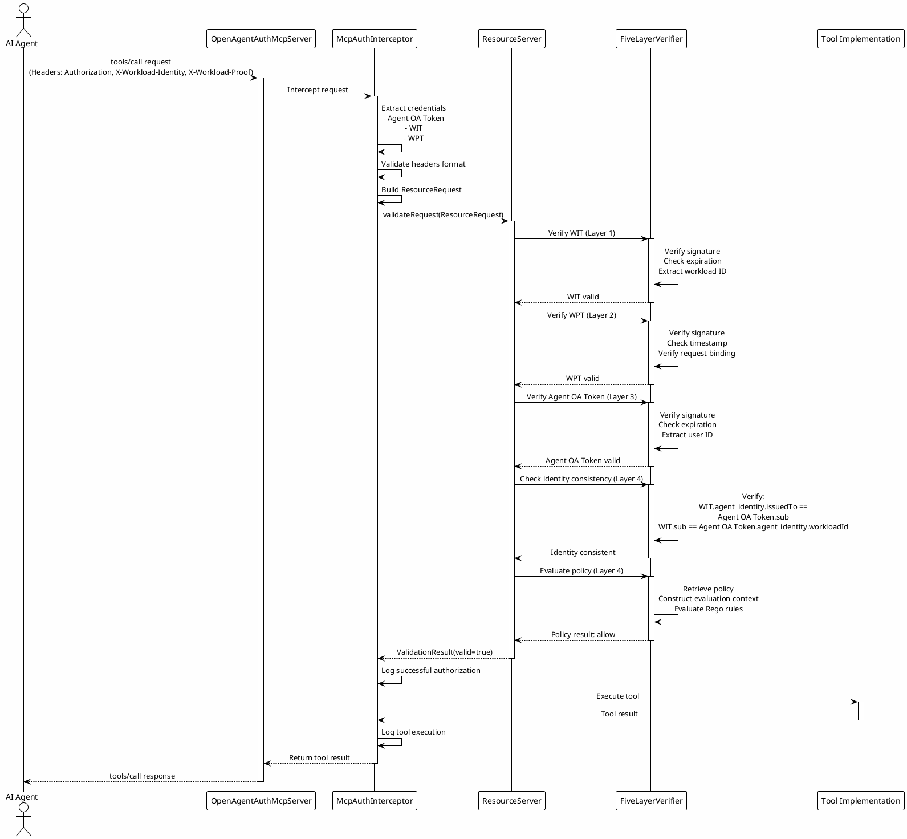

# MCP Protocol Adapter

The Model Context Protocol (MCP) adapter layer provides seamless integration between the Open Agent Auth framework's security capabilities and the MCP protocol, enabling AI agents to securely access tools and resources while maintaining comprehensive authorization and auditability. This adapter acts as a bridge between standardized MCP tool invocation patterns and the framework's five-layer verification architecture, ensuring that every tool execution is properly authenticated, authorized, and audited, following the Agent Operation Authorization specification's requirements for transparent and verifiable agent operations.

The MCP adapter implements the MCP protocol specification while extending it with Agent Operation Authorization capabilities. It intercepts all tool invocation requests, extracts authentication credentials from HTTP headers, performs the five-layer verification, and either allows the tool execution to proceed or rejects it with appropriate error messages. This transparent integration means that MCP servers can benefit from strong security guarantees without requiring changes to their core tool implementation logic, while maintaining semantic audit trails that capture the complete context from user intent to tool execution.

## MCP Protocol Fundamentals

The Model Context Protocol defines a standardized communication protocol between AI agents and tools, enabling interoperability across different agent platforms and tool providers. The protocol uses JSON-RPC 2.0 as its transport mechanism, providing a simple yet flexible foundation for tool invocation and result handling. MCP supports multiple transport layers including HTTP, WebSocket, and stdio, with the framework primarily focusing on HTTP-based transport for web application scenarios.

The protocol defines several core concepts including tools, resources, and prompts. Tools represent executable operations that agents can invoke, such as data queries, computations, or external service calls. Resources represent data sources that agents can access, such as files, databases, or API endpoints. Prompts represent pre-defined templates that help agents structure their interactions with tools or resources. Each of these concepts has associated metadata including name, description, input schema, and output schema.

The MCP protocol flow begins with tool discovery, where the agent queries the server for available tools using the `tools/list` method. The server responds with a list of tool definitions including their names, descriptions, and input schemas. The agent then invokes a tool using the `tools/call` method, providing the tool name and input parameters that conform to the tool's input schema. The server executes the tool and returns the result, which may include text output, images, or structured data.

The standard MCP protocol does not define security mechanisms for tool invocation, leaving security implementation to the transport layer or application-specific extensions. This creates a challenge in enterprise environments where tools may access sensitive resources or perform privileged operations. The Open Agent Auth MCP adapter addresses this gap by integrating comprehensive authorization capabilities directly into the MCP protocol flow.

The adapter enforces several security requirements that are critical for enterprise deployment. Every tool invocation must include valid authentication credentials proving the identity of both the user and the workload. The authorization must be specific to the requested operation, with scopes and permissions matching the tool's capabilities. The entire flow must be auditable, recording who invoked which tool, when, and with what parameters. Access control must be fine-grained, allowing policies to consider factors such as user roles, resource sensitivity, and contextual conditions.

These security requirements are implemented through the five-layer verification architecture, which validates the workload identity, request integrity, user authorization, identity consistency, and policy compliance before allowing any tool execution. This comprehensive approach ensures that even if a tool implementation has vulnerabilities, the authorization layer provides strong protection against unauthorized access.

## OpenAgentAuthMcpServer Design

The OpenAgentAuthMcpServer class serves as the primary integration point between MCP protocol handling and Agent Operation Authorization. It wraps standard MCP server implementations and intercepts all incoming requests to perform security validation before allowing tool execution. This design follows the decorator pattern, where the OpenAgentAuthMcpServer adds security capabilities to existing MCP servers without requiring modifications to their core functionality.

The server architecture consists of three main components: the authentication interceptor, the resource server orchestrator, and the audit logger. The authentication interceptor (McpAuthInterceptor) extracts authentication credentials from HTTP headers and performs initial validation. The resource server orchestrator executes the five-layer verification and makes authorization decisions. The audit logger records all tool invocation attempts and outcomes for compliance and security monitoring.

This separation of concerns enables independent evolution of each component. The authentication interceptor can be extended to support additional authentication methods or header formats without affecting the verification logic. The resource server orchestrator can be upgraded to new verification algorithms without changing the MCP protocol handling. The audit logger can be enhanced to support additional logging destinations or formats without impacting the core authorization flow.

### Authentication Interceptor

The McpAuthInterceptor is responsible for extracting authentication credentials from HTTP requests and preparing them for verification. It implements a non-invasive interception mechanism that works with standard HTTP-based MCP servers, requiring only that the client include specific headers in their requests.

The interceptor expects three authentication headers: the Authorization header containing the Agent OA Token in Bearer token format, the X-Workload-Identity header containing the WIT, and the X-Workload-Proof header containing the WPT. These headers are extracted and validated for presence and format before being passed to the resource server for comprehensive verification.

The interceptor constructs a ResourceRequest object containing all the information needed for verification, including the extracted tokens, HTTP method, URI, headers, and body. This request object is passed to the resource server's validateRequest method, which performs the five-layer verification and returns a ValidationResult indicating whether the request should be allowed.

The interceptor handles various error scenarios gracefully. If required headers are missing, it returns a clear error message indicating which header is missing. If token extraction fails due to malformed headers, it returns an appropriate error. If verification fails at any layer, it returns the error details from the verification result. This comprehensive error handling ensures that clients receive actionable feedback when their requests are rejected.

### Resource Server Integration

The OpenAgentAuthMcpServer integrates with the ResourceServer interface to leverage the framework's five-layer verification architecture. This integration is achieved through dependency injection, where the ResourceServer implementation is provided to the OpenAgentAuthMcpServer constructor and used for all authorization decisions.

The ResourceServer interface defines a single method, validateRequest, which takes a ResourceRequest object and returns a ValidationResult. The ValidationResult contains a boolean indicating whether the request is valid, a list of error messages if validation failed, and extracted identity and policy information if validation succeeded. This simple interface abstracts away the complexity of the five-layer verification, allowing the MCP adapter to focus on protocol-specific concerns.

The integration enables the MCP adapter to benefit from all the security capabilities of the ResourceServer, including WIT validation, WPT verification, Agent OA Token validation, identity consistency checking, and policy evaluation. This means that MCP tools automatically inherit the same strong security guarantees as other resource access mechanisms in the framework.

## Tool Registration and Execution

The MCP protocol requires tools to be registered with the server before they can be invoked by agents. The OpenAgentAuthMcpServer supports tool registration through the standard MCP `tools/list` method, which returns a list of available tools with their metadata. This registration process is typically performed when the server starts up, but can also be dynamic, allowing tools to be added or removed at runtime.

Tool metadata includes the tool name, description, input schema, and output schema. The input schema defines the expected structure and types of input parameters, enabling validation and auto-completion in agent implementations. The output schema defines the structure of the return value, enabling agents to parse and process results correctly.

The OpenAgentAuthMcpServer does not modify the tool registration process, allowing existing MCP server implementations to continue using their standard registration mechanisms. However, the adapter can enhance tool metadata by adding security-related information such as required scopes, sensitivity levels, or policy identifiers. This information helps agents understand the security requirements of each tool and obtain appropriate authorization before invoking them.

### Tool Invocation Flow

The tool invocation flow begins when an agent sends a `tools/call` request to the MCP server. The request includes the tool name and input parameters that conform to the tool's input schema. The OpenAgentAuthMcpServer intercepts this request before it reaches the underlying tool implementation.

The interceptor first extracts the authentication credentials from the HTTP headers, validating that all required headers are present and properly formatted. It then constructs a ResourceRequest object containing the authentication tokens, HTTP method, URI, headers, and body. This object represents the complete context needed for authorization verification.

The interceptor calls the ResourceServer's validateRequest method with the ResourceRequest object. The ResourceServer performs the five-layer verification, checking the WIT signature and claims, verifying the WPT signature and request binding, validating the Agent OA Token signature and authorization, checking identity consistency between user and workload, and evaluating the OPA policy for the requested operation. This comprehensive verification ensures that every tool invocation is traceable back to explicit user consent through the semantic audit trail embedded in the tokens.

If any layer of verification fails, the ResourceServer returns a ValidationResult with isValid set to false and error messages describing the failure. The interceptor returns an error response to the agent, preventing tool execution. The error response includes details about which verification layer failed and why, enabling the agent to understand and potentially correct the issue.

If all verification layers pass, the ResourceServer returns a ValidationResult with isValid set to true, along with extracted identity and policy information. The interceptor allows the request to proceed to the underlying tool implementation, which executes the tool and returns the result. The interceptor also logs the successful tool invocation for audit purposes, recording the user identity, workload identity, tool name, input parameters, and execution result, enabling post-hoc analysis and compliance verification.

## Error Handling and Response

When tool invocation requests fail verification, the OpenAgentAuthMcpServer returns structured error responses that help agents understand and potentially correct the issue. Error responses follow the JSON-RPC 2.0 error format, including an error code, message, and optional data field with additional details.

The error codes are organized by verification layer, enabling agents to quickly identify which security check failed. Layer 1 errors (error codes 1000-1099) indicate WIT validation failures, such as invalid signature, expired token, or untrusted issuer. Layer 2 errors (error codes 1100-1199) indicate WPT validation failures, such as invalid signature or timestamp mismatch. Layer 3 errors (error codes 1200-1299) indicate Agent OA Token validation failures, such as invalid signature, expired token, or insufficient scope. Layer 4 errors (error codes 1300-1399) indicate identity consistency failures, where the user and workload identities don't match as expected. Layer 5 errors (error codes 1400-1499) indicate policy evaluation failures, where the OPA policy denies access.

The error message provides a human-readable description of the failure, helping developers diagnose issues during integration and testing. The data field includes additional details such as the specific claim that failed validation, the expected value, and the actual value received. This detailed information enables agents to provide meaningful feedback to users and potentially retry the request with corrected credentials.

The framework supports retry mechanisms for certain types of failures, particularly transient failures such as network timeouts or temporary service unavailability. Agents can implement exponential backoff retry logic for these scenarios, gradually increasing the delay between retries to avoid overwhelming the server.

However, for security-related failures such as invalid credentials, insufficient permissions, or policy denials, retry is unlikely to succeed without corrective action. In these cases, the error response should guide the user or agent to take appropriate action, such as re-authenticating, obtaining additional authorization, or modifying the request parameters.

The framework also supports token refresh mechanisms, where agents can obtain new Agent OA Tokens using refresh tokens when the current token expires. This enables long-running agent sessions without requiring repeated user authentication, while still maintaining security through time-limited access tokens.

## Implementation Details

The MCP adapter functionality is implemented in the `open-agent-auth-mcp-adapter` module, which provides the integration layer between MCP protocol handling and the Open Agent Auth framework. The module contains two main classes: `OpenAgentAuthMcpServer` and `McpAuthInterceptor`.

The `OpenAgentAuthMcpServer` class implements the server-side integration, wrapping MCP server implementations and adding security capabilities. The class is designed to be framework-agnostic, working with any standard MCP server implementation that follows the JSON-RPC 2.0 specification. The server maintains references to the ResourceServer for authorization decisions and an audit logger for recording tool invocation events.

The `McpAuthInterceptor` class implements the request interception logic, extracting authentication credentials from HTTP headers and preparing verification requests. The class is responsible for header parsing, format validation, and ResourceRequest construction. It also handles error response generation, ensuring that clients receive clear, actionable error messages when verification fails.

The module includes comprehensive test coverage for all components, including unit tests for individual classes and integration tests for end-to-end flows. These tests validate correct behavior for various scenarios including successful invocations, verification failures, malformed requests, and error conditions.

### Spring Boot Integration

The MCP adapter provides Spring Boot autoconfiguration for seamless integration with Spring-based applications. The autoconfiguration is activated when the `open-agent-auth.mcp.enabled` property is set to true, creating an `OpenAgentAuthMcpServer` bean that can be injected into MCP server implementations.

The autoconfiguration requires a ResourceServer bean to be available, which is typically provided by the `ResourceServerAutoConfiguration` when `open-agent-auth.role` is set to `resource-server`. This ensures that the MCP adapter has access to the five-layer verification capabilities without requiring manual configuration.

Configuration properties for the MCP adapter are defined in the `McpAdapterProperties` class, which supports configuration of header names, error handling behavior, and logging options. These properties can be configured through YAML or properties files, providing flexibility for different deployment scenarios.

The framework provides sample implementations demonstrating how to integrate the MCP adapter with existing MCP servers. The sample resource server includes a `ShoppingMcpServerConfig` class that configures an MCP server with shopping-related tools and integrates it with the OpenAgentAuthMcpServer for security.

### Tool Security Metadata

The framework supports extending tool metadata with security-related information that helps agents understand authorization requirements. This metadata can be added during tool registration and included in the `tools/list` response.

Security metadata includes the required scopes field, which lists the OAuth 2.0 scopes that must be present in the Agent OA Token for the tool to be invoked. The sensitivity level field indicates the sensitivity of the tool's operations, with values such as public, internal, confidential, or restricted. The policy identifier field references the specific OPA policy that should be evaluated for this tool, enabling fine-grained policy selection.

Agents can use this metadata to guide their authorization flow. Before invoking a tool, the agent can check the required scopes and ensure that the Agent OA Token includes these scopes. The agent can also consider the sensitivity level when presenting authorization requests to users, providing more context for sensitive operations.

The framework also supports dynamic policy selection, where different policies can be applied based on the tool's input parameters. For example, a data access tool might use different policies based on the data type or access level requested. This dynamic selection enables more nuanced access control without requiring multiple tool definitions.

## Security Considerations

### Header Security

The authentication headers used by the MCP adapter carry sensitive security credentials and must be protected from interception and tampering. The framework requires all MCP communication to use TLS encryption, ensuring that headers cannot be intercepted or modified in transit.

The framework also supports header encryption for additional security in high-risk scenarios. When header encryption is enabled, the authentication headers are encrypted using the resource server's public key before transmission and decrypted on the server side using the corresponding private key. This provides an additional layer of protection against header exposure even if TLS is compromised.

The framework validates header formats strictly, rejecting malformed headers to prevent injection attacks. The Bearer token format is enforced for the Authorization header, and the WIT and WPT headers are validated to ensure they contain valid JWT tokens. This strict validation prevents attackers from injecting malicious content through malformed headers.

### Token Security

The MCP adapter enforces the same token security measures as the rest of the framework. All tokens must be signed using asymmetric cryptography, and signatures are verified on every use. Token expiration is enforced strictly, with no grace period for expired tokens. Token revocation is supported through the blacklist mechanism, enabling immediate revocation in security incident scenarios.

The adapter also implements token caching to improve performance while maintaining security. Token validation results are cached for the token's remaining lifetime, avoiding repeated signature verification for the same token. The cache key includes the token's JWT identifier and a hash of the token content, ensuring that modified tokens are not cached incorrectly.

The framework supports token introspection through the OAuth 2.0 Token Introspection endpoint, allowing resource servers to query the authorization server for token status and metadata. This is particularly useful for MCP servers that need to verify token status before invoking tools, especially in scenarios where tokens may be revoked before their expiration time.

### Audit and Logging

The MCP adapter maintains comprehensive audit logs of all tool invocation attempts and outcomes. Each log entry includes the timestamp, user identity, workload identity, tool name, input parameters, verification result, and execution result. This audit trail enables security monitoring, compliance reporting, and forensic analysis in the event of security incidents.

Audit logs are structured and can be exported to various logging systems including local files, centralized log aggregation services, or security information and event management (SIEM) systems. The framework supports configurable log formats including JSON, key-value pairs, and plain text, enabling integration with different logging infrastructure.

The framework also supports real-time alerting based on audit events. Administrators can configure alerts for specific event types such as repeated authorization failures, access to sensitive tools, or unusual access patterns. These alerts enable proactive security monitoring and rapid response to potential security incidents.

## Performance Considerations

### Request Latency

The MCP adapter adds minimal latency to tool invocation requests, typically adding less than 10 milliseconds for the five-layer verification. This low overhead is achieved through efficient implementation, caching of frequently accessed data, and optimized cryptographic operations.

The most computationally intensive operations are the signature verifications for WIT, WPT, and Agent OA Token. These operations are performed using optimized cryptographic libraries that leverage hardware acceleration when available. The results of these verifications are cached for the token's lifetime, avoiding repeated verification for the same token in subsequent requests.

Policy evaluation is typically fast, with most policies completing in less than 1 millisecond. Complex policies involving extensive rules or external data lookups may take longer, but the framework supports policy optimization and caching to minimize the impact on request latency.

### Scalability

The MCP adapter is designed for horizontal scalability, supporting deployment of multiple MCP server instances behind load balancers. Stateless token validation allows each instance to verify tokens independently using only public keys from JWKS endpoints, without requiring coordination between instances.

The adapter supports caching of validation results and policy evaluation outcomes, reducing the computational load on each instance. For deployments requiring shared caching across instances, the framework supports distributed caching solutions like Redis, ensuring that cache hits can be served from any instance.

The framework supports sharding of audit logs by user ID or workload ID, enabling the logging layer to scale to handle high-volume tool invocation scenarios. This sharding strategy ensures that no single logging destination becomes a bottleneck, even in environments with millions of tool invocations per day.

### Resource Utilization

The MCP adapter is designed to minimize resource utilization while providing comprehensive security. Memory usage is primarily driven by caching of validation results and policy evaluation outcomes, both of which have configurable maximum sizes to prevent excessive memory consumption.

CPU usage is primarily driven by cryptographic signature verification and policy evaluation. These operations are optimized to use efficient algorithms and leverage hardware acceleration when available. The framework supports parallel verification when multiple tokens are present in a request, enabling efficient use of multi-core processors.

Network usage is minimal, as the adapter primarily performs local verification and does not require external service calls for most operations. The only external dependencies are JWKS endpoint lookups for key retrieval, which are cached to minimize network traffic. Policy evaluation may involve external data lookups for some advanced policies, but these can be optimized through caching and batch retrieval.
