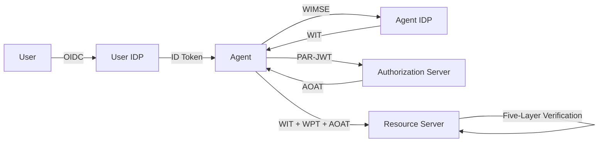

# Architecture Documentation

Comprehensive architecture documentation for the **Open Agent Auth** framework — a standards-based authorization framework for AI agent operations.

## Architecture Overview

## Documentation Index

### Core Architecture

| Module | Description | Entry Point |
|--------|-------------|-------------|
| **[Token](token/README.md)** | Token types, structures, lifecycle, and relationships | `token/README.md` |
| **[Identity](identity/README.md)** | Dual-layer identity model, workload isolation, IDP architecture | `identity/README.md` |
| **[Authorization](authorization/README.md)** | OAuth 2.0 + PAR flow, five-layer verification, policy evaluation | `authorization/README.md` |
| **[Security](security/README.md)** | Cryptographic protection, threat mitigation, audit & compliance | `security/README.md` |

### Protocol & Integration

| Module | Description | Entry Point |
|--------|-------------|-------------|
| **[MCP Protocol Adapter](protocol/mcp/README.md)** | Model Context Protocol integration with five-layer verification | `protocol/mcp/README.md` |
| **[Spring Boot Integration](integration/spring-boot-integration.md)** | Autoconfiguration, role detection, configuration properties | `integration/spring-boot-integration.md` |
| **[Key Resolution SPI](integration/key-resolution-spi.md)** | Pluggable key resolution mechanism | `integration/key-resolution-spi.md` |
| **[Peers Configuration](integration/peers-configuration.md)** | Convention-over-configuration for peer services | `integration/peers-configuration.md` |
| **[OAA Discovery](integration/oaa-configuration-discovery.md)** | Service discovery via `/.well-known/oaa-configuration` | `integration/oaa-configuration-discovery.md` |

## Recommended Reading Order

1. **Token** — Understand the six token types and their relationships
2. **Identity** — Learn the dual-layer identity model and workload isolation
3. **Authorization** — Follow the complete authorization flow end-to-end
4. **Security** — Review cryptographic protection and audit mechanisms
5. **MCP Protocol** — See how authorization integrates with MCP tool invocation
6. **Integration** — Configure and deploy with Spring Boot

## Related Documentation

- [API Documentation](../api/) — API reference and usage guide
- [User Guides](../guide/) — Tutorials and getting started
- [Standards](../standard/) — Protocol standards and specifications

---

**Maintainer**: Open Agent Auth Team
**Last Updated**: 2026-03-03
