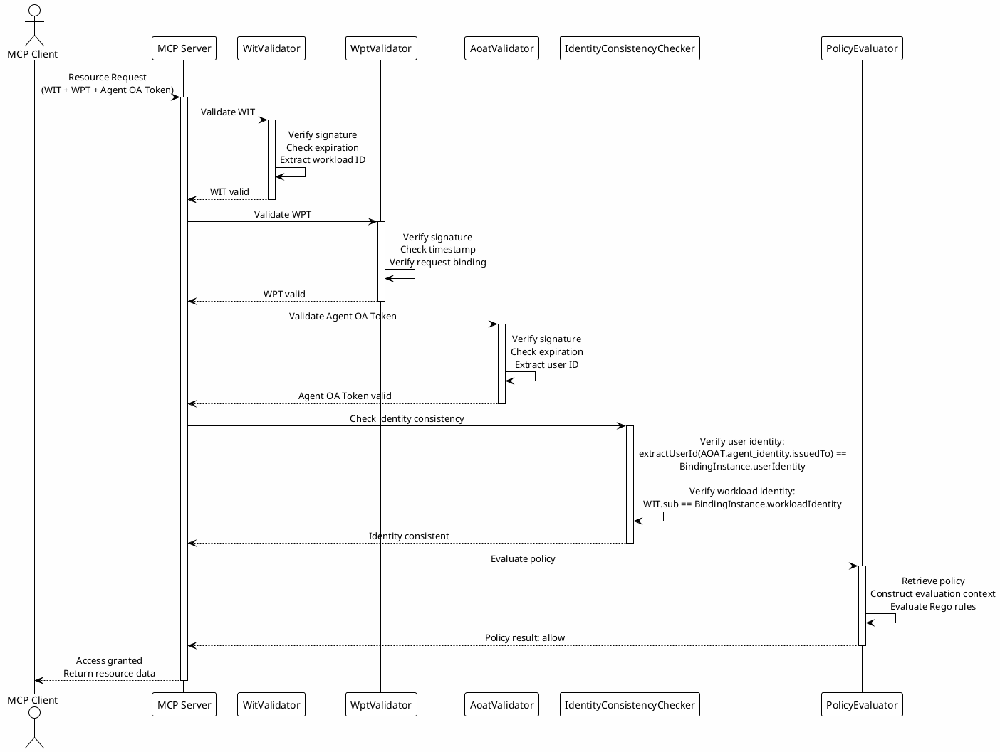

## Five-Layer Verification Architecture

### Layer 1: Workload Authentication

The first layer of verification validates the Workload Identity Token (WIT) to establish the workload's identity. This verification is performed by the WitValidator component, which checks the token's signature using the Agent IDP's public key obtained from the JWKS endpoint. The validator verifies that the signature was generated by the legitimate Agent IDP, preventing forgery of workload identities.

The validator checks several standard JWT claims including the expiration time (exp) to ensure the token hasn't expired, the issued at time (iat) to detect clock skew issues, the issuer (iss) claim to verify the token was issued by a trusted Agent IDP, and the audience (aud) claim to ensure the token is intended for the current resource server. These checks prevent expired tokens, tokens from untrusted issuers, and tokens intended for other services from being accepted.

The validator extracts the workload-specific claims including the subject (sub) containing the WIMSE workload identifier and the confirmation (cnf) claim containing the workload's public key. These claims are used in subsequent verification layers to establish identity consistency and perform authorization decisions.

The WIT validation is computationally intensive due to the cryptographic signature verification, but it provides strong security guarantees by ensuring that only authenticated workloads can access resources. The validation result is cached for the token's lifetime to avoid repeated verification for the same token in subsequent requests.

### Layer 2: Request Integrity

The second verification layer validates the Workload Proof Token (WPT) to ensure the integrity and authenticity of the HTTP request. The WPT is generated using HTTP Message Signatures (RFC 9421), where specific components of the HTTP request including the method, URI, headers, and body are signed using the workload's private key. This signature proves that the request originated from the workload that possesses the private key corresponding to the public key in the WIT.

The WptValidator component extracts the signature from the X-Workload-Proof header and verifies it using the public key extracted from the WIT. The validator reconstructs the signed message components from the HTTP request and verifies that the signature matches, ensuring that the request hasn't been modified in transit. The validator checks the signature timestamp to ensure the request is recent, preventing replay attacks where old valid requests are resent.

The validator verifies that the signature covers the required components including the HTTP method (htm), HTTP URI (htu), and WIT hash (wth) claims. The WIT hash ensures that the request is bound to a specific WIT instance, preventing an attacker from using a valid signature with a different WIT.

Request integrity verification is particularly important in distributed environments where requests may pass through multiple intermediaries such as proxies, load balancers, and API gateways. The WPT ensures that even if these intermediaries modify the request, the modification will be detected and the request will be rejected.

### Layer 3: User Authentication

The third verification layer validates the Agent OA Token to establish the user's authorization. This verification is performed by the AoatValidator component, which checks the token's signature using the authorization server's public key obtained from the JWKS endpoint. The validator verifies that the signature was generated by the legitimate authorization server, preventing forgery of authorization tokens.

The validator checks the standard JWT claims including expiration time, issued at time, issuer, and audience, similar to the WIT validation. Additionally, the validator checks the token's scope to ensure it includes the required permissions for the requested operation, and extracts the user subject identifier from the sub claim for use in identity consistency verification.

The AoatValidator also validates the agent_identity claim, extracting the issuedTo field and workloadId field for identity consistency verification. This ensures that the authorization token is bound to a specific workload and user, preventing token reuse across different workloads or users.

The Agent OA Token validation is the most critical layer in the verification architecture because it represents the user's explicit authorization for the operation. Any failure at this layer indicates that the agent is not authorized to perform the operation, and the request should be rejected immediately.

### Layer 4: Identity Consistency

The fourth verification layer ensures that the user identity, workload identity, and authorization identity are consistently bound together. This verification is performed by the IdentityConsistencyValidator component, which performs a two-layer verification using the BindingInstance.

The first layer verifies user identity consistency by extracting the user ID from the Agent OA Token's agent_identity.issuedTo field (format: "issuer|userId") and retrieving the corresponding BindingInstance from the Authorization Server using the agent_identity.id as the key. The validator then verifies that the extracted user ID matches the BindingInstance's userIdentity, ensuring that the authorization token is bound to the same user who granted authorization.

The second layer verifies workload identity consistency by extracting the workload identity from the WIT's sub claim and verifying that it matches the BindingInstance's workloadIdentity. This ensures that the authorization token is bound to the specific workload making the request, preventing token reuse across different workloads, even if they are bound to the same user.

Identity consistency verification is the cornerstone of the framework's security model, ensuring that the chain of trust from user authentication through workload creation to authorization issuance remains intact. Any inconsistency in this chain indicates a potential security breach and causes immediate rejection of the request.

### Layer 5: Policy Evaluation

The fifth and final verification layer performs fine-grained access control using OPA (Open Policy Agent) policy evaluation. This layer is implemented by the PolicyEvaluator component, which retrieves the policy referenced in the Agent OA Token and evaluates it against the request context.

The policy evaluator extracts the policyId from the Agent OA Token's policy claim and retrieves the policy from the PolicyRegistry. The registry may be implemented as an in-memory store for simple deployments or as a distributed cache or database for production deployments requiring policy persistence and sharing across multiple instances.

The evaluator constructs a policy evaluation input containing the request context including the user identity, workload identity, operation type, resource identifier, HTTP method, URI, headers, and body. This context provides the policy with all relevant information needed to make an access control decision.

The policy itself is written in Rego, a declarative policy language designed specifically for access control. Rego policies define rules that evaluate to allow or deny based on the input context. The framework supports complex policy logic including conditional permissions, time-based restrictions, rate limiting, data masking, and custom business rules.

The policy evaluation result is a boolean decision (allow or deny) along with any additional metadata such as the reason for denial or data filtering instructions. If the policy evaluation result is allow, the request proceeds to the resource access handler. If the result is deny, the request is rejected and an error response is returned to the agent.

The policy evaluation layer provides the flexibility to implement fine-grained, context-aware access control that goes beyond simple scope-based authorization. Policies can consider factors such as the user's role, the resource's sensitivity, the time of day, the user's location, and the data being accessed to make nuanced authorization decisions.

