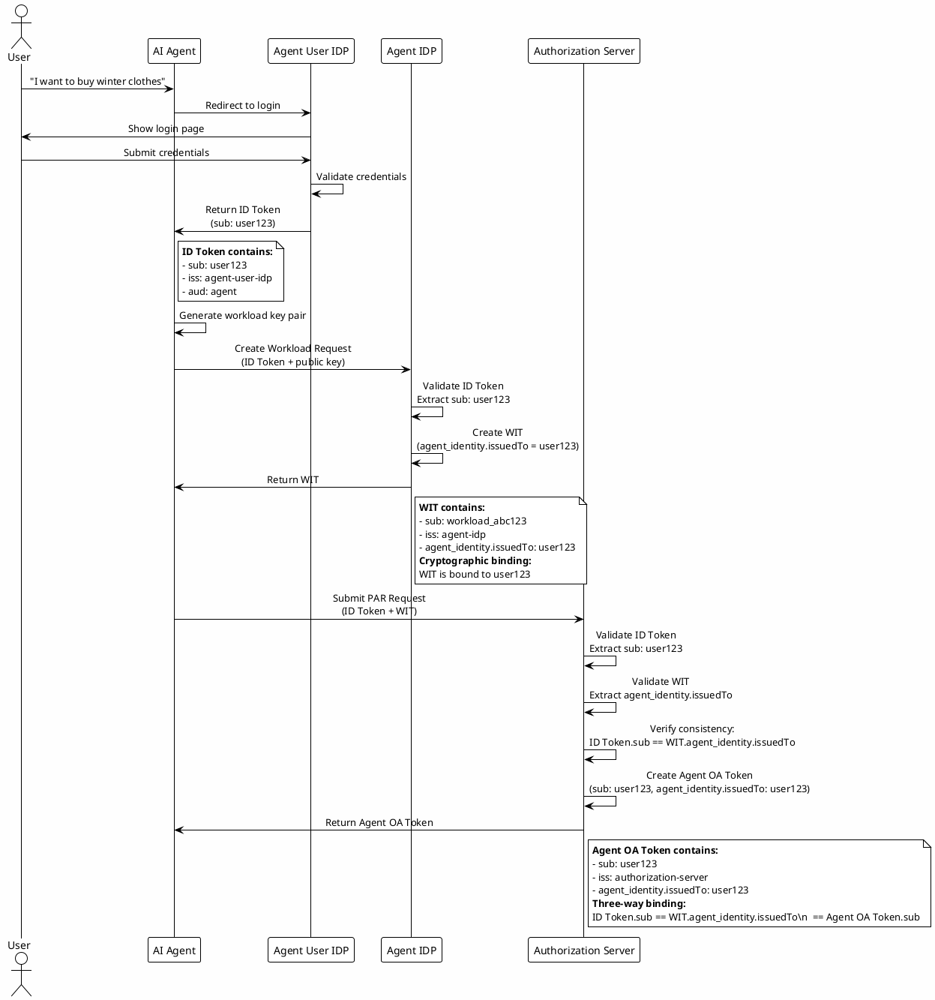

## Identity Binding Mechanism

### Cryptographic Identity Binding

Cryptographic identity binding is the cornerstone of the framework's security model, ensuring that user identity, workload identity, and authorization tokens remain consistently linked throughout the authorization flow. This binding is achieved through cryptographic signatures and claims that establish unforgeable relationships between different tokens and identities.

The binding process begins when the Agent IDP creates the WIT. The issuedTo field in the agent_identity claim is set to the user's subject identifier extracted from the ID Token. This cryptographic binding means that the WIT can only represent the specific user who authenticated to obtain the ID Token. Even if an attacker intercepts the WIT, they cannot use it to impersonate a different user because the issuedTo field is cryptographically signed by the Agent IDP and cannot be modified without invalidating the signature.

When the agent submits an authorization request to the authorization server, it includes both the WIT and the ID Token in the PAR request. The authorization server validates both tokens and verifies that the ID Token's subject matches the WIT's agent_identity.issuedTo field. This cross-validation ensures that the workload requesting authorization is indeed bound to the authenticated user, preventing scenarios where a malicious agent might attempt to use a workload created for one user to obtain authorization for another user.

The binding continues when the authorization server issues the Agent OA Token. The token's subject claim is set to the user's subject identifier, and the agent_identity claim contains the same issuedTo field from the WIT. This creates a three-way binding: ID Token.sub == WIT.agent_identity.issuedTo == Agent OA Token.sub. Any mismatch in this chain causes authorization to fail, ensuring that authorization tokens can only be used by the specific workload that was bound to the specific user who requested authorization.

### Identity Consistency Verification

Identity consistency verification occurs at multiple points in the authorization flow to ensure that the binding remains intact. The first verification happens at the Agent IDP when creating the WIT, where the ID Token's subject is extracted and bound to the workload. The second verification happens at the authorization server when processing the PAR request, where the consistency between ID Token and WIT is checked. The third verification happens at the resource server when validating access requests, where the consistency between WIT and Agent OA Token is verified.

These verification steps collectively prevent identity spoofing and authorization token misuse. Even if an attacker manages to obtain a valid Agent OA Token, they cannot use it without also possessing the corresponding WIT that is bound to the same user. Similarly, even if an attacker obtains a valid WIT, they cannot use it to obtain authorization for a different user because the WIT is cryptographically bound to a specific user identity.

The framework implements this verification through specialized validator components that parse and validate each token type. The WitValidator checks the WIT signature using the Agent IDP's public key obtained from the JWKS endpoint, verifies the token's expiration, and extracts the agent_identity claims. The AoatValidator performs similar validation for Agent OA Tokens using the authorization server's public key. These validators work together to ensure identity consistency across the entire authorization flow.

## Workload Identity Token (WIT) Structure

The WIT is a JWT that encapsulates the workload's identity and authorization metadata. The token includes the standard JWT claims such as issuer, subject, audience, and expiration time, along with custom claims specific to the Agent Operation Authorization specification.

The agent_identity claim is the core of the WIT, providing a structured representation of the agent's identity and its relationship to the user. This claim includes the agent's unique identifier, the issuer that created the identity, the user to whom the agent is bound (issuedTo), the workload context, and validity timestamps. The cryptographic signature on the WIT ensures that these claims cannot be modified without invalidating the token, providing strong protection against identity spoofing.

The WIT also includes the agent_operation_authorization claim, which references the policy that governs the agent's authorized operations. This claim contains a policy_id that identifies the registered policy in the Authorization Server, along with any additional authorization metadata required for policy evaluation. This design enables the Authorization Server to act as the central policy enforcer, ensuring that all agents operate within the boundaries defined by the user's explicit consent.

