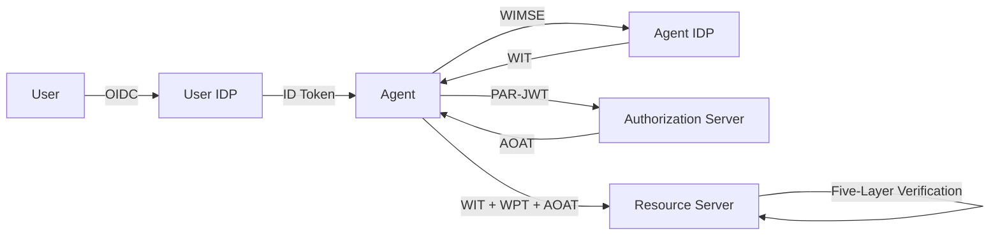

# Architecture Documentation

Comprehensive architecture documentation for the **Open Agent Auth** framework — a standards-based authorization framework for AI agent operations.

## Architecture Overview

## Documentation Index

### Core Architecture

| Module | Description |
|--------|-------------|
| **[Token Reference](01-token.md)** | Token types (ID Token, WIT, WPT, PAR-JWT, VC, AOAT), structures, lifecycle, and relationships |
| **[Identity & Workload](02-identity.md)** | Dual-layer identity model, workload isolation, IDP architecture, identity binding |
| **[Authorization Flow](03-authorization.md)** | OAuth 2.0 + PAR flow, five-layer verification, policy evaluation |
| **[Security](04-security.md)** | Cryptographic protection, key management, threat mitigation, audit & compliance |

### Protocol & Integration

| Module | Description |
|--------|-------------|
| **[Agent Authorization Flow](05-agent-authorization-flow.md)** | Complete six-phase AOA protocol flow from user authentication to tool execution |
| **[MCP Protocol Adapter](06-protocol-mcp.md)** | Model Context Protocol integration with five-layer verification |
| **[Spring Boot Integration](07-spring-boot-integration.md)** | Autoconfiguration, role detection, bean lifecycle, configuration properties |
| **[Integration Infrastructure](08-integration-infrastructure.md)** | Key Resolution SPI, Peers Configuration, OAA Configuration Discovery |

## Recommended Reading Order

1. **Token** — Understand the six token types and their relationships
2. **Identity** — Learn the dual-layer identity model and workload isolation
3. **Authorization** — Follow the complete authorization flow end-to-end
4. **Security** — Review cryptographic protection and audit mechanisms
5. **MCP Protocol** — See how authorization integrates with MCP tool invocation
6. **Integration** — Configure and deploy with Spring Boot

## Related Documentation

- [API Documentation](../api/00-api-overview) — API reference and usage guide
- [User Guides](../guide/01-quick-start) — Tutorials and getting started

---

**Maintainer**: Open Agent Auth Team
**Last Updated**: 2026-03-03
