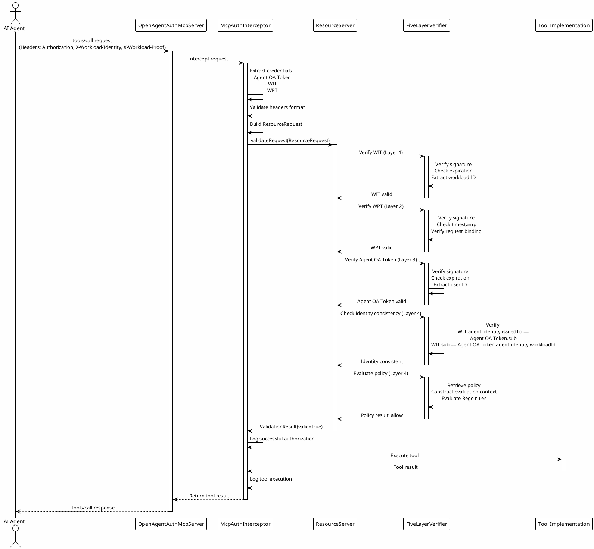

## Tool Registration and Execution

### Tool Registration

The MCP protocol requires tools to be registered with the server before they can be invoked by agents. The OpenAgentAuthMcpServer supports tool registration through the standard MCP `tools/list` method, which returns a list of available tools with their metadata. This registration process is typically performed when the server starts up, but can also be dynamic, allowing tools to be added or removed at runtime.

Tool metadata includes the tool name, description, input schema, and output schema. The input schema defines the expected structure and types of input parameters, enabling validation and auto-completion in agent implementations. The output schema defines the structure of the return value, enabling agents to parse and process results correctly.

The OpenAgentAuthMcpServer does not modify the tool registration process, allowing existing MCP server implementations to continue using their standard registration mechanisms. However, the adapter can enhance tool metadata by adding security-related information such as required scopes, sensitivity levels, or policy identifiers. This information helps agents understand the security requirements of each tool and obtain appropriate authorization before invoking them.

### Tool Invocation Flow

The tool invocation flow begins when an agent sends a `tools/call` request to the MCP server. The request includes the tool name and input parameters that conform to the tool's input schema. The OpenAgentAuthMcpServer intercepts this request before it reaches the underlying tool implementation.

The interceptor first extracts the authentication credentials from the HTTP headers, validating that all required headers are present and properly formatted. It then constructs a ResourceRequest object containing the authentication tokens, HTTP method, URI, headers, and body. This object represents the complete context needed for authorization verification.

The interceptor calls the ResourceServer's validateRequest method with the ResourceRequest object. The ResourceServer performs the five-layer verification, checking the WIT signature and claims, verifying the WPT signature and request binding, validating the Agent OA Token signature and authorization, checking identity consistency between user and workload, and evaluating the OPA policy for the requested operation. This comprehensive verification ensures that every tool invocation is traceable back to explicit user consent through the semantic audit trail embedded in the tokens.

If any layer of verification fails, the ResourceServer returns a ValidationResult with isValid set to false and error messages describing the failure. The interceptor returns an error response to the agent, preventing tool execution. The error response includes details about which verification layer failed and why, enabling the agent to understand and potentially correct the issue.

If all verification layers pass, the ResourceServer returns a ValidationResult with isValid set to true, along with extracted identity and policy information. The interceptor allows the request to proceed to the underlying tool implementation, which executes the tool and returns the result. The interceptor also logs the successful tool invocation for audit purposes, recording the user identity, workload identity, tool name, input parameters, and execution result, enabling post-hoc analysis and compliance verification.

