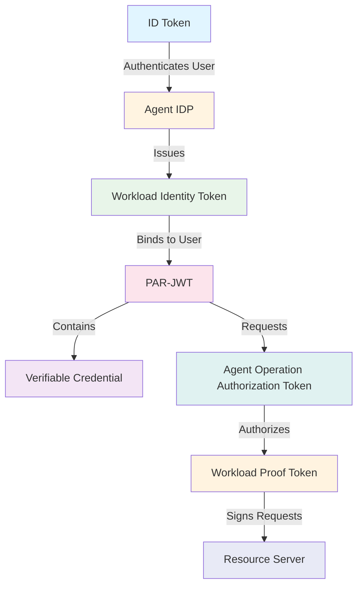

# Token Reference

This directory contains comprehensive documentation about all tokens used in the Open Agent Auth framework.

## Overview

The Open Agent Auth framework orchestrates multiple token types to establish secure, verifiable delegation chains from human principals to autonomous AI agents. Each token plays a distinct role in this cryptographic choreography, ensuring that AI agents operate within user-approved boundaries while maintaining complete auditability.

## Token Types

### Core Tokens

- [ID Token](id-token.md) - OpenID Connect token representing user identity, issued by a trusted Identity Provider after authentication
- [Workload Identity Token](workload-identity-token.md) - Token that authenticates virtual workloads, implementing the WIMSE protocol for request-level isolation
- [Workload Proof Token](workload-proof-token.md) - Cryptographic signature over HTTP request components, proving request authenticity and integrity
- [PAR-JWT](par-jwt.md) - Pushed Authorization Request in JWT format, carrying operation proposals with embedded evidence
- [Verifiable Credential](verifiable-credential.md) - W3C-standard credential that cryptographically captures user intent, enabling semantic audit trails
- [Agent Operation Authorization Token](agent-operation-authorization-token.md) - Final access token granting operational permission after user consent

## Additional Information

- [Token Flow and Relationships](token-flow-and-relationships.md) - Complete authorization sequence and identity binding chain
- [Appendix](appendix.md) - Security best practices, references, and glossary

## Token Relationships

## Quick Links

- Learn about the [Authorization Flow](../../authorization/README.md) to understand how tokens are used
- Read about [Identity and Workload Management](../../identity/README.md) to understand token creation

---

**Document Version**: 2.0.0  
**Last Updated**: 2026-02-09  
**Maintainer**: Open Agent Auth Team
