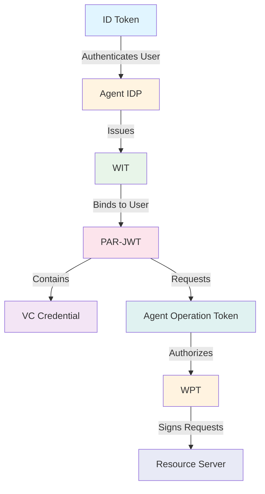

# Token Reference

This document provides a comprehensive overview of all tokens used in the Open Agent Auth framework, their purposes, structures, and relationships in the authorization flow.

## Overview

The Open Agent Auth framework orchestrates multiple token types to establish secure, verifiable delegation chains from human principals to autonomous AI agents. Each token plays a distinct role in this cryptographic choreography, ensuring that AI agents operate within user-approved boundaries while maintaining complete auditability.



The framework employs six primary token types, each serving a specific security function in the authorization pipeline. The **ID Token** establishes user identity through OpenID Connect authentication. The **Workload Identity Token (WIT)** authenticates virtual workloads created for specific user requests, implementing the WIMSE protocol for workload-level isolation. The **Workload Proof Token (WPT)** provides cryptographic proof of request authenticity using HTTP Message Signatures. The **PAR-JWT** carries authorization proposals with embedded evidence of user intent. The **Verifiable Credential (VC)** cryptographically captures the user's original natural language input, enabling semantic audit trails. Finally, the **Agent Operation Authorization Token** grants operational permission after user consent, containing all necessary claims for enforcement.

---

## ID Token

### Purpose and Role

The ID Token serves as the foundation of the entire authorization chain, representing the user's authenticated identity. It follows the OpenID Connect standard and is issued by a trusted Identity Provider after successful user authentication. This token is critical because all subsequent tokens in the flow ultimately derive their authority from the user's proven identity established by this token.

When a user logs into the system through the Agent User IDP, the Identity Provider validates the user's credentials and issues an ID Token containing the user's subject identifier, email address, and other profile information. The Agent Client then uses this ID Token as proof of user identity when requesting workload creation from the Agent IDP and when submitting authorization proposals to the Authorization Server.

### Token Structure

The ID Token is a standard JWT (JSON Web Token) signed by the Identity Provider using asymmetric cryptography. It contains standard OpenID Connect claims that identify the user and establish the token's validity.

```json
{
  "iss": "https://agent-user-idp.example.com",
  "sub": "user_12345",
  "aud": "https://agent.example.com",
  "exp": 1731668100,
  "iat": 1731664500,
  "nonce": "abc123",
  "email": "user@example.com",
  "email_verified": true,
  "name": "John Doe"
}
```

The `iss` claim identifies the Identity Provider that issued the token, enabling verification through the provider's public keys published at their JWKS endpoint. The `sub` claim contains the user's canonical subject identifier, which becomes the foundation for all identity binding throughout the framework. The `aud` claim specifies the intended audience—in this case, the Agent Client—ensuring the token cannot be used by unauthorized parties. The `exp` and `iat` claims establish the token's validity period, typically one hour from issuance.

### Security Characteristics

The ID Token's security derives from its cryptographic signature, which can be verified by any component with access to the Identity Provider's public keys. This enables distributed verification without requiring shared secrets. The token's short lifetime limits the window of opportunity for credential misuse, while the `nonce` claim provides protection against replay attacks by binding the token to a specific authentication session.

The framework treats the ID Token's subject identifier as immutable and authoritative. All identity binding operations reference this identifier, ensuring that workload creation, authorization grants, and resource access remain consistently bound to the authenticated user throughout the authorization flow.

---

