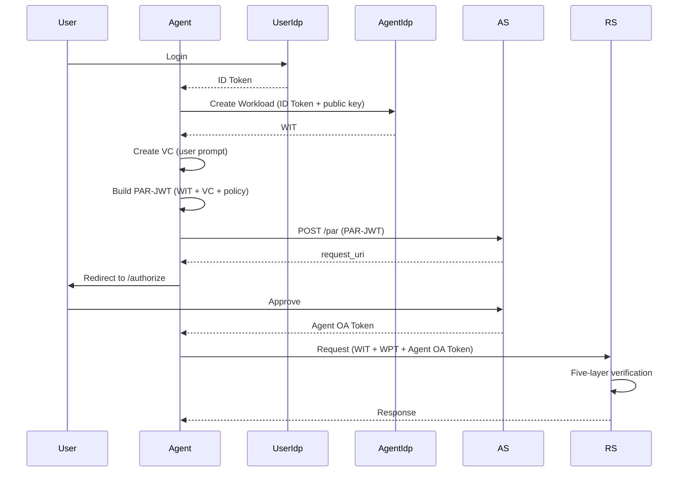

## Token Flow and Relationships

### Complete Authorization Sequence

The tokens flow through the system in a carefully orchestrated sequence that ensures security, auditability, and proper authorization at each step.



The flow begins with user authentication through the User IDP, which issues an ID Token proving the user's identity. The Agent Client uses this ID Token to request workload creation from the Agent IDP, which issues a WIT that cryptographically binds a virtual workload to the user. The Agent Client then creates a Verifiable Credential capturing the user's original prompt and builds a PAR-JWT containing the operation proposal, evidence, and identity binding information.

The Agent Client submits the PAR-JWT to the Authorization Server via the PAR endpoint, receiving a single-use `request_uri`. The Agent Client redirects the user to the Authorization Server's authorization endpoint with this `request_uri`. The Authorization Server retrieves the stored PAR-JWT, presents the user with a consent interface showing the original prompt and interpreted operation, and waits for user approval.

Upon user approval, the Authorization Server validates all components, registers the OPA policy, and issues an Agent OA Token containing the user identity, verified agent identity, policy reference, audit trail, and evidence credential. The Agent Client uses this token to access protected resources, presenting it along with the WIT and WPT to the Resource Server.

The Resource Server performs five-layer verification: validating the WIT signature, validating the WPT signature, validating the Agent OA Token, verifying identity consistency across all tokens, and evaluating the OPA policy. If all verifications pass, the Resource Server executes the requested operation and returns the result to the Agent Client.

### Identity Binding Chain

The framework maintains a cryptographic identity binding chain throughout the authorization flow, ensuring that all tokens remain consistently bound to the authenticated user and authorized workload.

```
ID Token.sub 
  ↓ (binds to)
WIT.sub (via Workload Registry)
  ↓ (binds to)
Agent OA Token.sub
```

This binding chain ensures that the workload is bound to the authenticated user, the authorization is granted to the specific workload, and the authorization token can only be used by the bound workload. Any mismatch in this chain indicates a potential security breach and causes immediate rejection of the request.

The binding chain is established when the Agent IDP creates the WIT and registers the workload in the WorkloadRegistry with the user's subject identifier from the ID Token. This binding is verified by the Authorization Server when processing the PAR-JWT, ensuring that the workload requesting authorization is bound to the authenticated user. The binding is then perpetuated in the Agent OA Token, which includes the user's subject identifier as the subject claim.

The Resource Server validates this binding during request processing through a two-layer verification mechanism implemented by the IdentityConsistencyValidator:

1. **User Identity Verification**: The validator extracts the user ID from the AOAT's `agent_identity.issuedTo` field (format: "issuer|userId") and retrieves the corresponding BindingInstance from the Authorization Server using the `agent_identity.id` as the key. It then verifies that the extracted user ID matches the BindingInstance's `userIdentity`.

2. **Workload Identity Verification**: The validator extracts the workload identity from the WIT's `sub` claim and verifies that it matches the BindingInstance's `workloadIdentity`.

This two-layer verification prevents scenarios where a malicious agent might attempt to use a workload created for one user to access authorization tokens granted to another user, or where a workload might try to use an authorization token issued to a different workload.

### Lifecycle Phases

The authorization flow can be understood as progressing through distinct phases, each involving specific tokens and serving specific security purposes.

During the **Authentication Phase**, the ID Token proves user identity, establishing the foundation for all subsequent operations. This token is issued by the User IDP after successful authentication and contains the user's subject identifier, which becomes the anchor for identity binding throughout the flow.

In the **Workload Creation Phase**, the Agent IDP issues a WIT that binds a virtual workload to the authenticated user. This token contains the workload's public key for signing subsequent requests and includes an `agent_identity` claim that cryptographically binds the workload to the user.

During the **Authorization Request Phase**, the Agent Client creates a PAR-JWT containing the operation proposal, evidence credential, and identity binding information. This token is submitted to the Authorization Server via the PAR protocol, which prevents sensitive data from appearing in URLs.

In the **Authorization Grant Phase**, the Authorization Server issues an Agent OA Token after user consent. This token grants operational permission and includes all necessary claims for enforcement and auditability, including the policy reference, audit trail, and evidence credential.

Finally, during the **Resource Access Phase**, the Agent Client presents the WIT, WPT, and Agent OA Token to the Resource Server. The Resource Server performs five-layer verification and enforces the OPA policy, executing or denying the requested operation based on the policy evaluation result.

---

