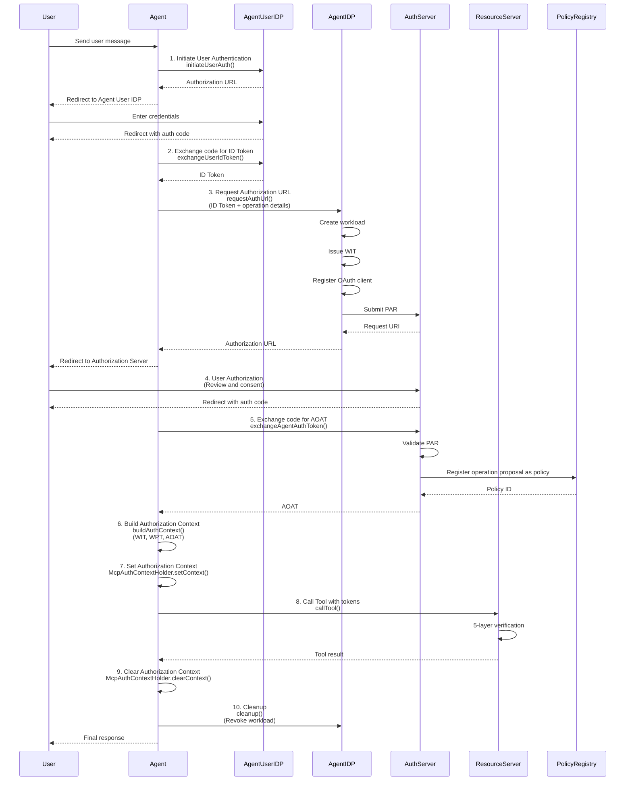
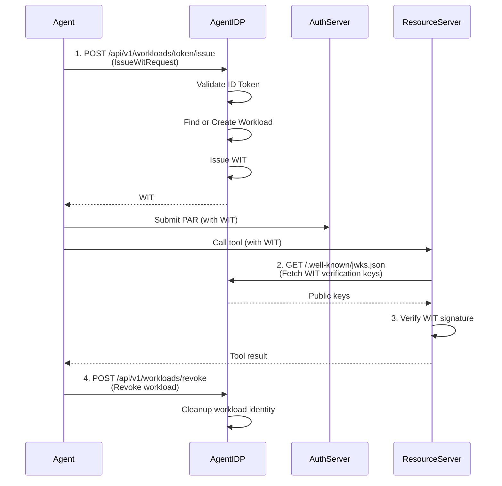
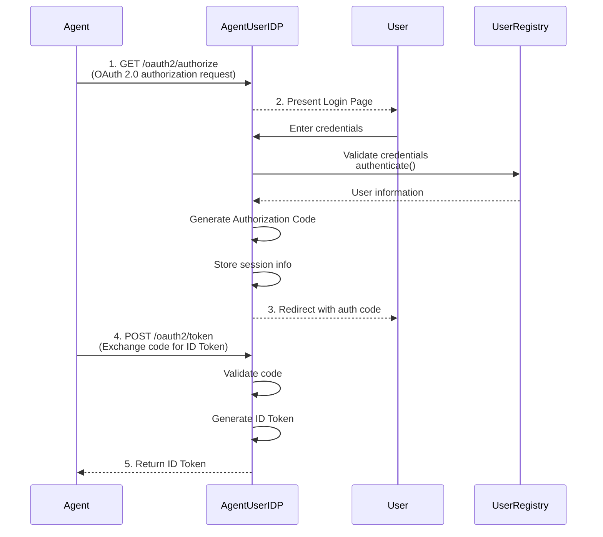
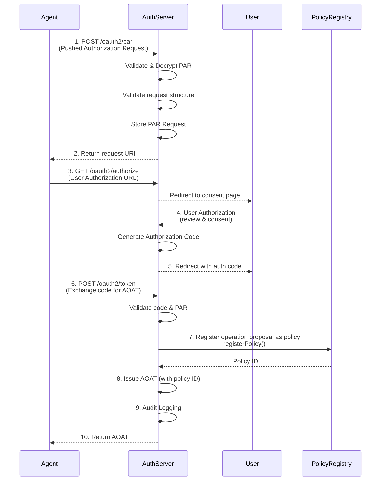
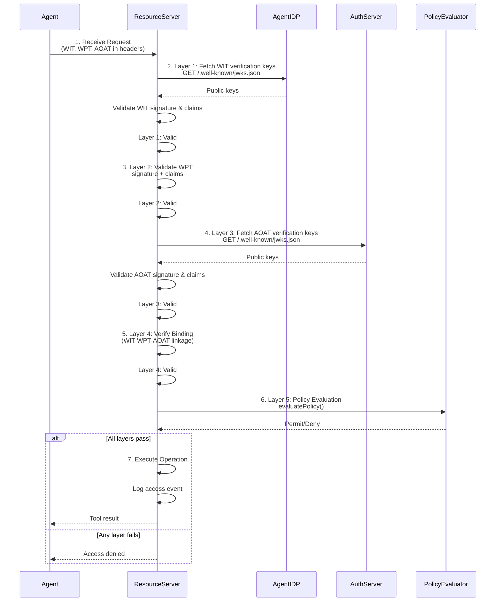
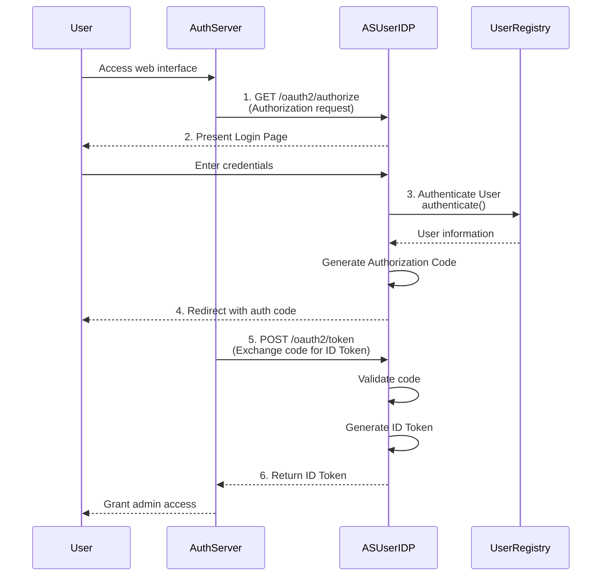

# Integration Guide

This guide provides comprehensive instructions for integrating the Open Agent Auth framework into your Spring Boot applications based on different roles.

## Table of Contents

- [1. Overview](#1-overview)
- [2. Prerequisites](#2-prerequisites)
- [3. Role-Based Integration](#3-role-based-integration)
  - [3.1 Agent Role](#31-agent-role)
  - [3.2 Agent IDP Role](#32-agent-idp-role)
  - [3.3 Agent User IDP Role](#33-agent-user-idp-role)
  - [3.4 Authorization Server Role](#34-authorization-server-role)
  - [3.5 Resource Server Role](#35-resource-server-role)
  - [3.6 AS User IDP Role](#36-as-user-idp-role)
- [4. Additional Roles](#4-additional-roles)
- [5. Common Configuration](#5-common-configuration)
- [6. Deployment Considerations](#6-deployment-considerations)
- [7. Next Steps](#7-next-steps)

---

## 1. Overview

The Open Agent Auth framework provides role-based auto-configuration through Spring Boot Starter. Each role represents a specific component in the AI Agent authorization architecture and requires specific configuration.

### Supported Roles

| Role | Description | Port (Sample) |
|------|-------------|---------------|
| **Agent** | AI Agent that orchestrates user requests and tool calls | 8081 |
| **Agent IDP** | Agent Identity Provider for workload identity management | 8082 |
| **Agent User IDP** | User Identity Provider for Agent user authentication | 8083 |
| **AS User IDP** | User Identity Provider for Authorization Server | 8084 |
| **Authorization Server** | OAuth 2.0 Authorization Server for operation authorization | 8085 |
| **Resource Server** | Protected resources with five-layer validation | 8086 |

### Integration Pattern

All roles follow a consistent integration pattern:

1. **Add Dependency**: Include `open-agent-auth-spring-boot-starter`
2. **Configure Role**: Enable specific role and set issuer
3. **Configure Infrastructure**: Set up trust domain, keys, and JWKS
4. **Configure Capabilities**: Enable required capabilities for the role
5. **Configure Services**: Define service endpoints and dependencies

---

## 2. Prerequisites

### Required

- **Java 17+**
- **Spring Boot 3.x**
- **Maven 3.6+** or Gradle 7+

### Add Starter Dependency

Add the Open Agent Auth Spring Boot Starter to your project using Maven or Gradle.

> **Note**: The Open Agent Auth artifacts are not yet published to Maven Central. For now, you need to build the project locally and install it to your local Maven repository:
> ```bash
> git clone https://github.com/alibaba/open-agent-auth.git
> cd open-agent-auth
> mvn clean install -DskipTests
> ```

---

## 3. Role-Based Integration

### 3.1 Agent Role

The **Agent** role is the core component that orchestrates user requests, manages authentication, and coordinates tool calls with operation authorization.

#### When to Use

- Building AI Agent applications that need to execute operations on behalf of users
- Implementing operation authorization with user consent
- Integrating with MCP (Model Context Protocol) servers
- Requiring prompt encryption and protection

#### Required Capabilities

- `oauth2-client`: OAuth 2.0 client for authentication
- `operation-authorization`: Agent Operation Authorization (AOA) flow

#### Configuration Steps

##### Step 1: Enable Framework and Role

```yaml
open-agent-auth:
  enabled: true
  
  roles:
    agent:
      enabled: true
      instance-id: agent-1
      issuer: http://localhost:8081  # REQUIRED: Your Agent's URL
      capabilities:
        - oauth2-client
        - operation-authorization
```

##### Step 2: Configure Infrastructure

```yaml
open-agent-auth:
  infrastructures:
    trust-domain: wimse://default.trust.domain  # REQUIRED
    
    key-management:
      providers:
        local:
          type: in-memory
      keys:
        # REQUIRED: Signing keys
        par-jwt-signing:
          key-id: par-jwt-signing-key
          algorithm: RS256
          provider: local
        vc-signing:
          key-id: vc-signing-key
          algorithm: ES256
          provider: local
        jwe-encryption:
          key-id: jwe-encryption-key-001
          algorithm: RS256
          jwks-consumer: authorization-server
        
        # REQUIRED: Verification keys
        wit-verification:
          key-id: wit-signing-key
          algorithm: ES256
          jwks-consumer: agent-idp
    
    jwks:
      provider:
        enabled: true  # REQUIRED: Expose JWKS endpoint
      consumers:
        agent-user-idp:
          enabled: true
          issuer: http://localhost:8083  # REQUIRED
        agent-idp:
          enabled: true
          issuer: http://localhost:8082  # REQUIRED
        authorization-server:
          enabled: true
          issuer: http://localhost:8085  # REQUIRED
    
    service-discovery:
      services:
        agent-user-idp:
          base-url: http://localhost:8083  # REQUIRED
        agent-idp:
          base-url: http://localhost:8082  # REQUIRED
        authorization-server:
          base-url: http://localhost:8085  # REQUIRED
```

##### Step 3: Configure Capabilities

```yaml
open-agent-auth:
  capabilities:
    oauth2-client:
      enabled: true  # REQUIRED
      authentication:
        enabled: true
      callback:
        enabled: true
        client-id: sample-agent  # REQUIRED
        client-secret: sample-agent-secret  # REQUIRED
    
    operation-authorization:
      enabled: true  # REQUIRED
      prompt-encryption:
        enabled: true
        jwks-consumer: authorization-server
      prompt-protection:
        enabled: true
        encryption-enabled: true
        sanitization-level: MEDIUM
      agent-context:
        default-client: sample-agent-client
        default-channel: web
        default-language: zh-CN
        default-platform: sample-agent.platform
        default-device-fingerprint: sample-device
      oauth2-client:
        client-id: sample-agent  # REQUIRED
        client-secret: sample-agent-secret  # REQUIRED
        oauth-callbacks-redirect-uri: http://localhost:8081/callback  # REQUIRED
      authorization:
        require-user-interaction: false
        expiration-seconds: 3600
```

##### Step 4: (Optional) Configure MCP Integration

```yaml
agent:
  tools:
    mcp:
      enabled: true
  mcp-servers:
    - name: shopping
      url: http://localhost:8086/mcp
      description: "Shopping service MCP Server"
      enabled: true
```
#### Code Integration

**Add Dependencies**

Add the following dependencies to your `pom.xml`:

- Spring Boot Starter Web
- Open Agent Auth Starter
- MCP Adapter (Optional - for tool calls)

**Use Framework Beans**

The framework automatically configures the following beans that you can inject:

- `AgentAapExecutor`: Execute Agent Operation Authorization (AOA) flow
- `AgentIdentityProvider`: Agent identity management
- `OAuth2CallbackService`: OAuth 2.0 callback handling
- `OpenAgentAuthMcpClient`: MCP client with automatic token injection

#### How It Works

The Agent role requires **developer code integration**. Unlike other roles that are framework-managed, the Agent role requires you to write code to orchestrate the AOA flow and coordinate tool calls.

**Framework Responsibilities** (handled automatically):
- OAuth 2.0 client configuration and callback handling
- Token validation and caching
- MCP adapter for automatic token injection
- Authorization context management (ThreadLocal)
- Workload lifecycle management

**Developer Responsibilities**:
- Configure the role and capabilities in YAML
- Inject `AgentAapExecutor` bean into your code
- Inject `OpenAgentAuthMcpClient` bean for tool calls
- Implement the AOA flow using `AgentAapExecutor` methods
- Manage authorization context with `McpAuthContextHolder`
- Call tools using the injected MCP client

The typical integration workflow for an Agent application is:



1. **Initiate User Authentication**: Use `AgentAapExecutor.initiateUserAuth()` to start the OIDC flow and obtain the authorization URL that redirects users to the Agent User IDP for authentication.

2. **Exchange Authorization Code for ID Token**: After users authenticate and are redirected back with an authorization code, use `AgentAapExecutor.exchangeUserIdToken()` to exchange the code for an ID Token that proves the user's identity.

3. **Request Authorization URL**: With the user's ID Token and the operation details (user input, operation type, resource ID), use `AgentAapExecutor.requestAuthUrl()` which automatically performs: workload creation, OAuth client registration, PAR submission, and authorization URL generation. This prepares everything needed for the operation authorization flow.

4. **User Authorization**: Redirect users to the authorization URL obtained in step 3, where they review the operation proposal and provide consent through the Authorization Server.

5. **Exchange Authorization Code for Agent OA Token**: After users grant consent and are redirected back with a new authorization code, use `AgentAapExecutor.exchangeAgentAuthToken()` to exchange the code for an Agent Operation Authorization Token (AOAT) that authorizes the specific operation.

6. **Build Authorization Context**: Use `AgentAapExecutor.buildAuthContext()` with the workload context from step 3 and the AOAT from step 5 to generate the complete authorization context containing all required tokens (WIT, WPT, AOAT) for tool execution.

7. **Set Authorization Context**: Use `McpAuthContextHolder.setContext()` to set the authorization context to the current thread's ThreadLocal storage. This makes the tokens available to the MCP adapter, which automatically injects them into each tool call request.

8. **Call Tool**: Inject `OpenAgentAuthMcpClient` bean and use `callTool()` to execute tools on the Resource Server. The MCP adapter automatically injects the authorization tokens into each request.

9. **Clear Authorization Context**: After the tool call completes, use `McpAuthContextHolder.clearContext()` to remove the authorization context from ThreadLocal storage, preventing memory leaks and ensuring thread safety.

10. **Cleanup**: After the operation completes, use `AgentAapExecutor.cleanup()` to revoke the workload identity, clear temporary keys, and release all allocated resources.

#### Auto-Configured Beans

The following beans are automatically configured:

- `AgentIdentityProvider`: Agent identity management
- `OAuth2CallbackService`: OAuth 2.0 callback handling
- `OAuth2CallbackController`: OAuth 2.0 callback endpoint
- `AgentAapExecutorConfig`: AOA executor configuration
- `VcSigner`: Verifiable Credential signing
- `AapParJwtGenerator`: PAR-JWT generation
- `WitValidator`: WIT validation
- `SpringAgentAuthenticationInterceptor`: Authentication interceptor
- `OpenAgentAuthMcpClient`: MCP client with automatic token injection

#### Sample Application

See `sample-agent` in the `open-agent-auth-samples` module for a complete example.

---

### 3.2 Agent IDP Role

The **Agent IDP** role manages workload identities and issues Workload Identity Tokens (WIT) following the WIMSE protocol.

#### When to Use

- Providing workload identity management for AI Agents
- Issuing WITs that can be verified by Authorization Servers and Resource Servers
- Implementing WIMSE protocol for workload identity

#### Required Capabilities

- `workload-identity`: Workload identity management

#### Configuration Steps

##### Step 1: Enable Framework and Role

```yaml
open-agent-auth:
  enabled: true
  
  roles:
    agent-idp:
      enabled: true
      instance-id: agent-idp-1
      issuer: http://localhost:8082  # REQUIRED: Your Agent IDP's URL
      capabilities:
        - workload-identity
```

##### Step 2: Configure Infrastructure

```yaml
open-agent-auth:
  infrastructures:
    trust-domain: wimse://default.trust.domain  # REQUIRED
    
    key-management:
      providers:
        local:
          type: in-memory
      keys:
        # REQUIRED: WIT signing key
        wit-signing:
          key-id: wit-signing-key
          algorithm: ES256
          provider: local
    
    jwks:
      provider:
        enabled: true  # REQUIRED: Expose JWKS endpoint
      consumers:
        agent-user-idp:
          enabled: true
          issuer: http://localhost:8083  # REQUIRED: For ID Token validation
```

##### Step 3: Configure Capabilities

```yaml
open-agent-auth:
  capabilities:
    workload-identity:
      enabled: true  # REQUIRED
```

#### How It Works

The Agent IDP role is designed to be **framework-managed**. Once configured, the framework automatically handles all workload identity management operations through REST API endpoints. 

**Framework Responsibilities** (handled automatically):
- REST API endpoint exposure via `WorkloadController`
- Workload creation and lifecycle management
- WIT issuance and signing
- ID Token validation
- JWKS endpoint for WIT verification

**Developer Responsibilities**:
- Configure the role in YAML
- Set up trust domain and keys
- No code required - just configuration!

The framework provides the following integration workflow:



1. **Receive IssueWitRequest**: The Agent IDP receives an `IssueWitRequest` via REST API endpoint `POST /api/v1/workloads/token/issue`, which contains the user's ID Token, operation context (operation type, resource ID, metadata), public key, and OAuth client ID. This is the main entry point for workload identity token issuance.

2. **Validate ID Token**: The Agent IDP validates the received ID Token's signature, issuer, audience, and expiration. It extracts the user identity (sub claim) from the validated ID Token to establish the user-workload binding.

3. **Find or Create Workload**: The Agent IDP checks if an existing active workload exists for the same user + agent context binding (user ID, platform, client, instance). If found, it reuses the existing workload; otherwise, it creates a new virtual workload with a unique workload ID and uses the provided public key.

4. **Issue WIT**: The Agent IDP signs the workload identity information (including workload ID, key identifier, and expiration time) using the configured signing key to create a Workload Identity Token (WIT). This token cryptographically binds the workload to the agent and proves its authenticity.

5. **Verify WIT**: When other components (Authorization Server or Resource Server) need to verify a workload's identity, they fetch the Agent IDP's public keys via `GET /.well-known/jwks.json` endpoint and validate the WIT's signature and claims locally using `WitValidator`.

6. **Revoke Workload**: After the operation completes or expires, the Agent revokes the workload identity via `POST /api/v1/workloads/revoke` to prevent further use, ensuring security and proper lifecycle management.

#### Auto-Configured Beans

The framework automatically configures the following beans:

- `WorkloadRegistry`: Workload information storage
- `AgentIdentityProvider`: Agent IDP service implementation
- `IdTokenValidator`: ID Token validation for Agent User IDP

#### Sample Application

See `sample-agent-idp` in the `open-agent-auth-samples` module for a complete example.

---

### 3.3 Agent User IDP Role

The **Agent User IDP** role provides user authentication and ID Token issuance for Agent users.

#### When to Use

- Authenticating users for AI Agent applications
- Issuing ID Tokens for user identity verification
- Providing OAuth 2.0 authorization flow for Agent users

#### Required Capabilities

- `oauth2-server`: OAuth 2.0 server for authorization
- `user-authentication`: User authentication functionality

#### Configuration Steps

##### Step 1: Enable Framework and Role

```yaml
open-agent-auth:
  enabled: true
  
  roles:
    agent-user-idp:
      enabled: true
      instance-id: agent-user-idp-1
      issuer: http://localhost:8083  # REQUIRED: Your Agent User IDP's URL
      capabilities:
        - oauth2-server
        - user-authentication
```

##### Step 2: Configure Infrastructure

```yaml
open-agent-auth:
  infrastructures:
    trust-domain: wimse://default.trust.domain  # REQUIRED
    
    key-management:
      providers:
        local:
          type: in-memory
      keys:
        # REQUIRED: ID Token signing key
        id-token-signing:
          key-id: agent-user-id-token-signing-key
          algorithm: ES256
          provider: local
    
    jwks:
      provider:
        enabled: true  # REQUIRED: Expose JWKS endpoint
```

Add Thymeleaf configuration for login page rendering:

```yaml
spring:
  thymeleaf:
    cache: false
    prefix: classpath:/templates/
    suffix: .html
```

##### Step 3: Configure Capabilities

```yaml
open-agent-auth:
  capabilities:
    oauth2-server:
      enabled: true  # REQUIRED
      token:
        id-token-expiry: 3600
      auto-register-clients:
        enabled: true
        clients:
          - client-name: sample-agent
            client-id: sample-agent
            client-secret: sample-agent-secret
            redirect-uris:
              - http://localhost:8081/callback
            grant-types:
              - authorization_code
            response-types:
              - code
            token-endpoint-auth-method: client_secret_basic
            scopes:
              - openid
              - profile
              - email
    
    user-authentication:
      enabled: true  # REQUIRED
      login-page:
        enabled: true
        page-title: "Agent IDP - Login"
        title: "Agent Identity Provider"
        subtitle: "Sign in to authorize your AI agent"
        username-label: "Username"
        password-label: "Password"
        button-text: "Sign In"
        show-demo-users: true
        demo-users: "alice:alice123;bob:bob456;charlie:charlie789"
        footer-text: "Agent IDP - Powered by Open Agent Auth"
      user-registry:
        enabled: true
        type: in-memory
        preset-users:
          - username: alice
            password: alice123
            subject: user_alice_001
            email: alice@example.com
            name: Alice User
          - username: bob
            password: bob456
            subject: user_bob_001
            email: bob@example.com
            name: Bob User
          - username: charlie
            password: charlie789
            subject: user_charlie_001
            email: charlie@example.com
            name: Charlie User
```

#### How It Works

The Agent User IDP role is designed to be **framework-managed**. Once configured, the framework automatically handles all user authentication and ID Token issuance through OAuth 2.0 endpoints.

**Framework Responsibilities** (handled automatically):
- Login page rendering
- User authentication flow
- Authorization code generation and validation
- ID Token issuance
- OAuth 2.0 authorization and token endpoints
- JWKS endpoint for ID Token verification

**Developer Responsibilities**:
- Configure the role in YAML
- Set up trust domain and keys
- Configure user registry (in-memory or custom)
- No code required for basic authentication!

The framework provides the following integration workflow:



1. **Receive Authorization Request**: The Agent User IDP receives an OAuth 2.0 authorization request via `GET /oauth2/authorize`, which includes the client ID, redirect URI, and requested scopes.

2. **Authenticate User**: The framework presents a login page (or uses your custom authentication logic) where users enter their credentials. The UserRegistry validates the credentials using `authenticate()` and returns user information.

3. **Generate Authorization Code**: After successful authentication, the framework generates an authorization code and stores it with associated session information (user details, client ID, requested scopes).

4. **Redirect with Authorization Code**: The framework redirects the user back to the Agent application with the authorization code in the query string.

5. **Exchange Authorization Code for ID Token**: The Agent application sends the authorization code to the token endpoint via `POST /oauth2/token`. The framework validates the code, retrieves the session information, and generates an ID Token signed with the configured signing key.

6. **Return ID Token**: The framework returns the ID Token to the Agent application, which can then be used to prove the user's identity in subsequent operations.

#### Auto-Configured Beans

The following beans are automatically configured:

- `SessionMappingStore`: Session mapping storage
- `SessionMappingBizService`: Session mapping business service
- `OidcFactory`: OIDC component factory
- `UserRegistry`: User authentication registry
- `IdTokenGenerator`: ID Token generation
- `AuthenticationProvider`: User authentication provider
- `UserIdentityProvider`: Agent User IDP service
- `OAuth2ParRequestStore`: PAR request storage
- `OAuth2ParServer`: PAR server
- `OAuth2AuthorizationCodeStorage`: Authorization code storage
- `OAuth2DcrClientStore`: DCR client storage
- `OAuth2DcrServer`: DCR server
- `OAuth2AuthorizationServer`: OAuth 2.0 authorization server
- `ConsentPageProvider`: Consent page rendering
- `TokenGenerator`: Token generation
- `OAuth2TokenServer`: OAuth 2.0 token server
- `UserAuthenticationInterceptor`: User authentication interceptor

#### Sample Application

See `sample-agent-user-idp` in the `open-agent-auth-samples` module for a complete example.

---

### 3.4 Authorization Server Role

The **Authorization Server** role provides OAuth 2.0 authorization and Agent Operation Authorization (AOA) flow.

#### When to Use

- Providing OAuth 2.0 authorization for Agent operations
- Implementing Agent Operation Authorization (AOA) flow
- Managing operation policies and audit trails
- Issuing Agent OA Tokens (AOAT)

#### Required Capabilities

- `oauth2-server`: OAuth 2.0 server for authorization
- `operation-authorization`: Agent Operation Authorization management
- `audit`: Audit logging for authorization events

#### Configuration Steps

##### Step 1: Enable Framework and Role

```yaml
open-agent-auth:
  enabled: true
  
  roles:
    authorization-server:
      enabled: true
      instance-id: authorization-server-1
      issuer: http://localhost:8085  # REQUIRED: Your Authorization Server's URL
      capabilities:
        - oauth2-server
        - operation-authorization
        - audit
```

##### Step 2: Configure Infrastructure

```yaml
open-agent-auth:
  infrastructures:
    trust-domain: wimse://default.trust.domain  # REQUIRED
    
    key-management:
      providers:
        local:
          type: in-memory
      keys:
        # REQUIRED: AOAT signing key
        aoat-signing:
          key-id: aoat-signing-key
          algorithm: RS256
          provider: local
        # REQUIRED for prompt decryption
        jwe-decryption:
          key-id: jwe-encryption-key-001
          algorithm: RS256
          provider: local
        
        # REQUIRED for WIT verification
        wit-verification:
          key-id: wit-signing-key
          algorithm: ES256
          jwks-consumer: agent-idp
    
    jwks:
      provider:
        enabled: true  # REQUIRED: Expose JWKS endpoint
      consumers:
        agent-idp:
          enabled: true
          issuer: http://localhost:8082
        agent-user-idp:
          enabled: true
          issuer: http://localhost:8083
        as-user-idp:
          enabled: true
          issuer: http://localhost:8084
        agent:
          enabled: true
          issuer: http://localhost:8081
    
    service-discovery:
      enabled: true
      type: static
      services:
        agent-idp:
          base-url: http://localhost:8082
        agent-user-idp:
          base-url: http://localhost:8083
        as-user-idp:
          base-url: http://localhost:8084
        agent:
          base-url: http://localhost:8081
        resource-server:
          base-url: http://localhost:8086
```

##### Step 3: Configure Capabilities

```yaml
open-agent-auth:
  capabilities:
    oauth2-server:
      enabled: true  # REQUIRED
      token:
        access-token-expiry: 3600
        refresh-token-expiry: 2592000
        id-token-expiry: 3600
        authorization-code-expiry: 600
      auto-register-clients:
        enabled: true
        clients:
          - client-name: sample-agent
            client-id: sample-agent
            client-secret: sample-agent-secret
            redirect-uris:
              - http://localhost:8081/oauth/callback
              - http://localhost:8081/callback
            grant-types:
              - authorization_code
            response-types:
              - code
            token-endpoint-auth-method: client_secret_basic
            scopes:
              - openid
              - profile
              - email
    
    oauth2-client:
      enabled: true
      callback:
        enabled: true
        endpoint: /callback
        client-id: sample-authorization-server-id
        client-secret: sample-authorization-server-secret

    operation-authorization:
      enabled: true  # REQUIRED
      prompt-encryption:
        enabled: true
        encryption-key-id: jwe-encryption-key-001
        encryption-algorithm: RSA-OAEP-256
        content-encryption-algorithm: A256GCM
```

Add audit configuration:

```yaml
open-agent-auth:
  audit:
    enabled: true
    provider: logging
```

#### How It Works

The Authorization Server role is designed to be **framework-managed**. Once configured, the framework automatically handles all OAuth 2.0 authorization and AOA flow through REST API endpoints.

**Framework Responsibilities** (handled automatically):
- PAR (Pushed Authorization Request) processing
- Authorization code generation and validation
- User consent page rendering
- AOAT (Agent Operation Authorization Token) issuance
- Policy evaluation
- Audit logging
- OAuth 2.0 authorization and token endpoints
- JWKS endpoint for AOAT verification

**Developer Responsibilities**:
- Configure the role in YAML
- Set up trust domain and keys
- Configure policy rules (optional, for custom policies)
- No code required for standard authorization flow!

The framework provides the following integration workflow:



1. **Receive PAR Request**: The Authorization Server receives a Pushed Authorization Request (PAR) via `POST /oauth2/par`, which includes the operation proposal (user input, operation type, resource ID) encrypted with the server's public key.

2. **Validate and Decrypt PAR**: The framework decrypts the PAR and validates the request structure, ensuring all required fields are present and properly formatted.

3. **Store PAR Request**: The framework stores the PAR request with a unique request URI and expiration time, making it available for subsequent authorization code exchange.

4. **Return request URI**: The framework returns a request URI to the Agent, which combines with the authorization endpoint to form the complete authorization URL.

5. **User Authorization**: When users are redirected to the authorization URL via `GET /oauth2/authorize`, the framework presents a consent page showing the operation proposal. Users review the operation and grant or deny consent.

6. **Generate Authorization Code**: If consent is granted, the framework generates an authorization code linked to the stored PAR request and user consent decision.

7. **Redirect with Authorization Code**: The framework redirects the user back to the Agent with the authorization code.

8. **Exchange Authorization Code for AOAT**: The Agent sends the authorization code to the token endpoint via `POST /oauth2/token`. The framework validates the code, retrieves the PAR request, verifies the user consent, and registers the operation proposal as a policy.

9. **Issue AOAT**: After successfully registering the operation proposal as a policy, the framework generates an Agent Operation Authorization Token (AOAT) containing the operation details, policy ID, and authorization claims, signed with the configured signing key.

10. **Audit Logging**: The framework logs all authorization events (PAR submission, user consent, token issuance) for audit and compliance purposes.

#### Auto-Configured Beans

The following beans are automatically configured:

- `OAuth2ParRequestStore`: PAR request storage
- `AuditService`: Audit logging service
- `OAuth2AuthorizationServer`: OAuth 2.0 authorization server
- `TokenServer`: OAuth 2.0 token server
- `TokenGenerator`: Token generation
- `AuthorizationCodeStorage`: Authorization code storage
- `AuthenticationProvider`: Authentication provider
- `UserRegistry`: User registry
- `IdTokenGenerator`: ID Token generation
- `OidcFactory`: OIDC factory
- `AuthorizationController`: Authorization endpoint controller
- `TokenController`: Token endpoint controller

#### Sample Application

See `sample-authorization-server` in the `open-agent-auth-samples` module for a complete example.

---

### 3.5 Resource Server Role

The **Resource Server** role hosts protected resources and implements the five-layer validation architecture.

#### When to Use

- Hosting protected resources that need to be accessed by AI Agents
- Validating Agent OA Tokens and WITs for access control
- Implementing fine-grained access control for AI Agent operations
- Providing MCP Server endpoints

#### Required Capabilities

- `resource-server`: Resource server functionality

#### Configuration Steps

##### Step 1: Enable Framework and Role

```yaml
open-agent-auth:
  enabled: true
  
  roles:
    resource-server:
      enabled: true
      instance-id: resource-server-1
      issuer: http://localhost:8086  # REQUIRED: Your Resource Server's URL
      capabilities:
        - resource-server
```

##### Step 2: Configure Infrastructure

```yaml
open-agent-auth:
  infrastructures:
    trust-domain: wimse://default.trust.domain  # REQUIRED
    
    key-management:
      providers:
        local:
          type: in-memory
      keys:
        # REQUIRED: Verification keys only
        wit-verification:
          key-id: wit-signing-key
          algorithm: ES256
          jwks-consumer: agent-idp
        aoat-verification:
          key-id: aoat-signing-key
          algorithm: RS256
          jwks-consumer: authorization-server
    
    jwks:
      provider:
        enabled: true  # REQUIRED: Expose JWKS endpoint
        path: /.well-known/jwks.json
        cache-duration-seconds: 300
        cache-headers-enabled: true
      consumers:
        agent-idp:
          enabled: true
          issuer: http://localhost:8082  # REQUIRED
        authorization-server:
          enabled: true
          issuer: http://localhost:8085  # REQUIRED
    
    service-discovery:
      enabled: true
      type: static
      services:
        agent-idp:
          base-url: http://localhost:8082  # REQUIRED
        authorization-server:
          base-url: http://localhost:8085  # REQUIRED
```

##### Step 3: Configure Capabilities

```yaml
open-agent-auth:
  capabilities:
    resource-server:
      enabled: true  # REQUIRED
```

Add MCP Server Configuration:

```yaml
mcp:
  server:
    name: shopping-mcp-server
```

#### How It Works

The Resource Server role is designed to be **framework-managed**. Once configured, the framework automatically enforces the five-layer validation architecture on protected endpoints through interceptors.

**Framework Responsibilities** (handled automatically):
- Five-layer validation (WIT, WPT, AOAT, binding, policy)
- Token signature and claims validation
- Binding verification
- Policy evaluation
- Access control enforcement
- JWKS endpoint (if needed for verification)

**Developer Responsibilities**:
- Configure the role in YAML
- Set up trust domain and verification keys
- Configure policy rules (optional, for custom policies)
- Annotate protected endpoints with `@RequireAuthorization`
- No complex security code needed!

The framework provides the following integration workflow:



1. **Receive Request**: The Resource Server receives a request from an Agent, which includes the authorization tokens (WIT, WPT, AOAT) in the HTTP headers.

2. **Layer 1 - WIT Validation**: The framework fetches the Agent IDP's public keys via `GET /.well-known/jwks.json` endpoint and validates the Workload Identity Token (WIT) signature and claims using `WitValidator`, verifying the workload's authenticity and binding to the agent.

3. **Layer 2 - WPT Validation**: The framework validates the Workload Pairing Token (WPT) signature and claims using `WptValidator`, verifying the workload's pairing with the Authorization Server and ensuring the workload is still valid.

4. **Layer 3 - AOAT Validation**: The framework fetches the Authorization Server's public keys via `GET /.well-known/jwks.json` endpoint and validates the Agent Operation Authorization Token (AOAT) signature and claims using `AoatValidator`, verifying the operation's authorization and binding to the user.

5. **Layer 4 - Binding Verification**: The framework verifies the cryptographic binding between WIT, WPT, and AOAT, ensuring all tokens are properly linked to the same workload and operation context.

6. **Layer 5 - Policy Evaluation**: The framework evaluates the operation against the configured policy rules using `PolicyEvaluator.evaluate()`, checking whether the requested operation is permitted for the given user, workload, and resource.

7. **Execute Operation**: If all five layers pass validation, the protected endpoint executes the requested operation with the authenticated context, and the framework logs the access event for audit purposes.

8. **Grant or Deny Access**: If all five layers pass validation, the framework allows the request to proceed to the protected endpoint. If any layer fails, the framework denies access and returns an appropriate error response.

#### Auto-Configured Beans

The following beans are automatically configured:

- `WitValidator`: WIT validation (Layer 1)
- `AoatValidator`: AOAT validation (Layer 3)
- `WptValidator`: WPT validation (Layer 2)
- `ServiceEndpointResolver`: Service endpoint resolution
- `PolicyRegistry`: Policy registry
- `PolicyEvaluator`: Policy evaluation (Layer 5)
- `ResourceServer`: Resource server implementation
- `BindingInstanceStore`: Binding instance storage

#### Sample Application

See `sample-resource-server` in the `open-agent-auth-samples` module for a complete example.

---

### 3.6 AS User IDP Role

The **AS User IDP** role provides user authentication and ID Token issuance for Authorization Server users.

#### When to Use

- Authenticating users for Authorization Server operations
- Issuing ID Tokens for Authorization Server user identity verification
- Providing OAuth 2.0 authorization flow for Authorization Server users

#### Required Capabilities

- `oauth2-server`: OAuth 2.0 server for authorization
- `user-authentication`: User authentication functionality

#### Configuration Steps

##### Step 1: Enable Framework and Role

```yaml
open-agent-auth:
  enabled: true
  
  roles:
    as-user-idp:
      enabled: true
      instance-id: as-user-idp-1
      issuer: http://localhost:8084  # REQUIRED: Your AS User IDP's URL
      capabilities:
        - oauth2-server
        - user-authentication
```

##### Step 2: Configure Infrastructure

```yaml
open-agent-auth:
  infrastructures:
    trust-domain: wimse://default.trust.domain  # REQUIRED
    
    key-management:
      providers:
        local:
          type: in-memory
      keys:
        # REQUIRED: ID Token signing key
        id-token-signing:
          key-id: as-user-id-token-signing-key
          algorithm: ES256
          provider: local
    
    jwks:
      provider:
        enabled: true  # REQUIRED: Expose JWKS endpoint
```

Add Thymeleaf configuration for login page rendering:

```yaml
spring:
  thymeleaf:
    cache: false
    prefix: classpath:/templates/
    suffix: .html
```

##### Step 3: Configure Capabilities

```yaml
open-agent-auth:
  capabilities:
    oauth2-server:
      enabled: true  # REQUIRED
      token:
        id-token-expiry: 3600
      auto-register-clients:
        enabled: true
        clients:
          - client-name: sample-authorization-server
            client-id: sample-authorization-server-id
            client-secret: sample-authorization-server-secret
            redirect-uris:
              - http://localhost:8085/callback
            grant-types:
              - authorization_code
            response-types:
              - code
            token-endpoint-auth-method: client_secret_basic
            scopes:
              - openid
              - profile
              - email
    
    user-authentication:
      enabled: true  # REQUIRED
      login-page:
        enabled: true
        page-title: "Authorization Server IDP - Login"
        title: "Authorization Server Identity Provider"
        subtitle: "Sign in to authorize agent operations"
        username-label: "Username"
        password-label: "Password"
        button-text: "Sign In"
        show-demo-users: true
        demo-users: "admin:admin123;testuser:testpass123;user:user123"
        footer-text: "Authorization Server IDP - Powered by Open Agent Auth"
      user-registry:
        enabled: true
        type: in-memory
        preset-users:
          - username: admin
            password: admin123
            subject: user_admin_001
            email: admin@example.com
            name: Admin User
          - username: testuser
            password: testpass123
            subject: user_test_001
            email: testuser@example.com
            name: Test User
          - username: user
            password: user123
            subject: user_002
            email: user@example.com
            name: Regular User
```

#### How It Works

The AS User IDP role is designed to be **framework-managed**. Once configured, the framework automatically handles all user authentication and ID Token issuance for Authorization Server through OAuth 2.0 endpoints.

**Framework Responsibilities** (handled automatically):
- Login page rendering
- User authentication flow
- Authorization code generation and validation
- ID Token issuance
- OAuth 2.0 authorization and token endpoints
- JWKS endpoint for ID Token verification

**Developer Responsibilities**:
- Configure the role in YAML
- Set up trust domain and keys
- Configure user registry (in-memory or custom)
- No code required for basic authentication!

The framework provides the following integration workflow:



1. **Receive Authorization Request**: The AS User IDP receives an OAuth 2.0 authorization request via `GET /oauth2/authorize` when a user accesses the Authorization Server's web interface.

2. **Authenticate User**: The framework presents a login page where users enter their credentials. The UserRegistry validates the credentials using `authenticate()` and returns user information.

3. **Generate Authorization Code**: After successful authentication, the framework generates an authorization code and stores it with associated session information.

4. **Redirect with Authorization Code**: The framework redirects the user back to the Authorization Server with the authorization code.

5. **Exchange Authorization Code for ID Token**: The Authorization Server sends the authorization code to the token endpoint via `POST /oauth2/token`. The framework validates the code and generates an ID Token.

6. **Return ID Token**: The framework returns the ID Token to the Authorization Server, which authenticates the user for administrative operations.

7. **Grant admin access**: The Authorization Server grants administrative access to the user after successful authentication.

#### Auto-Configured Beans

The same beans as Agent User IDP role are configured.

#### Sample Application

See `sample-as-user-idp` in the `open-agent-auth-samples` module for a complete example.

---

## 4. Additional Roles

### 4.1 Agent User IDP and AS User IDP Roles

For the Agent User IDP and AS User IDP roles, the framework provides auto-configured authentication and authorization endpoints. You typically don't need to write custom code for these roles unless you want to customize the user authentication logic.

If you want to use a custom user registry (e.g., database-backed), implement the `UserRegistry` interface and register it as a Spring bean.

### 4.2 Authorization Server Role

For the Authorization Server role, the framework provides complete OAuth 2.0 and AOA flow endpoints. Customization is typically done through configuration rather than code.

If you want to register custom policies programmatically, implement the `PolicyRegistry` interface and use it to register your policies.

## 5. Common Configuration

### 5.1 Trust Domain Configuration

The trust domain is a critical configuration that defines the trust boundary for workload identity management. All components in the same trust domain must use the same trust domain value.

```yaml
open-agent-auth:
  infrastructures:
    trust-domain: wimse://your.trust.domain  # REQUIRED: Must be consistent across all roles
```

### 5.2 Key Management Configuration

#### Key Providers

The framework supports multiple key providers:

- **in-memory**: Keys stored in memory (default, suitable for development)
- **file-system**: Keys stored in files (suitable for production)

```yaml
open-agent-auth:
  infrastructures:
    key-management:
      providers:
        local:
          type: in-memory
```

#### Key Definitions

Keys are defined with specific IDs and algorithms:

```yaml
open-agent-auth:
  infrastructures:
    key-management:
      keys:
        my-signing-key:
          key-id: my-signing-key-id
          algorithm: RS256  # Supported: RS256, ES256, PS256
          provider: local
```

#### Supported Algorithms

| Algorithm | Key Type | Use Case |
|-----------|----------|----------|
| RS256 | RSA | General signing (default) |
| ES256 | ECDSA | WIT signatures (recommended) |
| PS256 | RSA | High-security signing |

### 5.3 JWKS Configuration

#### Provider Configuration

Expose your public keys through JWKS endpoint:

```yaml
open-agent-auth:
  infrastructures:
    jwks:
      provider:
        enabled: true
        path: /.well-known/jwks.json
        cache-duration-seconds: 300
        cache-headers-enabled: true
```

#### Consumer Configuration

Fetch public keys from other services:

```yaml
open-agent-auth:
  infrastructures:
    jwks:
      consumers:
        service-name:
          enabled: true
          jwks-endpoint: https://service.example.com/.well-known/jwks.json
          issuer: https://service.example.com
          refresh-interval-seconds: 300
          connection-timeout-ms: 5000
          read-timeout-ms: 10000
          cache-enabled: true
          clock-skew-seconds: 60
```

### 5.4 Service Discovery Configuration

Configure service endpoints for inter-service communication:

```yaml
open-agent-auth:
  infrastructures:
    service-discovery:
      enabled: true
      type: static
      services:
        service-name:
          base-url: https://service.example.com
          endpoints:
            endpoint-name: /api/path
```

---

## 6. Deployment Considerations

### 6.1 Production Configuration

For production deployments, consider the following:

#### Use Secure Key Management

```yaml
open-agent-auth:
  infrastructures:
    key-management:
      providers:
        local:
          type: in-memory
```

#### Enable HTTPS

All services should use HTTPS in production:

```yaml
open-agent-auth:
  roles:
    agent:
      issuer: https://agent.example.com  # Use HTTPS
```

#### Configure Appropriate Timeouts

```yaml
open-agent-auth:
  infrastructures:
    jwks:
      consumers:
        service-name:
          connection-timeout-ms: 10000
          read-timeout-ms: 30000
```

### 6.2 High Availability

#### Configure Load Balancing

Ensure your services are behind a load balancer with health checks.

#### Use Distributed Storage

For production deployments, consider implementing a distributed storage solution for workload registry to support horizontal scaling and workload recovery after restarts. The framework provides an extensible `WorkloadRegistry` interface that can be customized to integrate with distributed storage systems.

### 6.3 Security Best Practices

- **Rotate Keys Regularly**: Implement key rotation policies
- **Use Strong Algorithms**: Prefer ES256 for WIT signatures
- **Enable Audit Logging**: Track all authorization events
- **Validate All Inputs**: Implement strict input validation
- **Use Least Privilege**: Grant minimum necessary permissions

---

## 7. Next Steps

### 7.1 Additional Guides

- [Quick Start Guide](01-quick-start.md) - Get started in 5 minutes
- [User Guide](00-user-guide.md) - Complete feature documentation
- [Configuration Guide](../configuration/) - Detailed configuration reference
- [Infrastructure Configuration Guide](../configuration/01-infrastructure-configuration.md) - Infrastructure setup

### 7.2 Architecture Documentation

- [Architecture Overview](../architecture/) - System architecture design
- [API Documentation](../api/) - API reference documentation

### 7.3 Support

- **GitHub Issues**: [Report Issues](https://github.com/alibaba/open-agent-auth/issues)
- **GitHub Discussions**: [Technical Discussions](https://github.com/alibaba/open-agent-auth/discussions)
- **Email**: open-agent-auth@alibaba-inc.com

---

**Document Version**: 1.0.0  
**Last Updated**: 2026-02-11  
**Maintainer**: Open Agent Auth Team
