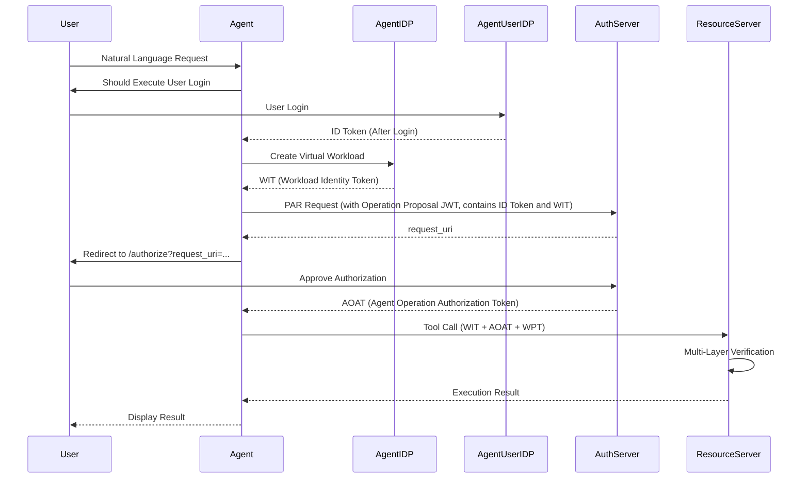

## How It Works

When AI agents operate on behalf of users, Open Agent Auth ensures every action is **authenticated**, **authorized**, and **auditable** through a standards-based flow:

Built on [IETF Draft: Agent Operation Authorization](https://github.com/maxpassion/IETF-Agent-Operation-Authorization-draft), extending upon OAuth 2.0, OpenID Connect, WIMSE, and MCP protocols.

